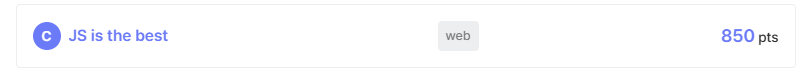

## 24년 9월

24년도에 본격적으로 버그바운티를 시작했던거 같다.
디코 돌아다니다가 어떤 유저분이 KERIS에서 주최하는 4세대 NEIS Plus 버그바운티 공고를 올리신걸 봤고 카카오 깔짝깔짝 경력도 있던터라 바로 참여해봤다.

시작한 당일날에 운좋게 취약점을 찾게 되었고 12월에 포상금 받으라고 연락왔다.  
학교에서 메일 온거 보고 하루종일 좋아했던게 기억난다 ㅋㅋ 무려 나이스의 취약점을 내가 찾았다고? 라는 성취감이 꽤 오래 갔던거 같다

## 24년 11월
가입만 해놓고 방치해놨던 드림핵에 들어가봤는데 드림핵 5만명 가입 기념 UCC CTF란게 열린다고 했다.  
23년 X-MAS CTF 뭣 모르고 참여했다 한 문제도 못 풀었던게 떠올라 지금의 내가 얼마나 성장했을지 궁금해서 참여해봤다.  
(사실 상품이 푸짐했던게 눈이 가지 않았나 싶다)

[`JS is the best`](https://dreamhack.io/wargame/challenges/1578) 라는 문제 하나를 풀게 되었고 생각보다 높은 등수인 28등으로 마무리했다.

이걸 기점으로 보안을 본격적으로 공부하게 되었다.

## 24년 12월

보안에 흥미가 생기자마자 경기과학고에서 여는 `WaRP CTF` 공고를 보게 되었고 마찬가지로 웹 1솔로 마무리 했다.  
끝나고 얼마 뒤 업솔빙 때린 문제들이 몇 개 있었던지라 꽤 아쉽긴 했다. 20팀 중에 2팀 뽑는 특별상에도 기대를 걸었는데 놓쳐버렸다..ㅎㅎ

23년 중학교 겨울방학 때 작은 취약점 하나를 카카오에서 찾아 Hall of Fame에 등재 되었었다.
카카오에서 버그바운티 대상을 대폭 증가시킨다는 내용의 안내 메일이 왔었고 그 추가 대상에서 전에 찾아놨던 취약점이 있었던지라 24년도 HoF 올라가겠다고 생각하고 있었다.

근데 까먹고 있다가 보고서를 안써서 먼저 보고서 제출하신 누군가에게 뺏겨버렸다..

## 25년 1월
고1 겨울방학을 시작한 1월엔 꽤 시도해본게 많았다
일단 첫번째로 CTF와 드림핵 풀이를 시작했다.

버그바운티는 해봤지만 다양한 웹해킹 기법에 대한 이해도는 전혀 없는 상태였다.

드림핵 `Web Begginer, 1레벨` 위주로 풀려고 노력했다.

작은 해킹 스터디에 들어가서 팀원들과 숭실대 `SSU CTF`에 나갔다.  
대학 vs 일반부로만 구분되었기에 일반부에 중고등학생과 성인들이 모두 포함되어서 더 빡셌던거 같다.
6시간 풀로 뛰어서 `100pt`짜리 문제들은 전부 푸는데 성공했다.

결국 종합 28등 일반부 17등으로 마무리했다. 팀원들이 이미 풀어놓은 문제를 혼자 끙끙거리며 푸는 뻘짓을 하긴했지만.. 뭐 다 같이 열심히했고 고수들 사이에서 28등이면 나쁘지 않은 성과라고 생각한다

## 25년 2월
특별한거 없이 해외 CTF랑 워게임만 계속 풀었다.

문제 풀고 풀이 적으며 복습하니 어느새 해결사 배너를 얻게 되었다.

Sechack님, One님, Predic님 등 드림핵 웹 네임드분들의 블로그를 전부 정독했다. 영양가 있는 정보들 많이 얻어갈 수 있었다 (감사합니다..)

이렇게 웹해킹을 살펴보다보니 접하게 된게 `EJS SSTI 취약점`이었다. 이걸로 CTF 언인텐도 나온 사례가 많았고 관련 문제도 드림핵에 있었다.  
원래 주력언어가 nodejs였기에 날잡아서 EJS 모듈을 분석했고 드림핵에서 관련 문제들 보이는건 전부 다 풀어놓았다.

## 25년 3월
기다리던 `코드게이트` 예선이 열렸다. 간절히 본선가고 싶었는데 결국 예선에서 떨어졌다..  
할 줄도 모르는 리버싱 문제 풀려다가 대회가 끝나버렸다. 주력분야에 충분히 매달려야겠다는 깨달음을 얻었다 ㅠㅠ

## 25년 4월

카카오에서 포상금 받으라 연락왔다. 25년 명예의 전당 달달하다.
위험도에 비해선 턱도 없이 적은 금액이었는데 보고서를 유치원생 일기장 같이 쓴 게 한 몫하지 않았나 싶다

여담으로 4월달에 카카오 취약점 하나 더 찾아서 바운티 넣었는데 지금까지 받은 금액 중 제일 높은 금액을 받게 되었다.
부모님 밥도 사드리고 그럴 생각이다

## 25년 5월
버그바운티 팀에서 활동하며 동기부여 받아서 본격적으로 버그바운티를 시작했다
오래 잡고 있던 오픈소스 취약점 하나 찾아서 issue 올리고 MITRE를 통해 CVE 제보했다

패치데이도 좀 해보고 싶어서 열심히 뛰었고 모두 작은 취약점들이었지만  
Dreamhack과 Goorm에 유의미한 취약점들을 제보할 수 있었다

드림핵 9레벨도 풀어보고 싶어서 몇주동안 잡았고 [`leakless`](https://dreamhack.io/wargame/challenges/1056)를 풀어낼 수 있었다. 다시 풀라면 못 풀거 같다 익스짜기 진짜 힘들었다

## 25년 6월
시험끝나고 본격적으로 대회들이 몰려오기 시작했다  
처음으로 공지뜬건 아주대 COSS CTF와 Kaist HackQuest였다.   

아주대는 수도권 대상으로만 참여자를 모집했던터라 팀원들과 쉽게 본선을 갈 수 있었다.  
첫 오프라인 CTF였는데 닉네임만 들어본 네임드분들을 실제로 만나니 신기했다. 수상은 못했다  

카이스트는 웹 마지막 문제 풀어서 겨우 본선 진출에 성공했다.  
포너블이랑 리버싱을 진짜 못하는지라 어려울줄 알았는데 3일정도 써서 난이도 있던 웹문제를 풀어냈다

---

이후부턴 월별로 따로 쓰겠다