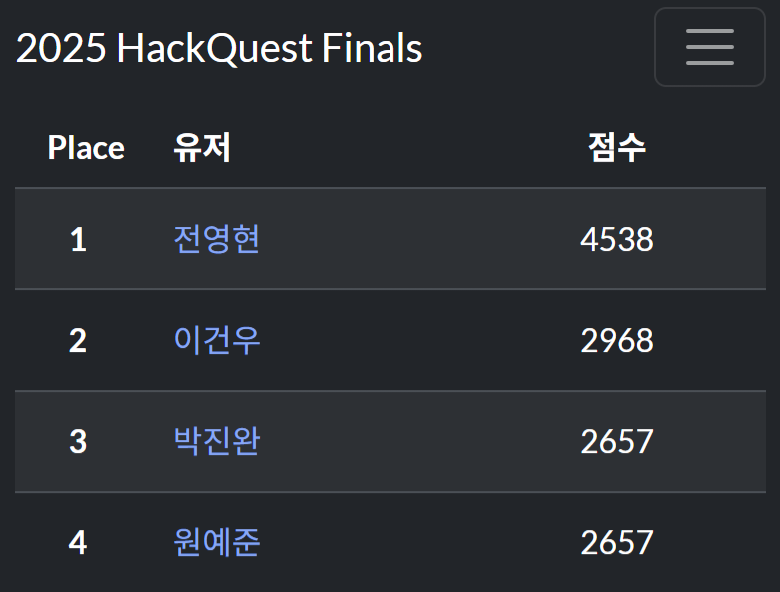
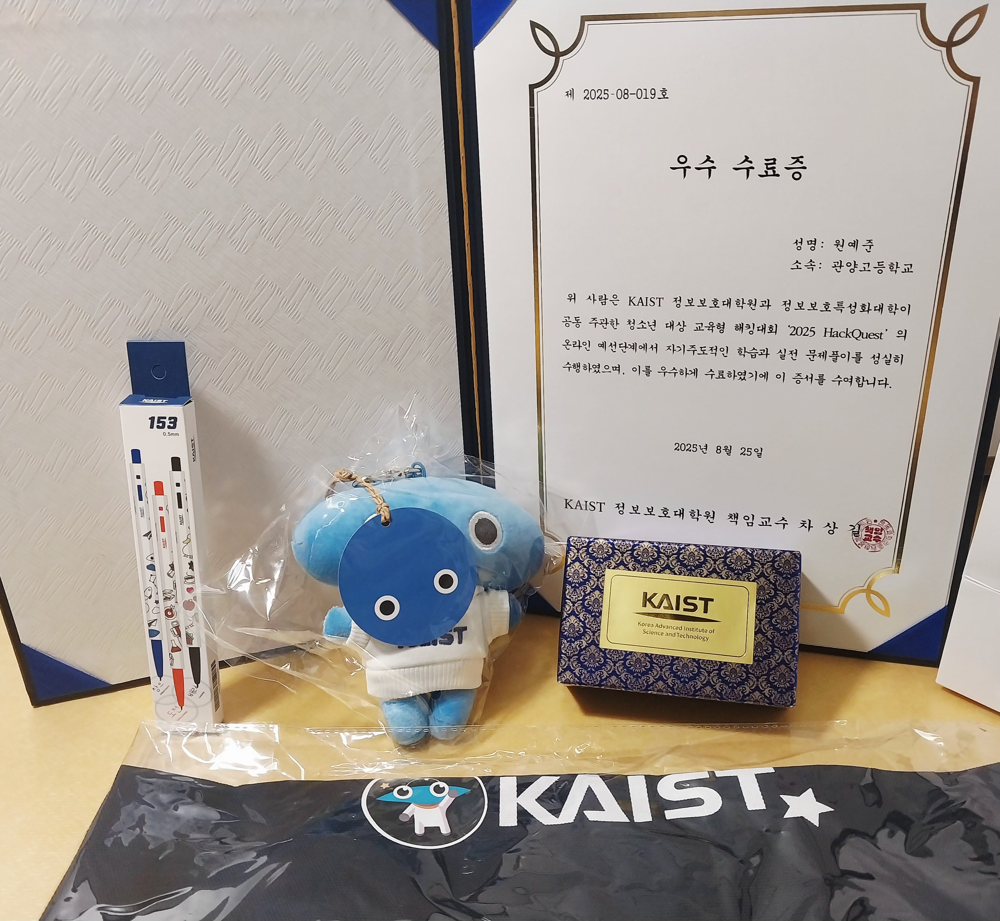

이전에 썼던 Write-Up 글들을 보신분들은 알겠지만 이번에 열린 순천향대 정보보호 페스티벌, Kaist Hackquest 본선에 다녀왔습니다

후기 적어보겠습니다

---
### 2025 YISF

**예선**  

우선 예선부터 설명하자면 금요일 오후 9시부터 일요일 오전 9시까지 약 이틀동안 진행 되었다.

11시에 학원끝나고 집에 들어와서 바로 시작했고 5시간정도 뛰고 새벽 4시쯤 잤다  
분야별로 쉬운 문제들을 다 풀어놨다

다음날 9시쯤 일어나서 웹을 올솔했다. 개인적으로 `Re:LS`라는 안드로이드 리버싱과 SSRF를 써서 해결해야하는 문제가 있었는데 재미있었다.

전반적으로 예선 웹이 진짜 아쉬웠는데 난이도가 출제된 웹 5문제 중에 2~3문제에 아주 쉬운 언인텐이 발생했다.
그래서 다른 분야에 비해 솔버수가 꽤 많았다. 나처럼 웹이 주분야인 사람들한텐 변수였을거다.

[Executable](https://dreamhack.io/wargame/challenges/2185) 문제는 진짜 감이 아예 안온다.

토요일 밤에 12등을 먹으며 이정도면 18등 본선 커트라인에는 들겠지? 라는 생각으로 잤는데 새벽에 키핑이 있었다.

일어나서 20등이 된 등수를 보니 진짜 참담했다  
.  
.  
.  
.   

근데 왜인지 위에서 몇 분 빠지셔서 턱걸이 본선갔다 :)

---

**본선**

다른 사람들 블로그에서나 보던 순천향대 향설생활관에서 진행되었다

딱히 많이 할 말은 없다 10등해서 한 등수 차이로 상 못 받았다

핑계를 좀 대자면 이유가 두 가지가 있는데  
첫번째는 일단 내가 포렌식 문제를 다운을 안받아놨었다.  
미래의 본선 진출자들은 YISF에서 포렌식이 큰 비중을 차지하니까 꼭 미리 다운받아가자.  
두번째는 주분야인 웹 3문제 중 하나가 굉장히 쉬워서 참가자 모두가 풀어버렸고, 하나는 포렌식이랑 엮어서 나와서 건들지도 못했다.
나머지 하나는 0솔 문제다..

**GANGIA**라는 출제자분들 중 한 분의 정확한 좌표를 찾는 osint 문제가 있었는데 재미있게 풀었다. 분명 구글맵 좌표로는 정확히 맞는데 정답과 꽤 달랐다. 힌트받고 풀었다.

예선, 본선 모두 웹 문제의 퀄리티가 약간 아쉽긴 했지만 좋은 경험이었다

---

### 2025 KAIST Hackquest

새벽같이 일어나서 대전으로 갔다

암호학 한 문제랑 웹 3문제 올솔브했고 본선 진출자 20명 중 4등했다.
3등까지 상이라서 YISF와 마찬가지로 한 등수 차이로 상 못 받았다

밥은 카이스트가 제일 맛있었다. 유부초밥 나왔는데 대회하면서 하나씩 먹기 편했다.

우수수료증이랑 기념품을 뭘 많이 줬다

