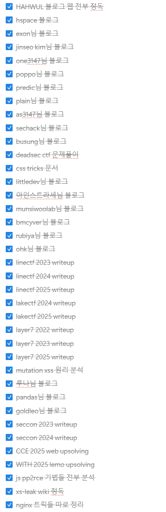

### About 2025
2025년도 보안 공부와 학업에 대해 되돌아보며 글을 써보겠다.

전체적으로 부족한게 많았던 한 해였고 아쉬운점이 정말 많았다.
일단 보안을 시작하면서 성적이 꽤 많이 떨어졌다. 1학년 때 보다 내신 평균이 1점정도 떨어졌고 수시로 인서울은 바라기 어려운 상황이 되었다. 대부분 학생 때 보안을 하면서 꽤나 이름을 날리는 사람들은 특기자로 가기에 너도 그 정도 스펙이면 특기자 쓰면 되는거 아님? 이라고 나에게 묻는 사람들이 꽤 있다.

일단 나는 다른 사람들에 비해 특기자로써의 경쟁력이 낮다. 23년 12월에 본격적으로 보안을 시작한 이후로 보이는 모든 대회에 다 나갔고, 실력좋은 세명컴고 2, 3학년들과 함께한 덕에 큰 어려움없이 본선까지 가며 닉네임을 알리기 시작했다. 그러나 본선만 가면 웹문제를 0솔브하기 일쑤였고, 작은 대회들에서도 한두 등수차이로 수상을 실패하며 현시점으로 특기증빙서류에 넣을 그렇다 할 상장이 없다.

버그바운티 실적을 꽤 쌓은건 있지만 대부분 버그바운티는 인증서류를 발급해주지 않는지라 역시 증빙서류에 넣긴 어렵다. NASA는 LoR이라고 감사장을 주길래 이거라도 받아보려고 요즘 나사 버그바운티에 도전하고 있다.

### 보안 입문?
이제 막 보안을 시작하는 중고등학생들에게 이런말을 해주고 싶다.  
**해킹 공부하기로 마음먹었으면 무조건 화햇스쿨 또는 영재원부터 들어가라**

메이저 대회들에 비해 화햇스쿨과 영재원 정보보안 경진대회는 수상하기 상당히 쉬운편에 속한다. 또한 이 상들은 대학들이 꽤 봐주는 상이다. 난 이번년도에 보안을 시작했기에 영재원에서 상을 받고 대학에 넣을 수가 없는 상황이다. 다음년도에 영재원 들어가봤자 대학 원서 마감이 끝난 후 경진대회가 있기에.. 상을 넣을 수가 없다.

메이저 대회들도 마찬가지다. 코드게이트를 제외한 Whitehat Contest, CCE, WACON(요즘 안열리긴 함) 들은 전부 원서 마감기간에 아슬아슬하게 걸쳐있거나 그 이후에 열린다. 즉 입시시즌 전 년도인 고2때 수상해놓는게 아니면 원서에 넣을 수 없다.

### 성취
이룬것도 어느정도 있다.

첫번째로는 인맥이 꽤 생겼다. 디미고 세명컴고분들과 대회를 나가다보니 친한 사람들이 생기기 시작했고 편하게 팀을 이루고 궁금한걸 물어보고 답변받을 수 있는 사이가 되었다.

두번째로는 팀이다. 내가 속한 팀으로는 버그바운티 팀 버그줍줍단과, CTF 팀 Fermion이 있다. 버그바운티 팀에서는 리얼월드 취분 고수분들과 케이스 스터디를 할 수 있었고 버그바운티하며 번아웃이 오지 않게 동기를 부여받을 수 있었다. 덕분에 Patchday에 몇건의 취약점을 제보할 수 있었고 25년 카카오 버그바운티는 2등이라는 높은 순위를 기록할 정도로 꾸준히 리얼월드 분석에 참여할 수 있었다.

CTF 팀은 Fermion에 들어갔다. 티오리에서 팀을 만든다길래 바로 신청서를 넣었고 운좋게도 알파로 들어갈 수 있었다. 내가 알파팀에 들어갈 실력이 되는지는 모르겠다. 팀원들은 대부분 포스텍, 고려대, 디미고 고수들 등으로 이루어져있었고 해외 CTF를 팀원분들과 뛰어보면 내가 한 문제를 온전히 풀어 플래그를 따는 경우는 거의 없었다.
평균적으로 한 CTF 당 한 문제 **기여** 정도가 최대였던거 같다. 풀지 못하더라도 계속 웹을 잡아보고 팀에 조금이라도 보탬이 된다는거에 의의를 갖고 계속 참여하며 실력을 키워나갈것이다.

워게임도 7, 8레벨을 반나절에서 하루정도 투자해 풀 수 있게 되었다. 얼마전까지만 해도 5레벨을 며칠동안이나 잡고 겨우겨우 풀었던거 같은데 이제 1시간 컷을 낼 수 있는 실력이 되었다.

### 앞으로의 목표
일단 이제 고3이기에 대학이 먼저다. 07년생들이 빠지면 26년도 청소년부가 널널해지긴하겠지만 수상 실적을 빵빵하게 채워서 특기자로 대학을 가는데에 모든걸 걸기엔 무리가 있다.
특기자도 어느정도 바라보되, 겨울방학엔 수능공부도 적당히 병행할 예정이다.

CTF 측면에서도 생각해본건, 나는 내 생각보다도 더 못한다. 보여줄만한 실적이라곤 버그바운티 몇 개와 Finalist 경력뿐, 심지어 본선에서 솔버가 거의 없는 웹을 익스한 경험은 적다.
이번에 화햇콘 직전에 이대론 안되겠다 싶어서 3주간 인터넷에 있는 CTF writeup 약 200개를 정독하고 이해했다. 그러나 이 지식들을 완전히 내것으로 만들었는지는 모르겠다.
writeup은 시간날때마다 계속 읽을거고 드림핵도 고레벨 위주로 솔브하면서 성장할거다. 적어도 팀원들에게 민폐는 되기 싫다.

사실 어려운 문제 솔브에 대해서는 뭐가 문제일지 아직 모르겠다. 본선만 가면 긴장을 해서 그런걸까, 풀 능력이 있는 문제에서도 예상치도 못한 실수를 한다.
CCE Final - 철도관제센터 문제에서는 `password`를 `pasword`로 오타내어 청소년부 솔버가 1명 나온 블랙박스 문제를 아쉽게 못풀었다.
LG Uplus final에서도 csrf token 우회와 csp bypass 방향까지 맞았지만 태그 한 줄 빼먹어서 못풀었다. 집에와서 2분만에 풀어버린 문제였다.
이것들도 다 실력 이슈겠지만 너무 아쉬운건 사실이다.

다른 분야도 추가로 공부해볼까 생각도 했었다. 대부분의 CTF가 팀으로 전환되어 개인의 분야 다양성이 예전처럼 요구되지는 않지만 YISF나 코드게이트처럼 여전히 개인전인 대회에서는 웹 원툴이 뒤쳐질 수 밖에 없기 때문이다. 하지만 내가 지금부터 시작해서 GPT 이상으로 리버싱이나 암호학을 잘할 수 있을거라고 생각하지 않는다. 웹해킹을 더 깊게 파서 실력을 올리는거에 초점을 맞추는게 더 중요할거라 생각한다. 포너블은 워게임 1, 2레벨 풀 수 있는정도로는 공부해놓을거다.
대회에서 제일 어려운 웹 문제들은 다 크로미움 분석을 요구하던데 크로미움 소스코드 읽는 능력도 길러놓을거다.

다음 대회부턴 웹 능력껏 풀고 수상할거다. 무조건.

아래는 공부하면서 읽은 블로그랑 정리, 업솔때릴거 계획했던거다.
궁금한건 편하게 [디스코드](https://blog.xss.kr/about)로 연락주길 바란다.
