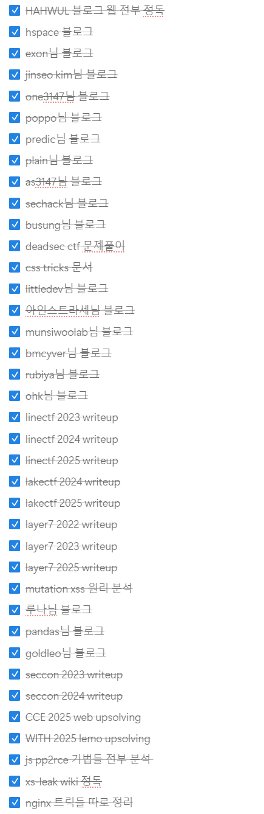

### About 2025
2025년은 여러모로 아쉬운 점이 많았던 한 해였다.

지금 고등학교 2학년이기에 성적 얘기를 빼놓을 수가 없다.
일단 보안을 시작하면서 성적이 꽤 많이 떨어졌다. 1학년 때 보다 내신 평균이 1점정도 떨어졌고 수시로 인서울은 바라기 어려운 상황이 되었다.

해킹 공부를 하는 사람들이라면 특기자를 노려볼 수 있을 것이다. 그러나 나는 특기자로써의 경쟁력도 낮다. 본격적으로 보안을 시작한 이후로 보이는 모든 CTF에 나갔고 세명컴고 3학년 고수팟에 끼게 되며 큰 어려움없이 본선 진출까지 하는 좋은 경험을 했었다.

하지만 본선만 가면 웹 문제를 하나도 못 풀고 돌아오거나, 플래그 따기 직전까지 접근해놓고 작은 실수들을 남발하며 아쉽게 상을 따지 못했다.
작은 대회들에서도 한 두 등수차이로 수상을 실패하며 25년의 대회들을 마무리하게 되었다.

YISF: 9등까지 상 - 10등  
HackQuest: 3등까지 상 - 4등  
SCA CTF: 3등까지 상 - 4등  

등등.. 정말 아깝게 상장 컬렉팅을 실패했다.

중딩때부터 리얼월드는 꾸준히 하였기에 버그바운티 실적을 꽤나 쌓은건 있지만 대부분 버바가 인증서나 상장 같은걸 주는게 아니라서 이걸 실적으로 증빙해서 내기가 어렵다.

### 보안 입문
보안은 24년 12월 달에 드림핵에서 웹해킹 문제를 풀기 시작하며 입문했다. 처음 나가본 CTF에서 배점 높은 웹 문제 하나를 풀며 30등 안에 들어갔고, 그때부터 재미를 느끼고 해킹을 판거 같다.  
이때 영재원 루트를 타고 안정적으로 보안을 팠으면 좋았을텐데 그러지 않았던게 정말 아쉽다.

코게, CCE, 화햇콘, 와콘 등 메이저 대회들에 비해 화햇스쿨과 영재원 정보보안 경진대회는 수상하기 상당히 쉬운편에 속한다. 또한 영재원 상도 대학에서 봐준다.
난 이번년도에 보안을 시작했기에 영재원에서 상을 받고 대학에 넣을 수가 없는 상황이다. 다음년도에 영재원 들어가봤자 대학 원서 마감이 끝난 후 경진대회가 있기에.. 상을 넣을 수가 없다.

이 글을 쓰는 시점은 고3 직전 겨울방학이다. 내신 원서느 9월초에 넣는데, 코드게이트는 7월에 열리고 CCE는 9월 초에 열린다.
즉 입시 원서에 실적으로 반영하기가 상당히 애매한 시기에 열리는 것이다.
결국 특기자 전형을 생각한다면 입시 시즌이 시작되기 전인 고2 때부터 미리 수상 실적을 만들어 놓는게 중요하다, 미래의 특기자 지망생들은 참고하도록 하자.

### 성취

함께 공부할 팀이 있으면 좋겠다고 생각해서 몇 개를 들어갔다. 내가 속한 팀으로는 버그바운티 팀 버그줍줍단과, CTF 팀 Fermion이 있다.

일단 페르미온은, 티오리에서 팀을 만든다길래 바로 신청서를 넣었고 운좋게도 고수팟인 알파로 들어갈 수 있었다. 디코에서 알파팀분들 라인업을보니 나와는 거리가 먼, 드림핵 리더보드 상위권에서 보던 고인물들을 볼 수 있었다. 함께 활동할 수 있는 좋은 기회라고 생각하여 그분들 문제 푸는거 지켜보고 채팅내용 다 캡쳐해놓고 변태같이 버스에서 복기하고 그러다보니까 문제푸는 사고 과정이 확실히 정리되었다.
팀원들과 정보 공유하는 방법부터 문제 접근법까지 정말 많은걸 얻어갈 수 있었다.  
아직 내가 큰 역할을 하진 못했고, 쉬운 문제 몇 가지 풀거나 중상 난이도 문제에 기여하는 정도가 최대였을 것이다.

버그줍줍단은 이전 블로그 글에서 버그바운티를 같이 할 팀이 있으면 좋겠다고 언급했던 것을 보고, 정말 감사하게도 goldleo님이 팀을 만들어보겠다고 연락을 주셨다. 그렇게 시작한 팀에서 지금까지 열심히 활동하고 있다.

CTF 외에 혼자 공부하는 습관도 유지하려 노력했다. 워게임은 7, 8레벨을 AI없이 하루 ~ 이틀정도 투자해 풀 수 있게 되었다. 얼마전까지만 해도 5레벨을 며칠동안이나 잡고 겨우겨우 풀었던거 같은데 이제 1시간 컷을 낼 수 있는 실력이 되었다. 요즘 AI가 너무 문제를 잘 풀어서 지금까지 투자한게 좀 허무하긴한데 난 그냥 워게임 푸는 행위 자체가 공부라고 안느껴지고 재미있다.
Slopper가 되진 않고 싶어 자기전에 시간나면 4, 5레벨 문제 하나씩 AI 안쓰고 풀고있는데 개꿀잼이다.

### 앞으로의 목표
일단 이제 고3이기에 대학이 먼저다. 07년생들이 청소년부에서 빠지면 26년도 청소년부가 널널해지긴 하겠지만 수상 실적을 빵빵하게 채워서 특기자로 대학을 가는데에 모든걸 걸기엔 무리가 있다.
특기자도 어느정도 희망을 가져보되, 겨울방학엔 수능공부도 적당히 병행할 예정이다.

그리고 CTF Writeup들은 앞으로도 꾸준히 읽을거다.
이번에 화햇콘 직전에 이대론 안되겠다 싶어서 3주간 인터넷에 있는 CTF writeup들을 정말 많이 정독하고, 정리하고 이해했다. 이 지식들을 완전히 내 것으로 만들었는지는 모르겠기에 CTF 아카이브 찾아가며 전부 업솔빙 해볼 것이다. 드림핵도 내가 모르는 트릭류 위주로 풀면서 성장할거다. 적어도 팀원들에게 민폐는 되기 싫다.

사실 어려운 문제 솔브에 대해서 어떤 역량을 길러야할지는 아직 모르겠다. 본선만 가면 긴장을 해서 그런걸까, 풀 능력이 있는 문제에서도 예상치도 못한 실수를 한다.
CCE Final - 철도관제센터 문제에서는 `password`를 `pasword`로 오타 내어 청소년부 솔버가 1명밖에 안 나왔던 블랙박스 문제를 아쉽게 못풀었다.
LG Uplus final에서도 CSRF token 우회와 CSP bypass 방향까지 맞았지만 태그 한 줄 빼먹어서 못풀었다. 집에와서 2분만에 풀어버린 문제였다.
이것들도 다 실력 이슈겠지만 애써 공부해 아는 지식을 사소한 실수때문에 못써먹다니 너무 아쉬운건 사실이다.

다른 분야도 추가로 공부해볼까 생각도 했었다. 대부분의 CTF가 팀으로 전환되어 개인의 분야 다양성이 예전처럼 요구되지는 않지만 YISF나 코드게이트처럼 여전히 개인전인 대회에서는 웹 원툴이 뒤쳐질 수 밖에 없기 때문이다. 하지만 내가 지금부터 시작해서 GPT를 뛰어넘을 정도로 리버싱이나 암호학을 잘할 수 있을거라고 생각하지 않는다. 웹해킹을 더 깊게 파서 실력을 올리는거에 초점을 맞추는게 더 중요할거라 생각한다. 포너블은 워게임 1, 2레벨 풀 수 있는정도로는 공부해놓을거다.
대회에서 제일 어려운 웹 문제들은 다 크로미움 분석을 요구하던데 크로미움 소스코드 읽는 능력도 길러놓을거다.

26년부턴 웹 능력껏 풀고 수상하고 싶다. 코게 주니어부랑 닷핵 본선 꼭 가보고 싶다.

아래는 공부하면서 읽은 블로그랑 정리, 업솔때릴거 계획했던거다.
궁금한건 편하게 [디스코드](https://blog.xss.kr/about)로 연락주세요
