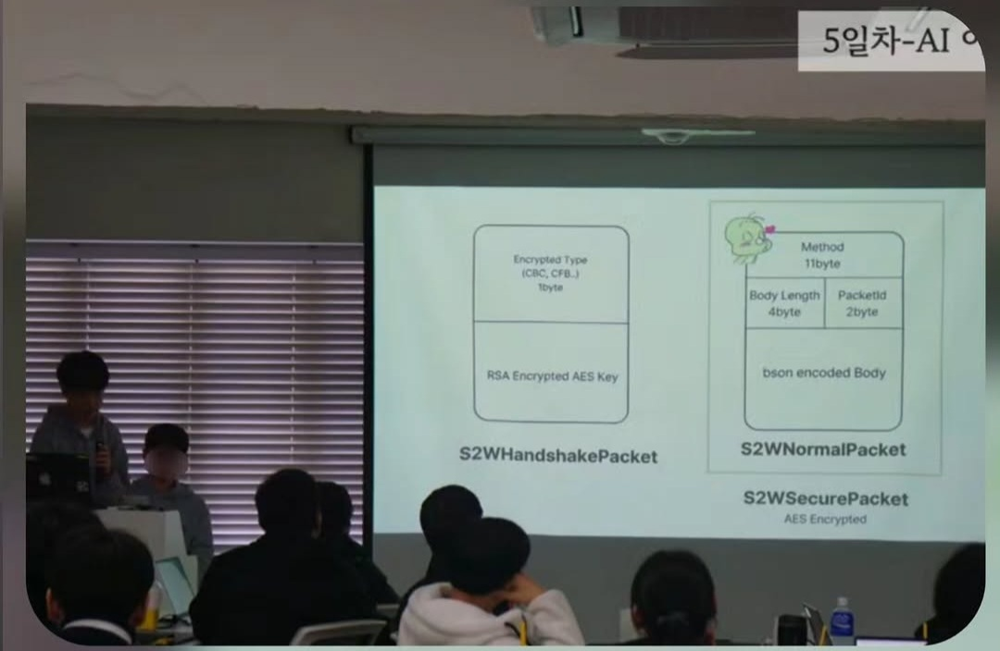
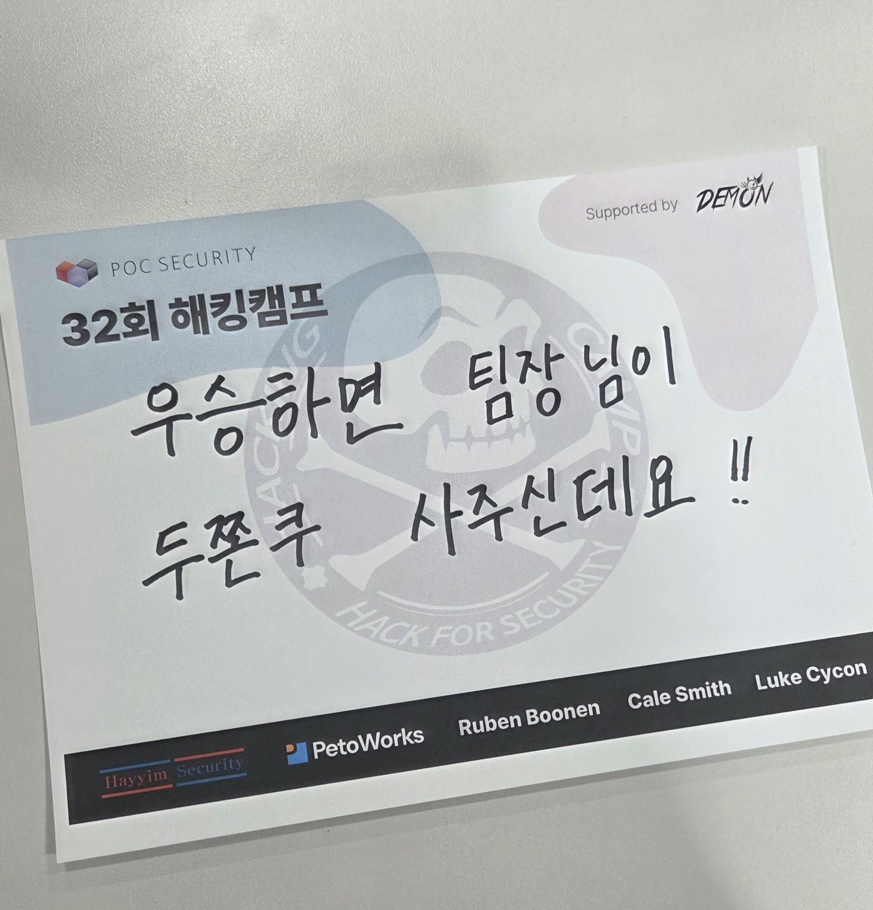
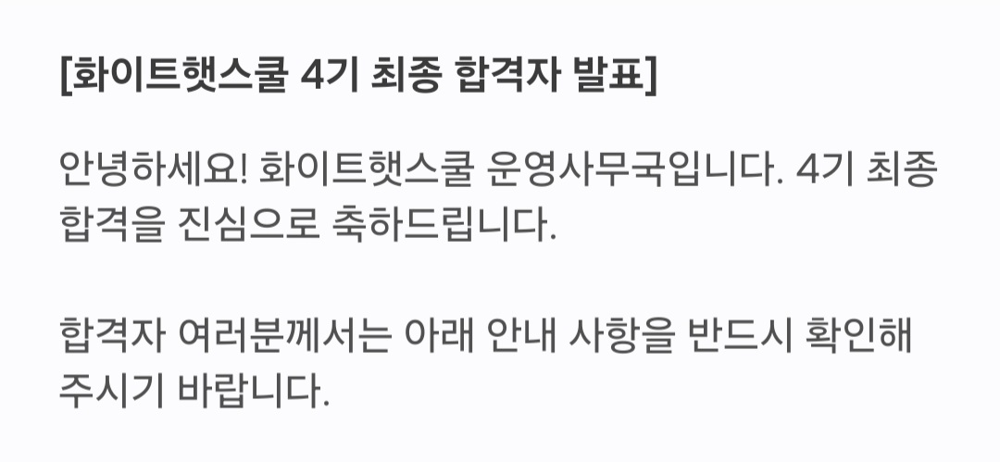
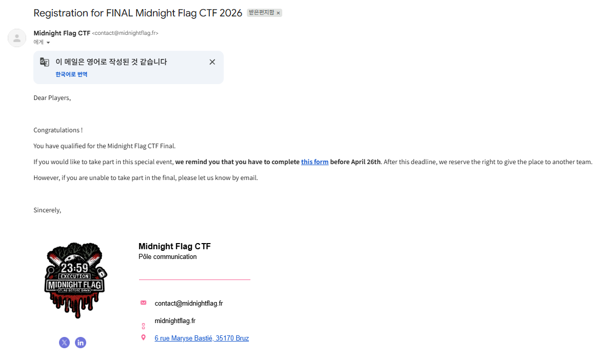
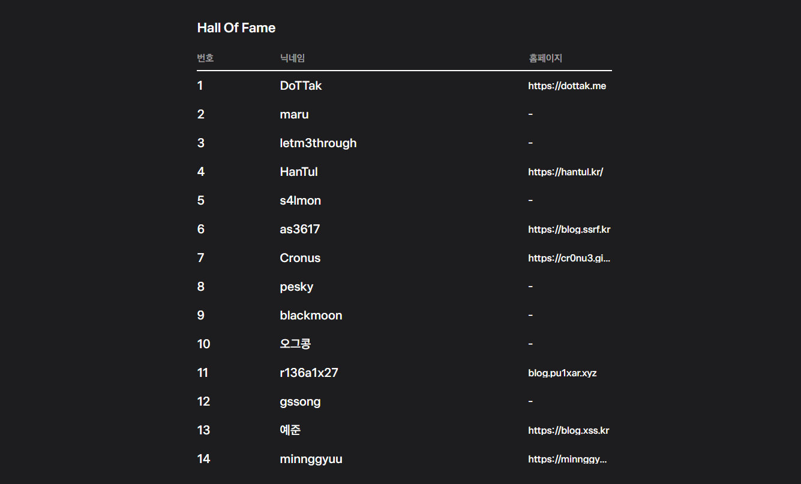
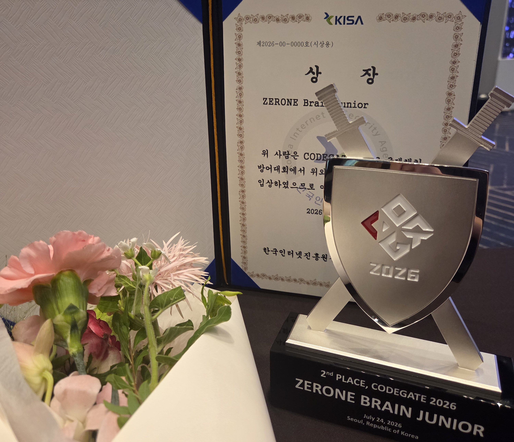

원래 2026년 연말에 몰아서 쓰려했지만 상반기에 한게 많아서 나누어 써보려 한다.  
고3 1학기는 순식간에 지나간다더니 그 말이 맞는거 같다. 특히 이번년초는 워낙 망나니처럼 날아다녀서 그런지 정리가 잘 안되긴 하는데 시작해보겠다.

## 겨울 방학
고2 겨울방학에는 Skills2Work에 지원했다.

드림핵에 모집글이 올라온 것을 보고  사실 어떤 프로그램인지도 제대로 모른채 지원했는데 합격해버렸다.

잠깐 설명하고 넘어가자면 아시아재단에서 주관하는, 데이터 센터를 주요 주제로 보안 교육을 해주는 프로그램이다.

교육 내용 자체도 좋았지만 TeamH4C 관계자분들이 강사로 참여하셨다는 점이 특히 좋았다. 쉬는 시간마다 유성이랑 찾아가서 이런저런 스몰토크를 나눴는데 그 과정에서 얻어가는게 진짜 많았다.  

게다가 어떻게 아시는건지는 모르겠지만 첫날에 이름표보고 먼저 알아봐주신 분들이 꽤 많았어서 그것도 정말 감사했다.

프로그램 중에는 간단하게 해커톤을 했다. 주제는 아마 데이터센터 활용이었나 그랬던거 같은데 우리 조가 주제를 살짝 잘못잡아서 결과적으로 보안에만 지나치게 치중하게 되었다.  
나는 혼자서 신나게 데이터센터에서 사용하기 좋은 보안 프로토콜 슥슥 설계하고 있었는데, 지금 생각해 보면 보안보다 좀 더 주제에 초점을 맞췄어야 하지 않았을까 하는 아쉬움이 남는다.

이때 팀명은 H4C 들어가고 싶은 마음에 당차게 "주한님 저 C4C 붙여주시는거죠??"로 정했는데 결국 학업 핑계로 지원서조차 넣지않았다. 

아래는 발표할 때 사진이다

### 나사 VDP

[First NASA Bugbounty](https://blog.xss.kr/posts/first_nasa_bugbounty/)에 잘 설명되어 있다. 겨울방학 끝나기 3일전에 LoR도 받고싶었고.. "나사를 해킹하면 간지나지 않을까?" 라는 생각으로 무작정 나사 VDP를 시작했다. 결국 개학 하루전에 익스를 성공해서 개학 당일 새벽에 triaged를 받고 기분좋게 학교갔다.  
이때 찾은 기법으로 나중에 LFI 3건, XSS 1건, 잡다한 버그 2개까지 해서 총 6개의 취약점을 나사에 제보했다.

처음으로 해킹캠프 갔다. 그냥 발표듣고 네트워킹하고의 반복이어서 딱히 쓸말은 없다. 좋은분들 많이 만나서 좋았다.

그리고 학기말에 화이트햇 스쿨을 지원했다. 사실 화햇 스쿨 교육 시작이랑 시험기간이 겹치기도 하고 애초에 딱히 할 생각도 없었던지라 대학교 가서나 하려했는데 친구가 하자고 꼬셔서 충동적으로 신청해버렸다.

그리고 왜인지 붙어버렸다. 면접도 긴장해서 어버버거리다 끝났는데 왜 합격했는진 아직도 모르겠다. 무튼 좋은게 좋은거니까.
화햇은 온라인 화상 수업으로 1차 교육이 진행되며 토욜 일욜 오전 10시부터 5시까지 매주 진행된다.. 어차피 집돌이인지라 딱히 주말 압수 당한다는 느낌은 많이 안들었고 어떻게 잘 마무리했다.  

## 3월 ~ 4월

코게 예선 뛰고 닷핵도 갔다. 닷핵은 예선을 제대로 안해서 본선을 하러가진 못했고 컨퍼런스 발표 중에 흥미로워 보이는게 많아서 들으러 갔다.

Midnight Flag CTF를 뛰어보고 싶어서 급하게 팀원 모아서 뛰었다. `광주소마고 + 세명컴고 + 선린 + 디미 + 고려대` 이렇게 20명 좀 안 되게 뛰었고, 18등으로 간신히 학생부 본선 진출에 성공했다.  
아쉽게도 다 학생이라 표 값이 없어서 프랑스에 가진 못했다.

## 5월 ~ 6월

설렁설렁 팀에서 하는 대회 몇 개 뛰고, 열심히 중간고사 준비를 했었다. 확실히 보안을 미뤄두고 아침자습이랑 야자를 꼬박꼬박 나가면서 학교 공부를 하니까 성적이 오르긴 했다.  
1학년 때부터 해킹한다고 돌아다니지말고 이렇게 공부했으면 대학 라인이 두 계단은 뛰지 않았을까 하는 생각도 든다.
물론 그때로 돌아간다고 해도 해킹을 아예 안 하지는 않았을 것 같다.

그리고 토스에서 취약점을 찾게 되어 명예의 전당에 올라갔다. 고등학교 졸업하기 전까지 네이버, 카카오, 토스, 나사 바운티 받기가 목표였는데 이룰 수 있을거 같아 기분이 좋다.

보안을 처음 시작하고 취업에 대해 생각하면서부터 꽤 열심히 달려왔던 것 같다. 특성화고 친구들은 학교에서 보안을 배우기도 하고, 현장실습이나 컨퍼런스에 참여할 기회도 상대적으로 많다 보니 사회에 나갔을 때 취업시장에서 내가 그들보다 많이 뒤처질 수밖에 없다고 생각했다. 그래서 고등학생 때 어떻게든 스펙을 끌어올려 경쟁력을 만들고 싶었고, 그중에서도 내가 가장 자신 있던 버그바운티를 위주로 계속 공부했다.

지금은 AI를 이용해 예전보다 훨씬 쉽게 취약점을 찾고 버그바운티 명예의 전당에도 오를 수 있게 되면서 이런 기록들의 의미가 조금은 퇴색한 것 같기도 하다. 그렇다고 내가 지금까지 해온 삽질까지 의미가 없어진 건 아닌 것 같다. 당시에는 버바하면서 뭐라도 찾으려고 며칠씩 같은 코드를 분석하고, 요청을 수십 번씩 바꿔 보내고, 요상한 래빗홀에 빠져서 의미없는 고민만 하기도 했다. 결과물만 놓고 보면 지금은 딸깍으로 취약점을 찾고 포상금을 입금받을 수 있을지 몰라도 그 삽질에서 얻은 경험은 그 자체만으로 충분히 의미 있다.

처음 버그바운티를 시작했을 때는 취약점 하나만 찾아도 며칠 동안 여운이 남았다. 스스로가 자랑스러워 수시로 명예의 전당 들어가서 내 이름이 떠있는걸 보며 동기부여를 받기도 했다. 그런데 어느 순간부터는 취약점을 찾기 위해 기울인 노력이나 내가 짠 익스의 아름다움보다, 얼마를 받을 수 있는지가 더 중요해진 것 같다. 예전의 난 포상금보단 내가 해냈다는 자부심이 중요했는데 말이다.

CTF도 그렇고 버그바운티도 그렇고, 예전처럼 직접 부딪치고 손으로 익스짜던 낭만이 점점 사라지고 있다는 사실이 너무 안타깝다.

## 7월

코드게이트에서 2등을 했다. 전날까지만 해도 수상할 거라는 생각은 전혀 못 하고 있었는데, 어쩌다 보니 상을 받아버렸다. 대회 종료 9분 전에 웹 1솔짜리 문제를 풀면서 버저비터를 울렸고, 그 점수가 수상까지 이어졌다. 해킹을 처음 시작했을 때부터 코드게이트에서 상 받는 망상은 계속했던 것 같은데, 진짜로 받아보니 기분이 정말 좋았다.

그렇다고 내가 다른 참가자들보다 잘해서 받은 상이라고 생각하지는 않는다. 예선에서 청소년 고수들이 AI 없음 이슈로 본선을 못오기도 했고, 여러 상황이 겹치면서 내가 수상권까지 올라온 것 같다. 순수하게 실력만 놓고 보면 내가 수상권에 들 수 있었을지도 잘 모르겠다.

그래도 운이 따랐다는 이유로 결과까지 부정하고 싶지는 않다. 결국 본선에 올라가서 마지막까지 문제를 붙잡고 있었고, 종료 직전에 직접 1솔 문제를 풀어 순위를 끌어올린 것도 사실이다. 실력과 운이 적당히 섞여서 얻은 결과라고 생각하고, 그냥 기분 좋게 받아들이기로 했다. 자만하지 않고 앞으로도 열심히 공부해보도록 하려한다.

---

앞으로의 목표라면 일단은 대학이 전부지 않을까 싶다. 이미 화햇도 시작해버렸고 수능공부는 제대로 해본적이 없으니 아마 수능으로 대학라인을 올리긴 어려울거 같다. 학종이랑 특기자를 믿고 기다리는게 할수있는 전부이지 않을까 싶다.  
26년 마무리 글에는 원하는 대학 붙었다는 소식을 실을 수 있었으면 좋겠다.