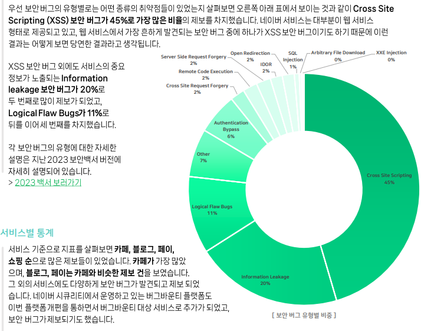
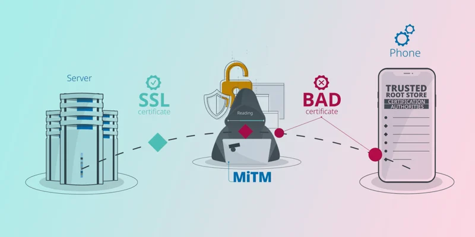
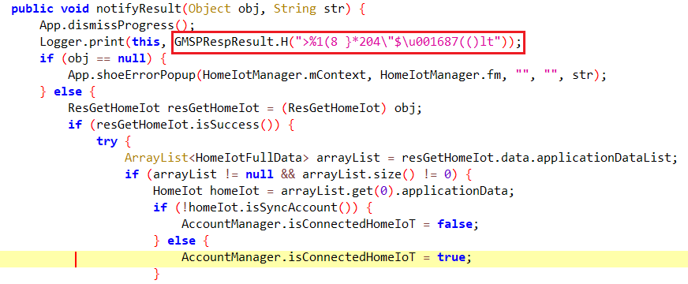
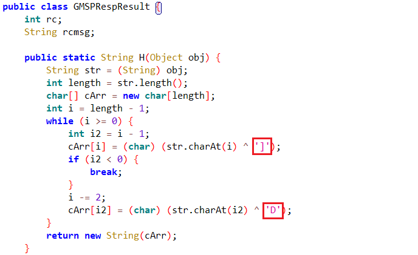

## 1. 들어가며
이번 글에서는 웹 버그바운티에 대한 방법론을 위주로 설명해보려 합니다.

겨울방학에 무작정 들이박아 버그바운티에 입문했을 때부터 지금까지 버그바운티를 해오며 겪었던 케이스들과, 그 과정에서 프로세스를 쉽게 진행하기 위해 사용한 기술들을 공유해보는 걸 목표로 작성했습니다.  
본 글에는 필자의 경험과 주관이 포함되어 있으니 감안하고 읽어주시면 감사하겠습니다.

## 2. 버그바운티에 대하여

버그바운티는 기업이 보안 취약점을 제보받기 위해 화이트 해커들에게 합법적으로 서비스에 대한 제한적 해킹을 허용하고 발견된 취약점의 심각도에 따라 보상을 지급하는 제도입니다.

국내에서는 대표적인 대기업인 Kakao, Naver, Toss 등이 자체적으로 버그바운티 서비스를 운영하고 있으며 다른 기업들도 KISA, FindTheGap, Patchday 와 같은 버그바운티 플랫폼에서 바운티를 운영하고 있습니다.  
또한 Keris나 금융보안원 같은 정부 기관에서 간헐적으로 버그바운티를 열기도 합니다.

## 3. 버그바운티 프로세스
대부분의 버그바운티는 아래와 같은 절차에 따라 운영됩니다.

1. 분석가의 타겟 분석 및 취약점 발견
2. 분석 리포트 제출
3. 벤더사의 취약성 평가 및 재현 여부 확인
4. 패치, 포상금 제공, Hall of Fame 등재

제 진행 방식 위주로 좀 더 상세히 살펴보겠습니다. 일단 **Out of Scope**를 꼼꼼하게 읽고 시작하는게 정말 중요합니다.
명시되지 않은 도메인에 대한 취약점 발굴은 불법이며, 저의 경우에도 취약점을 찾은 뒤에 API 엔드포인트를 보니 대상 도메인이 아니라 낙담하는 경우가 있었습니다.

이를 방지하기 위해 몇몇 서비스에서는 Burp Suite Config 파일을 제공합니다. 이는 벤더사에서 요구하는 HTTP 헤더를 알아서 달아준다던가 대상 도메인만 proxy 패널에 띄워주어 대상 도메인에 대한 취약점 분석만을 진행할 수 있도록 해줍니다. 그러나 타겟 서비스에 대한 전체적인 context를 깊이 이해해야하는 경우가 있기에 저는 경우에 따라 config를 적절히 수정해서 사용하는 편입니다.

---

## 4. 취약점 분석
## Web Analysis
웹해킹에 대해서는 많은 사람들이 접근해봤을 것입니다. 이 글을 읽는 사람들 중 워게임을 추가로 접해봤다면 Burp suite로 요청을 변조해보거나 XSS, CSRF, SQL Injection 등 한 번쯤 실습해 봤으리라 생각합니다.

다른 블로그에서 서술할 만한 글 대신 조금 더 리얼월드틱한 팁을 드리고 싶습니다.

### XSS

먼저 XSS부터 얘기해 보겠습니다. 2025 네이버 보안 백서에 따르면 네이버에서 발견된 취약점 중 XSS가 45%나 차지할 정도로 리얼월드에서 흔하게 발견되는 취약점 중 하나입니다.

```js
<script>alert(1)</script>
```
많은 입문자분이 XSS를 테스트할 때 이 페이로드를 넣는걸로 시작합니다. 그리고 다른 포인트로 옮겨가 또 넣어보고 좌절하고를 반복합니다.
그 전에 서비스가 어떤 라이브러리를 사용하는가를 먼저 살펴보는게 중요합니다.
만약 서비스가 `React` `Next.js` `Svelte`를 사용한다면 XSS를 성공시키긴 어렵습니다. 이들은 가상 DOM을 사용하기 때문입니다.
이런 프론트엔드 프레임워크들은 렌더링 과정에서 입력을 HTML로 해석하지 않고 문자열로 Escape 하여 DOM에 삽입합니다.
물론 예외도 있습니다. `dangerouslySetInnerHTML`를 사용하거나 `ReactElement`로 로드되지 않는 일부 기능의 경우 취약할 가능성이 있습니다.

### JSON Injection
여러분들이 생각하시는 것 이상으로 JSON Injection to Database Injection의 사례는 흔하게 존재합니다.
당장 Github에서 Express 백엔드와 MongoDB를 사용하는 서비스를 찾아봅시다. 대다수 서비스는 아래와 같은 코드를 사용하고 있고, 대부분의 Express js 개발자라면 이런 코드를 작성할 것입니다.

```js
app.post('/api/login', (req, res) => {
  await Users.findOne({ username: req.body.username });
});
```

제가 과거에 작성했던 코드를 가지고 와봤습니다.
이는 매우 취약한 예시입니다. Express는 런타임에서 인풋의 타입을 검증하지 않기 때문입니다.

```json
{
  "username": {
    "$ne": null
  }
}
```

공격자는 이렇게 바디를 보내 Blind NoSql Injection을 수행할 수 있습니다.
그러나 Java Spring, PHP, Nest JS 등 다른 백엔드는 대부분 타입을 검증하기 때문에 프레임워크가 express인 경우에만 제한적으로 시도해볼 수 있습니다.
## Android App Analysis
안드로이드 앱은 [JADX](https://github.com/skylot/jadx)라는 도구를 사용해 간단히 분석할 수 있습니다. 물론 smali 코드를 읽어야하는 경우도 간혹 존재하며 안드로이드의 네이티브 라이브러리는 IDA Pro를 사용해 분석해야합니다.
그러나 탐지 기법이 거의 없는 앱이나 네이티브 라이브러리에 크게 의존하지 않는 앱들은 jadx로 디컴파일 된 코드를 읽는 것만으로 루틴을 알아낼 수 있습니다.
### SSL Pinning

안드로이드 앱의 경우 분석을 방해하기 위한 보호 기법들이 존재합니다. 루팅 탐지, 앱 위변조 탐지, 디버거 탐지, 실행 기기 탐지와 같은 기법들이 그 예입니다.
이 기법들은 서로 복합적으로 체이닝 되어 있고, 난독화된 네이티브 라이브러리나 apk 바이너리 내에 내장되어 있기에 분석하고 우회하기가 꽤나 까다롭습니다.
필자도 리버싱은 잘 못하는지라 이름있는 회사의 보안 솔루션이 적용되어 있다면 동적분석은 포기하곤 합니다.

위 기법들이 적용되지 않았거나 우회한 이후의 환경을 가정하고 서술해 보겠습니다.

다들 Burpsuite를 켜 HTTP 패킷을 보고 분석을 시도하실거라 생각합니다. 그러나 안드로이드 앱은 웹만큼 간단히 패킷을 캡쳐할 수 없습니다. 왜일까요?

오늘날 많은 서비스의 백엔드에는 HTTPS가 적용되어 있습니다. 웹에서는 TLS가 적용되어 있더라도 사용자 인증서를 신뢰하도록만 해주면 MITM 프록시가 인증서를 대신 발급하고 중간에서 평문 패킷을 볼 수 있게 됩니다.
그러나 대부분의 안드로이드 앱은 **Certificate Pinning / SSL Pinning** 을 적용합니다. Pinning이 걸려있는 앱은 서버의 CA / Public Key가 미리 저장된 값과 일치하는지까지 검증합니다.
때문에 안드로이드 앱은 이 Pinning을 우회하는 과정을 거쳐야 정상적으로 패킷을 캡쳐할 수 있습니다. 이 과정이 **SSL Unpinning**입니다.

SSL 인증서 고정을 Unpinning 하기 위해서는 크게 두 가지 방법을 시도할 수 있습니다.

첫 번째는 루트 인증서를 신뢰하도록 APK를 수정하는 방법입니다.
`res/xml/network_security_config.xml` 에는 앱의 네트워크 설정이 정의되어 있습니다. APK를 디컴파일하고 이를 수정한 후 서명하여 SSL 피닝을 우회합니다.
그러나 이 방식에는 한계가 존재합니다. Pinning이 User CA 미신뢰 수준에서 끝나는 앱, 위변조 탐지가 적용되지 않은 앱에 한에서만 우회가 가능하기 때문입니다.
때문에 필자는 두 번째 방식을 선호합니다.


두 번째는 Frida를 사용해 우회하는 방법입니다.
먼저 루팅된 Device가 필요합니다. 직접 루팅하기 어려우신 분들은 PC에 Emulator를 설치해 사용하시는걸 추천드립니다.
[Frida CodeShare](https://codeshare.frida.re/@masbog/frida-android-unpinning-ssl/)에서는 간단하게 SSL Unpinning을 위한 스크립트를 제공하고 있습니다. 이후 Burp Suite와 프록시를 연결하시면 앱의 패킷을 가로챌 수 있습니다.

리버싱하면서 위에서 설명한 Frida를 이용해 함수를 후킹해가며 리턴값을 보는게 아주 효율적입니다. JADX에서는 편리하게 함수에 맞는 Frida Script를 복사해올 수 있는 기능이 존재합니다.
이를 이용해 함수가 어떤 값을 인자로 받고 뭘 리턴하는지 찍어가며 분석하는 방법이 있습니다.

Frida Setting 가이드에 대해서도 조만간 글을 작성해 보도록 하겠습니다.

### Constant Obfuscation
리버싱을 해보신 분들이라면 다들 잘 대처하실거기에 짧게 다뤄보겠습니다.

상수 난독화는 코드에서의 상수를 그대로 두지 않고 런타임에서 동적으로 로드해와 정적분석을 귀찮게 합니다.



위와 같이 XOR 기반으로 단순하게 변형해오는 형태가 흔하게 존재합니다.
해당 APK에서는 짝수 인덱스는 `^ 'D'`, 홀수 인덱스는 `^ ']'` 처럼 키만 달라지는 복호화 함수가 모든 클래스에 적용되어 있었습니다.
이런 경우에는 복호화 함수를 잡고, 함수의 키만 파싱하여 복호화하는 스크립트를 작성해 평문 문자열로 복원하는 사용할 수 있습니다.

## 5. 리포트 작성
영향력있는 취약점을 찾는게 전부가 아닙니다. 질 좋은 리포트를 쓰는 것은 포상액과 취약성 인정 여부를 좌우할 정도로 중요합니다.
리포트에는 보통 제목, 취약점 설명, 재현 방법 (PoC), 악용 시나리오, 대응방안이 들어가게 됩니다.
Patchday에서 공개되어 있는 [모범 리포트](https://patchday.io/open-reports/1)를 읽어보시는걸 추천드립니다.

HackerOne에서도 수백가지 리포트를 유형별로 나누어 공개하고 있습니다. ([Github](https://github.com/reddelexc/hackerone-reports))

## 6. 마치며
요즘 AI가 발전하며 버그바운티에 AI를 활용하는 사례가 확실히 늘고 있습니다. LinkedIn을 보면 "Full Auto AI를 통해 Chromium이나 NASA의 취약점을 발견했다"라는 글이 간간히 보입니다.
AI는 강력합니다. 복잡한 코드를 빠르게 읽고 그에 맞는 수백까지 페이로드를 생성하고 테스트하는 과정을 밤낮없이 진행할 수 있습니다.

이런 흐름을 보면 앞으로 버그바운티도 결국 **AI를 얼마나 잘 쓰는가**가 실력의 한 축이 될 것이라고 생각합니다.
버바에서 AI를 멀리하고 전통적 방식을 고수하는게 아닌 AI를 활용해야 할 측면에서는 적극적으로 활용하는게 바람직한 자세라고 생각합니다.

긴 글 읽어주셔서 감사합니다. 질문 사항은 디스코드 itznullbyte로 편하게 주시면 답변해드리겠습니다.