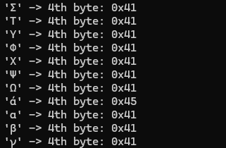
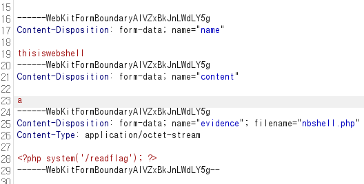

# Solve
- timetravel
- 04-정보자원관리원

---
곧 CCE인데 연습할겸 apollo에 나왔던 문제들 몇 개를 간단하게 write up 작성해보겠다

---

## timetravel
```php
<?php
  $timeInterval = 5;
  
  if ($_SERVER["REQUEST_METHOD"] == "POST") {
      while (ob_get_level()) {
          ob_end_clean();
      }
  
      session_start();
      $_SESSION['time'] = date('Y-m-d H:i:s');
  
      if (!isset($_SESSION['last_attempt'])) {
          $_SESSION['last_attempt'] = time();
      } else {
          $currentTime = time();
          $timeElapsed = $currentTime - $_SESSION['last_attempt'];
  
          if ($timeElapsed < $timeInterval) {
              die('No Bruteforce');
          }
  
          $_SESSION['last_attempt'] = $currentTime;
      }
  
      $passcord = htmlspecialchars($_POST['passcord']);
      $passcord = mb_strcut($passcord, 0, 3, 'UTF-8');
      $flag = getenv('flag');
  
      ob_start(null, 4096);
      $output = '생략';
      function safe_iconv($in_charset, $out_charset, $str)
      {
          $result = @iconv($in_charset, $out_charset, $str);
  
          if ($result === false) {
              throw new Exception("iconv conversion failed: Detected an illegal character in input string");
          }
          return $result;
      }
  
      $dummy = str_repeat("A", 1098);
      try {
          $passcord = safe_iconv("UTF-8", "ISO-2022-CN-EXT", $passcord);
      } catch (Exception $e) {
          header("location:index.html");
          echo "redirected";
          exit();
      } finally {
          $passcord = iconv("UTF-8", "ISO-2022-CN-EXT", $passcord);
          $passcord_hex = bin2hex($passcord);
          error_log("Passcord: " . $passcord_hex);
          if (strlen($passcord_hex) >= 8) {
              $fourth_byte_hex = substr($passcord_hex, 6, 2);
              $fourth_byte_value = hexdec($fourth_byte_hex);
  
              if ($fourth_byte_value >= 0x48 && $fourth_byte_value <= 0x4C) {
                  header("location:index.html");
                  echo "redirected";
                  exit();
              } else {
                  error_log("OK");
              }
          } else {
              header("location:index.html");
              echo "redirected";
              exit();
          }
          
      }
  
      $newoutput = str_replace("{{ passcord }}", $passcord, $output);
      $newoutput = str_replace("{{ dummy }}", $dummy, $newoutput);
      $newoutput = str_replace("{{ flag }}", $flag, $newoutput);
  
      echo $newoutput;
      $saved_time = $_SESSION['time'];
      $comparison_time = '2028-08-03 18:05:00';
      $saved_time_obj = new DateTime($saved_time);
      $comparison_time_obj = new DateTime($comparison_time);
  
      if ($saved_time_obj < $comparison_time_obj) {
          ob_clean();
          $newoutput = "";
          header("location:index.html");
          echo "redirected";
      }
      ob_flush();
      flush();
  }
?>
```

`passcord`가 맞으면 플래그를 준다.
중요한 부분만 뽑아서 passcord에 대해 분석해보자

```php
$passcord = mb_strcut($passcord, 0, 3, 'UTF-8');
$passcord = iconv("UTF-8", "ISO-2022-CN-EXT", $passcord);
$passcord_hex = bin2hex($passcord);

if (strlen($passcord_hex) >= 8) {
    $fourth_byte_hex = substr($passcord_hex, 6, 2);
    $fourth_byte_value = hexdec($fourth_byte_hex);

    if ($fourth_byte_value >= 0x48 && $fourth_byte_value <= 0x4C) {
        header("location:index.html");
        echo "redirected";
        exit();
    } else {
        error_log("OK");
    }
} else {} // 실패 로직 생략

```

1. 앞에서 3바이트 strcut
2. `ISO-2022-CN-EXT` 변환
3. 4번째 바이트가 `0x48 ~ 0x4C` 사이에 있으면 `exit();`

```python
import subprocess

for i in range(0x20, 0x3000):
    ch = chr(i)
    if len(ch.encode('utf-8')) > 3:
        continue
    p = subprocess.run(
        ['iconv', '-f', 'UTF-8', '-t', 'ISO-2022-CN-EXT'],
        input=ch.encode(),
        stdout=subprocess.PIPE,
        stderr=subprocess.DEVNULL
    )
    out = p.stdout
    if len(out) < 4:
        continue
    b4 = out[3]
    if 0x48 <= b4 <= 0x4C:
        continue
    print(f"{repr(ch)} -> 4th byte: {b4:#04x}")
```

익스플로잇은 간단하게 나온다. 빨리 풀려고 좀 분석 때리고 지피티보고 짜달라했다



`flag: cce2024{d82e4e7f1882be6a45b603ad2a552e513f680d2c25547aa3cdcd80f0edbabd4f}`

---

## 04-정보자원관리원

`/readflag`가 존재하기에 RCE 해야한다는걸 알 수 있다.
난 php rce 문제가 나오면 보통 웹셸하고 php 역직렬화를 먼저 의심해보는편이다.
역직렬화 포인트는 딱히 안보이고, 업로드 기능이 `/api/report_check.php`에 존재하기에 웹셸 업로드라고 생각했다.

```php
<?php
    session_start();
    if(!isset($_SESSION['uid'])) {
        header('Location: /login.php');
    }

    include '../config/db.php';

    function generateRandomString($length = 10) {
        $characters = '0123456789abcdefghijklmnopqrstuvwxyzABCDEFGHIJKLMNOPQRSTUVWXYZ';
        $charactersLength = strlen($characters);
        $randomString = '';
    
        for ($i = 0; $i < $length; $i++) {
            $randomString .= $characters[random_int(0, $charactersLength - 1)];
        }
    
        return $randomString;
    }

    $name = $_POST['name'];
    $content = $_POST['content'];
    $author = $_SESSION['uid'];

    if(!$name || !$content) {
        die("신고자 및 신고 대상자를 모두 입력해주세요.");
    }

    $maxFileSize = 3 * 1024 * 1024; // 5MB

    $evidence = $_FILES['evidence'];
    
    $random_name = generateRandomString();
    if($evidence['size'] > 0) {
        if($evidence['size'] > $maxFileSize) {
            die("파일 크기는 3MB 이하여야 합니다.");
        }
        if($evidence['error'] === 0) {
            $evidencePath = '/app/report/' . $name . '_' . $random_name.'_'.$evidence['name'];
            move_uploaded_file($evidence['tmp_name'], $evidencePath);
        }
    
        $ext = pathinfo($evidencePath, PATHINFO_EXTENSION);
        $stmt = $dbcon->prepare("INSERT INTO report (name, content, evidence, author_id) VALUES (?, ?, ?, ?)");
        $stmt->bind_param("ssss", $name, $content, $evidencePath, $author);
        $stmt->execute();
    
        if($ext !== 'zip'){
            die("zip 파일만 업로드 가능합니다.");
        }
    
        echo "<script>alert('신고가 완료되었습니다. 신고번호 : ".$random_name."');history.go(-1)</script>";
    } else {
        $stmt = $dbcon->prepare("INSERT INTO report (name, content, author_id) VALUES (?, ?, ?)");
        $stmt->bind_param("sss", $name, $content, $author);
        $stmt->execute();
        echo "<script>alert('신고가 완료되었습니다. 신고번호 : ".$random_name."');history.go(-1)</script>";
    }
?>
```

코드를 잘 읽어보면 모든 파일을 업로드 하고 마지막에 zip 파일만 업로드 가능하다고 die를 하는 버그가 있다. 

따라서 php webshell을 넣을 수 있다.



그러나 `random_name`을 붙이기에 바로 웹셸을 실행할 수 는 없다

---

000-default.conf에서 `RewriteRule`이라는걸 쓰길래 구글링해봤고 `CVE-2024-38475`가 존재한다는걸 알 수 있었다.
이 취약점은 `mod_rewrite`가 사용되는 구버전의 apache HTTP server에서 `%3F`를 붙이게 되면 파싱을 잘못해서 `LFI`가 터지는 그런거라고 하는데
경로뒤에 `%3F` 넣으면 다 익스 되길래 정확히는 안찾아봤다

`http://16.184.15.57:8090/user/admin/pw.json%3F`

이렇게 해서 어드민 계정을 가져올 수 있다.

이후에 `http://16.184.15.57:8090/admin/api/post_select.php`에서 sqli로 디비털어서 웹셸명 찾고 `/readflag` 실행하면 끝이다

글을 쓰는 시점에 누군가 admin 기능을 먹통으로 만들어놔서 이 부분 풀이는 적지 않겠다

---

# 후기
이번에도 역시 sqli가 발목을 잡았다.
다른 취약점들도 시간이 걸리긴 했지만 꽤 쉽게 알아챘던거 같은데 SQL 인젝션은 지피티랑 씨름해서 겨우 페이로드 얻었다

제발 이번에 1인분만 하길..