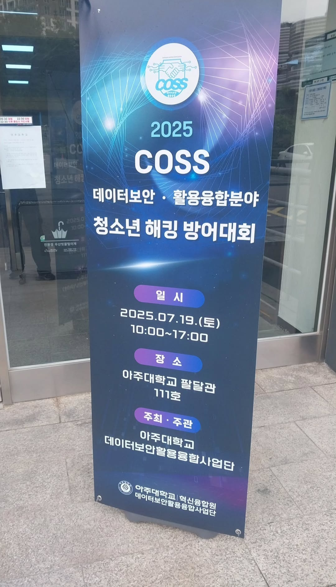
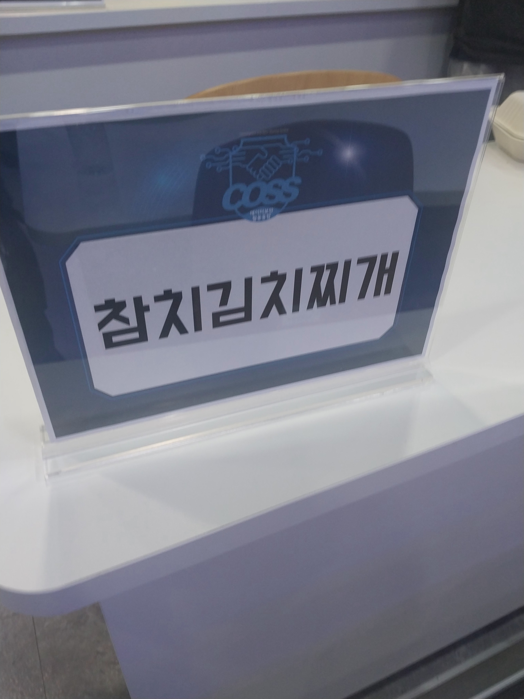
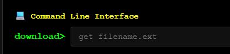

## 대회장 입장

아주대 COSS CTF 본선 갔다왔다. 생각나는대로 적어보겠다.

일단 9시에 30분 일찍 대회장 도착했다. 30분 동안 대기실에 있었는데 아는 사람이 없어서 구석에서 인스타 보고 있었다
팀원들 만나고 대회장 들어갔다.

강의실에서 대회 진행했는데 진짜 강의실 일체형 나무 의자는 지옥이다. 대회 내내 허리아파 죽는줄 알았다

이름표 받았는데 주위 둘러보니까 이름 한 번씩 들어본 사람들이 꽤 있었다 현실에서 보니 신기했다

---

## 대회 시작
일단 난 시작하자마자 웹을 잡았다.  
어차피 crypto나 분야별 쉬운 문제는 누군가 풀어줄거기에 플래그 욕심 안내고 웹만 하루종일 풀고 가자는 생각으로 했다.  
웹 문제는 블랙박스 3문제, 화이트 박스 1문제가 나왔다

첫번째는 저런식으로 입력하면 파일 다운해주는 서비스였다

웹 최다솔브 나온 문제였는데 오래 잡고있던건 진짜 사고다

중간에 밥 나왔는데 맛있었다

오프라인 CTF는 처음이라 좀 긴장해서 그런지 아무것도 못했던거 같다.

---

결국 난 0솔로 마무리했다.
CTF하면서 0솔한건 처음 같은데 0솔한거 자체보단 당연히 풀법한 문제들을 못풀었다는게 더 참담했다.

다음 CTF까지는 팀원들한테 민폐 안끼치도록 열심히 공부할 생각이다.
CCE 전까진 부족한 부분 기초 개념까진 메우고 드림핵 5~6레벨 위주로 풀어볼 생각이다
