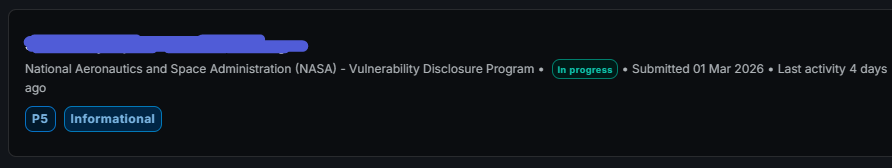
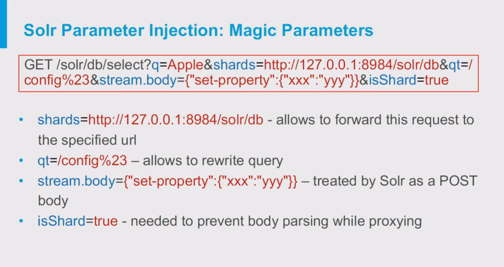
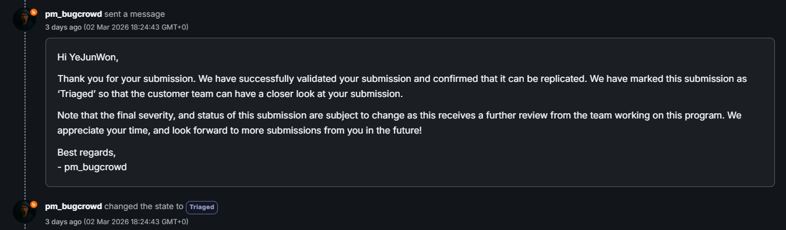
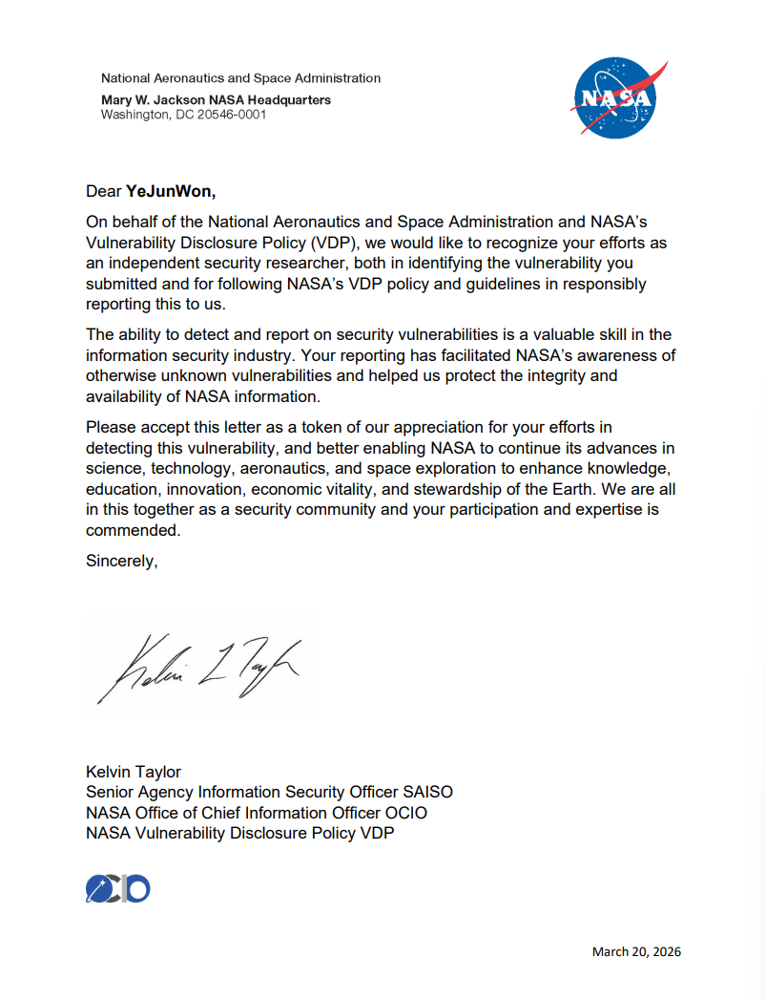

## Nasa Bugbounty

다른 해커분들의 포트폴리오를 보던 중 **NASA Bug Bounty**라는 프로그램을 처음 접하게 되었습니다.  
바로 찾아보았고, Bugcrowd에서 NASA VDP 프로그램이 운영되고 있다는 것을 알게 되었습니다.

호기심이 생긴 저는 프로그램 페이지를 살펴보았지만, 그 유명한 NASA답게 루트 도메인을 중심으로 수많은 서브도메인이 존재했고 전 세계 수천 명의 분석가들이 이미 **8천 개 이상의 유효한 리포트**를 제보한 상태였습니다.  
그 규모에 압도되어 처음에는 시도조차 하지 않으려 했습니다.

그로부터 약 2개월이 지난 2025년 5월쯤, 주말에 시간이 비어 약 5시간 정도 가볍게 테스트를 해보았고 Self XSS 하나를 발견하는 데 성공했습니다.  
그러나 Self XSS는 대부분의 버그바운티 프로그램에서 인정되지 않거나 영향도가 매우 낮은 취약점으로 여겨집니다.  
혹시 몰라 리포트를 제출해 보았지만, 역시 최하 등급인 **P5 (Informational)** 로 처리되었습니다.

당시에는 "그래도 내가 이 정도 찾은 게 어디야" 라는 생각으로 만족했고, 그렇게 NASA 버그바운티에서는 자연스럽게 손을 떼게 되었습니다.

몇 달 정도 지난 어느 날, 팀에서 두 팀원분이 NASA 버그바운티 프로젝트를 시작했고 단 3일 만에 취약점을 찾았다는 소식을 듣게 되었습니다.  
물론 두 분 모두 저보다 실력도 뛰어나고 경험도 많으신 분들이었지만, 막상 아는 사람이 성공했다는 이야기를 들으니 저도 다시 한 번 도전해보고 싶다는 생각이 들었습니다.
또한 NASA는 일반적인 포상금 대신 P1 ~ P4 대상으로 **Letters of Recognition (LOR)** 이라는 감사장을 수여한다는 사실을 알게 되었고, 개인적으로 한 번 받아보고 싶다는 욕심도 생겼습니다.

마침 고2 겨울방학이 되어 시간이 조금 생겼고, 관련 블로그와 문서를 찾아보며 개학을 3일 남기고 아래와 같은 과정으로 프로젝트를 시작하게 되었습니다.

---

### 1. 도메인 탐색

앞서 언급했듯이 NASA에는 셀 수 없을 정도로 많은 서브도메인이 존재합니다.  
따라서 `subfinder`, `assetfinder`, `findomain` 등의 도구를 활용해 `*.nasa.gov` 범위의 도메인을 수집했습니다.

이후 403, 404 상태 코드가 반환되는 도메인을 제거하고 DNS 스캐닝까지 진행하여 약 1000개 정도의 도메인으로 범위를 좁혔습니다.

### 2. Open Report 분석

NASA는 영향도가 낮은 취약점들에 한해 보고서 종료 후 일부 내용을 공개하기도 합니다.

공개된 리포트를 읽어보면서  
- 어떤 유형의 취약점이 자주 발견되는지  
- NASA 서비스의 전반적인 환경이 어떻게 구성되어 있는지  

등을 대략적으로 파악할 수 있었습니다.

### 3. Fuzzing
간단한 파이썬 스크립트를 작성하여 모든 도메인을 대상으로 open redirect 스캐닝을 진행했습니다.
역시 의미있는 아웃풋은 없었습니다.

---

## P5

이후 대부분의 도메인은 직접 하나씩 접속해보며 수동으로 탐색하기 시작했습니다.
그렇게 약 80개 정도 취약해보이는 도메인을 일일히 탐색하던 중, 유난히 수상한 서비스 하나를 발견하게 되었습니다.

일반적인 기능을 사용했음에도 오류가 발생했고 서버의 응답 속도 또한 아주 느린, 전형적인 유지보수가 되지 않는 서비스였습니다. 이 도메인에서 가능성을 느끼고 조금 더 깊이 분석해보기 시작했습니다.

그 결과 데이터베이스 간접적으로 인젝션이 가능한 취약점을 찾게 되었습니다.
환호성 지르고 바로 파파고와 보고서를 작성해서 제보하고 답변을 기다렸습니다.



다음날, 해당 취약점 역시 P5로 처리되었습니다. SQLI처럼 직접적으로 인젝션이 가능한 형태가 아니었기에 악용 가능성이 낮다는게 그 이유였습니다.

---

## P5를 P1으로 고도화하기

> 이 아래로 쓰여지는 내용은 이미 NASA에 허락을 받고 윤리적인 공개 처리가 된 내용입니다.

그러나 여기서 포기하지 않고 다시 같은 포인트를 대상으로 분석을 진행하던 중, 해당 엔드포인트는 여전히 취약하다는 사실을 발견했습니다.
방금 언급했듯이 처음에 찾은건 데이터베이스에 Query 삽입이 가능한 취약점이었습니다.
그러나 저는 이 쿼리에 몇 가지 인풋을 넣어 오류를 발생시켜 보았습니다.

임의로 한글을 넣었을 때의 오류 메시지의 일부는 다음과 같았습니다.

```
HTTP Status 500 - Server returned HTTP response code: 500 for URL: http://localhost:8983/(경로마스킹)?version=2.2&indent=on&wt=json&q=item_UUID:슈퍼아이돌

type Exception report

message Server returned HTTP response code: 500 for URL: http://localhost:8983/(경로마스킹)?version=2.2&indent=on&wt=json&q=item_UUID:슈퍼아이돌

description The server encountered an internal error that prevented it from fulfilling this request.

exception
```
일단 8983 포트를 구글링해보면 `Apache Solr`를 쓰고 있다는걸 알 수 있고,
localhost:8983 내부망의 쿼리로 제가 넣은 인풋인 `슈퍼아이돌`이 들어가는걸 알 수 있었습니다. 그럼 URL Query를 새로 생성하는게 가능하지 않을까요?  
예를 들어 `test&newquery=1`을 넣는다면 아래와 같이 새로운 쿼리를 내부망의 URL에 삽입할 수 있었습니다.

```
http://localhost:8983/(경로마스킹)?version=2.2&indent=on&wt=json&q=item_UUID:test&newquery=1
```

쿼리 삽입으로 뭘 할 수 있을까요? 전 apache solr 쿼리 인젝팅에 대해 구글링해보았습니다.  
그리고 아래와 같은 엄청난 레퍼런스를 찾을 수 있었습니다.



Michael Stepankin의 DEF CON 27 발표 자료입니다.  
query 삽입이 가능하면 Response 값을 재작성해 SSRF로 이어지게 할 수 있었습니다.

이를 기반으로 페이로드를 작성했고 결과적으로 내부망의 파일을 읽어올 수 있었습니다.



드디어 유효한 취약점을 제보할 수 있었습니다.
프로젝트를 시작할 때는 P3, P4 정도만 받아도 감지덕지라고 생각했었는데 P1 취약점으로 첫 나사 VDP를 성공하게 되었네요  
버그를 찾았으면 사소하다고 넘어가는게 아니라 저장해놓고 다른 체인에 활용하는게 중요한거 같습니다.



결과적으로 LoR을 받았습니다.

---

## Timeline
- 2026.03.02 - 보고서 제출, Triaged
- 2026.03.19 - Resolved
- 2026.03.20 - LoR 지급
- 2026.03.22 - 보고서 공개