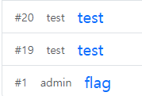
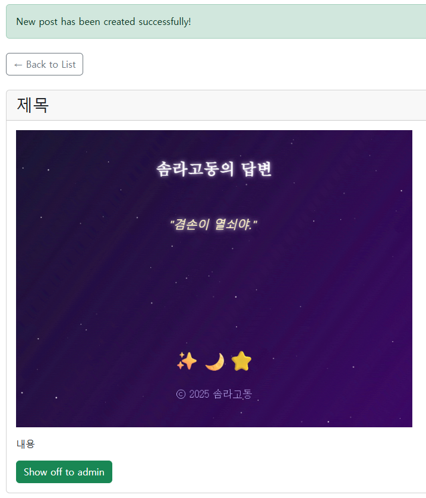
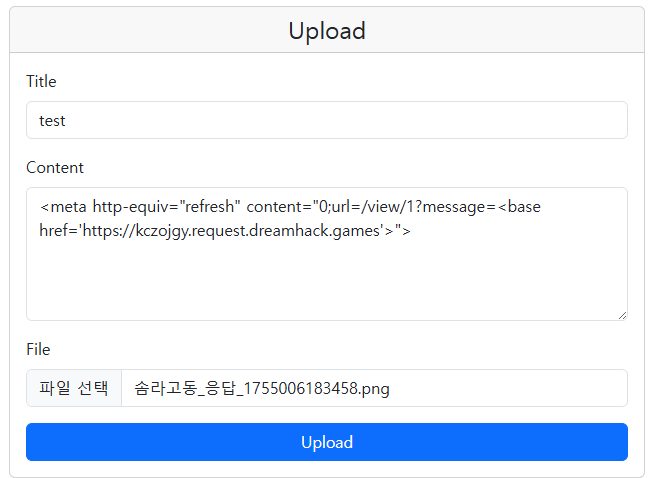
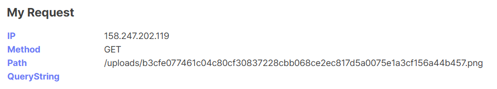

4등으로 마무리 했다 goldleo님이 3등으로 동점이지만 워낙 웹 고수셔서 크게 아쉽진 않다..  
더 어렵게 나왔으면 격차는 더 벌어졌을거다  
웹은 꽤 쉬웠고 올솔했다. 하나는 웹 같지가 않아서 2개만 write up 써보겠다

## Simple Gallery
아이디어 생각해내기가 좀 까다로웠다



admin post에 플래그가 포함된 사진이 업로드 되어있다. 물론 어드민만 읽을 수 있다.



로그인해서 글을 써보면 XSS 터지는 포인트가 크게 두 곳이 보이는데
내용이랑 맨 위 알림창이다

`http://158.247.202.119/view/177?message=(페이로드)`

```js
app.use((req, res, next)=>{
    nonce = crypto.randomBytes(32).toString('hex');
    res.setHeader('Cache-Control', 'no-cache, no-store, must-revalidate');
    res.setHeader('X-Frame-Options', 'deny');
    res.setHeader('Content-Security-Policy', 'script-src \'nonce-' + nonce + '\'');
    next();
})
```

그러나 script-src가 걸려있어서 admin 쿠키를 탈취해 해결하긴 어려워보인다

CSP에 base-uri 관련 설정이 들어있지 않다는 점을 이용해 base 태그를 사용한 nonce retargeting이 가능하다

```js
const flagImageName = crypto.randomBytes(32).toString('hex') + '.png';
const flagImagePath = path.join('uploads', flagImageName);

fs.copyFileSync('flag.png', flagImagePath);
```

위 코드에서 알 수 있듯이 랜덤화된 플래그 파일명만 알면 어드민이 아니어도 접근할 수 있으므로 아래와 같이 시나리오를 짰다

1. 게시글 본문 XSS로 meta tag open redirect
2. admin 게시글로 이동 후 message query에서 nonce retargeting
3. admin 게시글의 플래그 이미지 로드 시 retargeting 된 웹훅으로 요청 `https://webhook/{flag파일명}`




해당 경로로 접속하면 플래그를 얻을 수 있다

## Simple Board

코드양이 좀 되어서 겁먹었는데 진짜 별 거 없었다

```js
app.get('/post/:id', requireAuth, async (req, res) => {
  const id = req.params.id;
  const post = postDB.get(id);
  if (!post) return res.status(404).send('Not Found');
  if (post.author !== req.session.user.username && !(req.session.user && req.session.user.role === 'admin')) {
    return res.status(403).send('Forbidden');
  }
  const { uneval } = await import('devalue');
  const postSerialized = filter(uneval(post));
  const meSerialized = filter(uneval({ username: req.session.user.username, role: req.session.user.role }));

  res.render('post', { user: getUser(req), postSerialized, meSerialized });
});
```

devalue라는 모듈을 사용해서 이상한 문자열들을 다 필터링 해버린다.  
우회하려고 삽질 좀 했는데 취약점은 상상도 못한곳에서 터진다.

```js
if (postRoot && window.__POST) {
  const p = window.__POST;
  const h1 = document.createElement('h1');
  h1.textContent = p.title;

  const meta = document.createElement('div');
  meta.className = 'post-meta';
  const who = document.createElement('span');
  who.innerHTML = `작성자: <b>${p.author}</b>`;
  const when = document.createElement('span');
  when.textContent = `작성시간: ${fmtDate(p.createdAt)}`;
  meta.appendChild(who);
  meta.appendChild(when);

  const pre = document.createElement('pre');
  pre.className = 'post-content';
  highlightText(pre, p.content, p.highlight);

  const tagsWrap = setToChips(p.tags);
  const details = mapToList(p.meta);

  postRoot.appendChild(h1);
  postRoot.appendChild(meta);
  postRoot.appendChild(pre);
  postRoot.appendChild(tagsWrap);
  postRoot.appendChild(details);

  const delForm = document.getElementById('delete-form');
  if (delForm) delForm.action = `/delete/${p.id}`;
}
```

작성자를 넣을 때는 그대로 innerHTML 하게되어서 아이디로 xss가 발생한다

그 다음은 간단한 XSS다. 페이로드 들어간거보면 문자 몇 개는 제거되니 주의하자. 왜 그런지는 모르겠다
```html

```

어드민 봇한테 주고 플래그 따면 끝

`http://158.247.202.119:3000/flag`

`flag: hackquest2025{2522482579226696ac9def67ab04c98c}`