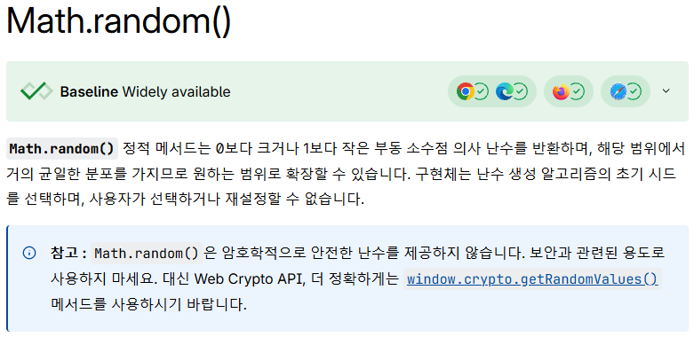
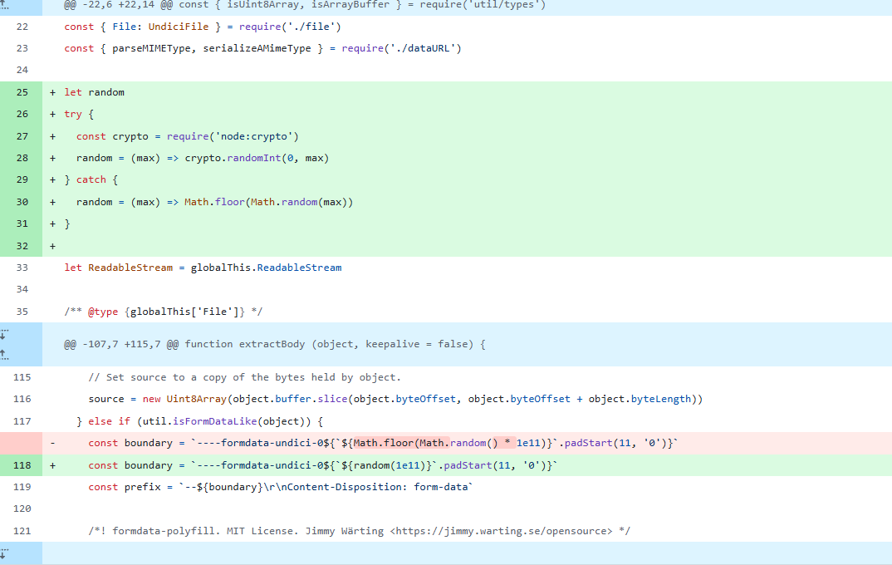

## About
CTF에서 `Math.random()`을 예측하는 문제가 꽤 나오길래 분석해 보기로 했습니다.

## Math.random()
  
`mdn` 공식 문서에서 `Math.random()`을 설명할 때 암호학적으로 안전한 난수를 제공하지 않으니 보안에 유의할 것을 언급합니다.  
이 글에서는 `Math.random()`을 예측하는 방법과 원리에 대해 다룹니다.

## About Math random
`Math.random()`이 생성하는 값은 **True Random** 값이 아닙니다. 해당 함수는 **Pseudo Random Number Generator (PRNG)** 이기 때문입니다. PRNG의 특징은 다음과 같습니다.
- 초기에 지정된 Seed 값을 재사용한다.
- 유한한 상태를 가지고 있기에 언젠가는 이미 생성되었던 숫자 시퀀스를 반복한다.
- 알고리즘 기반으로 동작하기에 계산 효율적이다.

내부적으로 PRNG의 구조는 다음과 같이 표현할 수 있습니다.
```
state = 0x12345678

output = g(state)

return output

state = f(state)
```

내부의 상태 `state`와 난수 생성 함수 `g`, `state`를 갱신하기 위한 함수 `f`가 존재합니다.  
유저가 output을 여러 개 수집하고 `g()`, `f()`의 구조를 알고 있다면 `state`를 역산할 수 있게 됩니다.

`state`를 알게 된다면 아래와 같이 다음 output을 예측할 수 있습니다.

```
next_output = g(f(state))
```

## V8 Analysis
ECMAScript는 `Math.random()` 구현의 표준을 명시하지 않습니다.  
즉, 엔진에 따라서 자체적인 `PRNG`를 구현해 사용합니다. 가장 많이 사용되는 V8의 경우에는 xorshift128+라는 알고리즘을 기반으로 한 `Math.random()`을 사용합니다.

아래는 Chromium에 포함된 V8 math-random 구현체 소스 코드입니다.
```c++
void MathRandom::InitializeContext(Isolate* isolate, Handle<Context> native_context) {
  Handle<FixedDoubleArray> cache = Handle<FixedDoubleArray>::cast(isolate->factory()->NewFixedDoubleArray(kCacheSize, TENURED));
  for (int i = 0; i < kCacheSize; i++) cache->set(i, 0);
  native_context->set_math_random_cache(*cache);
  Handle<PodArray<State>> pod = PodArray<State>::New(isolate, 1, TENURED);
  native_context->set_math_random_state(*pod);
  ResetContext(*native_context);
}
void MathRandom::ResetContext(Context* native_context) {
  native_context->set_math_random_index(Smi::zero());
  State state = {0, 0};
  PodArray<State>::cast(native_context->math_random_state())->set(0, state);
}
Address MathRandom::RefillCache(Isolate* isolate, Context* native_context) {
  DisallowHeapAllocation no_gc;
  PodArray<State>* pod = PodArray<State>::cast(native_context->math_random_state());
  State state = pod->get(0);
  // Initialize state if not yet initialized. If a fixed random seed was
  // requested, use it to reset our state the first time a script asks for
  // random numbers in this context. This ensures the script sees a consistent
  // sequence.
  if (state.s0 == 0 && state.s1 == 0) {
    uint64_t seed;
    if (FLAG_random_seed != 0) {
      seed = FLAG_random_seed;
    } else {
      isolate->random_number_generator()->NextBytes(&seed, sizeof(seed));
    }
    state.s0 = base::RandomNumberGenerator::MurmurHash3(seed);
    state.s1 = base::RandomNumberGenerator::MurmurHash3(~seed);
    CHECK(state.s0 != 0 || state.s1 != 0);
  }
  FixedDoubleArray* cache = FixedDoubleArray::cast(native_context->math_random_cache());
  // Create random numbers.
  for (int i = 0; i < kCacheSize; i++) {
    // Generate random numbers using xorshift128+.
    base::RandomNumberGenerator::XorShift128(&state.s0, &state.s1);
    cache->set(i, base::RandomNumberGenerator::ToDouble(state.s0));
  }
  pod->set(0, state);
  Smi new_index = Smi::FromInt(kCacheSize);
  native_context->set_math_random_index(new_index);
  return new_index.ptr();
}
```

64비트 정수 2개(s0, s1)로 128비트 state를 구현합니다.

```c++
if (state.s0 == 0 && state.s1 == 0) {
  uint64_t seed;
  if (FLAG_random_seed != 0) {
    seed = FLAG_random_seed;
  } else {
    isolate->random_number_generator()->NextBytes(&seed, sizeof(seed));
  }
  state.s0 = base::RandomNumberGenerator::MurmurHash3(seed);
  state.s1 = base::RandomNumberGenerator::MurmurHash3(~seed);
  CHECK(state.s0 != 0 || state.s1 != 0);
}
```

Random seed가 설정되어 있지 않다면 OS 엔트로피 기반으로 seed를 생성하고 MurmurHash3로 섞어 s0, s1을 할당합니다.
이를 기반으로 여러 개의 난수(kCacheSize)를 미리 생성해 놓고 Math.random() 호출 시마다 캐시에서 하나씩 꺼내 사용합니다.

구조가 단순하고 당연하게도 seed를 initialize 하는 부분이 없기에 충분히 미래의 값을 알아내는 스크립트를 작성할 수 있습니다.
이를 구현한 대표적인 라이브러리가 [V8 Random Predictor](https://github.com/PwnFunction/v8-randomness-predictor)입니다.

## Case Analysis CVE-2025-22150

m0lecon의 securetextbin 문제에서 [CVE-2025-22150](https://nvd.nist.gov/vuln/detail/CVE-2025-22150)를 사용한 문제가 출제되었습니다.

HTTP/1.1 클라이언트인 Undici 라이브러리에서 multipart boundary를 생성할 때 Math.random()을 사용했기에, 이를 예측하고 multipart/form-data를 smuggling 할 수 있었습니다.
이를 통해 공격자는 boundary 값을 예측하거나 요청을 변조할 수 있습니다.

다음과 같이 crypto.randomInt()를 사용하도록 수정되었습니다.

