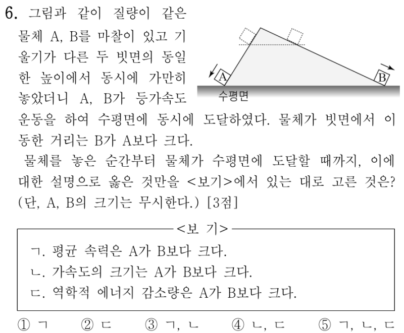
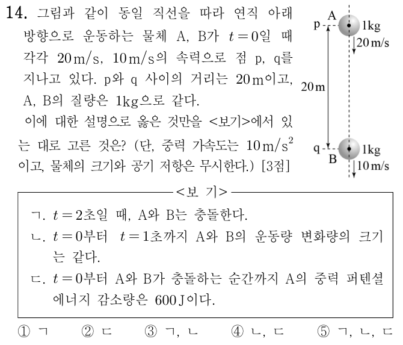
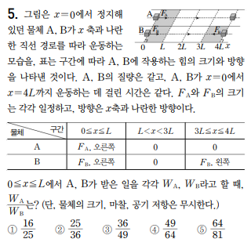
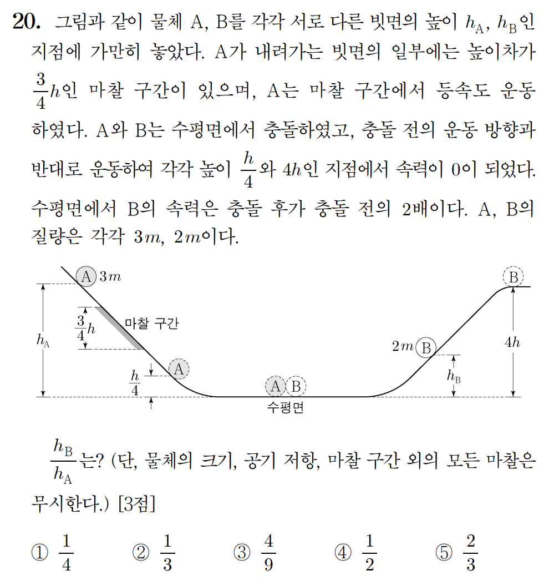
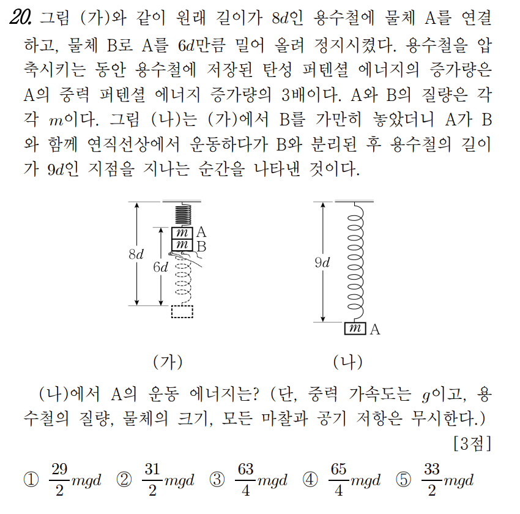
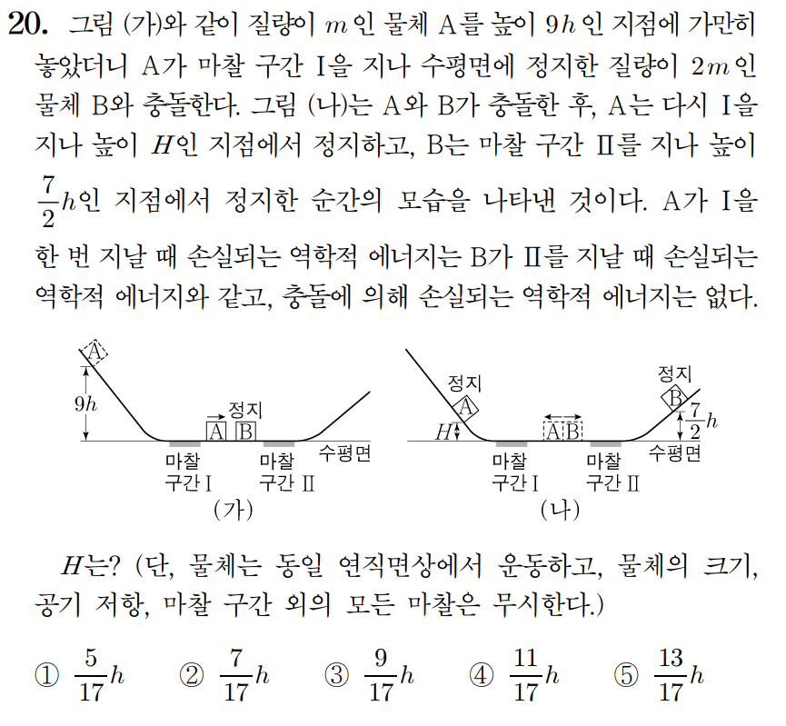

물리 실력이 부족하다는걸 느꼈다.  

보안 문제 풀이 쓰는거 처럼 푼 물리문제 정리해놓으면 기억에 남을거 같아서 시작해본다.

## Solve
### 2019 학년도 9월 모평 6번

거리는 다른데 A, B가 동시에 도착한다

- ㄱ `X` - $v_b > v_a$ 이고 $t$는 일정하므로 $\bar{v}$은 $B$가 더 크다.
- ㄴ `X` - 가속도 $a$는 $\frac{\Delta v}{t}$ 이므로 $B$가 $A$보다 크다.
- ㄷ `O` - 역학적 에너지 감소량은 아래와 같이 계산할 수 있다.  
  $-mgh$는 $A$, $B$가 모두 같다.  
  $E_k$를 계산하면
  - $E_ka = \frac{1}{2}m(v_a)^2$
  - $E_kb = \frac{1}{2}m(v_b)^2$
  - $v_b > v_a$ 이므로 $E_kb > E_ka$ 따라서 A가 역학적 에너지를 더 많이 잃었다

`답: 2`

---

### 2019 학년도 9월 모평 14번

가속도가 $10m/s^2$ 으로 같다 $A, B$의 $a$, $s$, $v_i$가 주어지므로 $t$와 $v_f$를 구해낼 수 있다.

ㄱ `O`
> A의 초기 속력은 $20m/s$, B의 초기 속력은 $10m/s$이다.  
> 이 둘은 중력가속도 $10m/s^2$을 받아 $2$초 후에 충돌한다.  
> 즉 A의 나중 속력은 $40m/s$, B의 나중 속력은 $30m/s$이다.

ㄴ `O`
> 운동량은 $P=mv$로 구할 수 있다
> - $P_{A,i} = 20 \cdot 1 = 20$, $P_{A,f} = 40 \cdot 1 = 40$
> - $P_{B,i} = 10 \cdot 1 = 10$, $P_{B,f} = 30 \cdot 1 = 30$  
> - $\Delta P$는 $20kg \cdot m/s$로 같다.

ㄷ `O`
> $v_{A,i} = 20m/s$, $v_{A, f} = 40m/s$ 이므로 $\bar{v_A}$는 $30m/s$가 된다.  
> $\bar{v_A} \cdot t = 30 \cdot 2 = 60 = s$  
> $m \cdot g \cdot s = 1 \cdot 10 \cdot 60 = 600$  
> 충돌할 때 까지 2초가 걸렸으므로 A가 2초 동안 이동한 거리에 mg를 곱하면 $E_k$의 감소량을 구할 수 있다.

`답: 5`

---

### 오투 대수능 대비 특별자료 실전 예상 모의고사 3회 5번

인텐은 역학적 에너지로 푸는거 같은데 그냥 `v-t` 그려서 풀었다

A의 속력을 $v_A$, 시간을 $t_1$  
B의 속력을 $v_B$, 시간을 $t_2$ 라고 정의할 때 거리가지고 계산해보면 각각 도달한 시간을 구할 수 있다.
$A$는 $\frac{5}{2} t_1$, $B$는 $3t_2$ 걸려서 도착한다.  
- 문제에서 $4L$까지 운동하는데 걸린 시간이 같다고 명시되어 있으므로  
  $\frac{5}{2} t_1 = 3t_2$
- 같은거리 $L$을 이동할 때를 가지고 식을 세우면  
  $v_A \cdot t_1 = v_B \cdot t_2$

- 두 물체의 질량이 같고 이동한 거리가 같으므로  
  $\frac{W_A}{W_B} = \frac{F_A}{F_B} = \frac{a_A}{a_B}$

세 식을 모두 정리하면 $\frac{25}{36}$이 나온다

`답: 2`

---

### 2022 학년도 9월 모평 20번

간단하게 마찰구간 빼고 역학적 에너지 보존으로 풀어주면 된다.

$E_{A,i} + E_{B,i} - E_{\text{손실}} = E_{A,f} + E_{B,f}$  
$3m \cdot g \cdot h_A + 2m \cdot g \cdot h_B - \frac{3}{4}h\cdot 3m \cdot g = \frac{h}{4} \cdot 3m \cdot g + 4h \cdot 2m \cdot g$

정리하면 아래와 같은 식을 구해낼 수 있다
- $3h_A + 2h_B = 11h$

문제에서 B의 속력은 충돌 후가 충돌 전의 2배라고 한다
이를 이용해 식을 더 도출해낼 수 있다

- $4h \cdot 2m \cdot g = \frac{1}{2} \cdot 2m \cdot (2v_B)^2$
- $2m \cdot g \cdot h_B = \frac{1}{2} \cdot 2m \cdot (v_B) ^2$

정리하면
- $v_B^2 = 2gh$
- $v_B^2 = 2gh_B$
> $h=h_B$

따라서 $h_A = 3h_B$가 되어 답은 $\frac{1}{3}$이다.

`답: 2`

---

### 2021 학년도 10월 학평 20번

그림이랑 물체 동작 이해하는게 좀 어려웠다.  

기준면을 (가)의 물체 윗부분으로 보고 시작한다

$E_pA = 6mgd, E_pB = 6mgd$ 이다.  
$E_{\text{탄성}} = 3E_pA = 18mgd (=\frac{1}{2} \cdot k \cdot (6d)^2)$

역학적 에너지 $E$는 $30mgd$이고 $A$와 $B$의 질량이 같으므로 각각 $15mgd$씩 나눠 가진다  
$E_A = 15mgd, E_B = 15mgd$

또, $\frac{1}{2}k \cdot (6d)^2 = 18mgd$  
$kd=mg$임을 도출해낸다.  
$E_A = A의 E_{\text{탄성p}} + E_{\text{중력p}} + E_k$이다.

(나) 그림을 봤을 때 A는 기준면 보다 d만큼 더 내려가 있으므로
$E_{\text{중력p}} = -mgd$

$15mgd = \frac{1}{2}mgd - mgd + E_k$

따라서 $E_k = \frac{31}{2}mgd$

`답: 2`

---

### 2024 학년도 수능 20번

세 과정이 필요하다

#### 1. 충격량 이용
충돌 전 A의 속력을 $v$, 충돌 후 $A, B$의 속력을 각각 $v_A, v_B$라고 하자

$mv = -mv_A + 2mv_B$ 라는 식이 나온다.  
정리하면 $v=-v_A + 2v_B$

#### 2. 운동에너지 보존
$\frac{1}{2}mv^2 = \frac{1}{2}mv_A^2 + \frac{1}{2} \cdot 2mv_B^2$  
$v^2 = v_A^2 + 2v_B^2$

첫번째 식을 두 번째 식에 대입하면  
$v_B(v_B - 2v_A) = 0$  
$v_B \ne 0$이므로 $v_B = 2v_A$  

$v$에 대해 표현하면
$v_A = \frac{1}{3}v, v_B = \frac{2}{3}v$

#### 3. 역학적 에너지 보존

w는 마찰구간에서 손실 되는 에너지
- $9mgh - w = \frac{1}{2}mv^2$
- $2mg \cdot \frac{7}{2}h = \frac{1}{2} \cdot 2m \cdot \frac{4}{9}v^2 - w$

$$
\begin{cases}
9mgh - w = \frac{1}{2}mv^2 \\
2mg \cdot \frac{7}{2}h  + w= \frac{1}{2} \cdot 2m \cdot \frac{4}{9}v^2
\end{cases}
$$

> $w=\frac{9}{17}mgh$

$\frac{1}{2}mv_A^2 - w = mgH$  
$= \frac{1}{2}m \cdot \frac{v^2}{9} - \frac{9}{17}mgh = mgH$

연립방정식의 첫번째 식에서   $9mgh - w = \frac{1}{2}mv^2$가 등장하므로  
구한 w를 사용해 변형하면
$\frac{1}{2}mv^2 = 16mgh \cdot \frac{9}{17}$

- 1. $\frac{1}{2}m \cdot \frac{v^2}{9} - \frac{9}{17}mgh = mgH$
- 2. $(16mgh \cdot \frac{9}{17}m) \cdot \frac{1}{9} - \frac{9}{17}mgh = mgH$
- 3. $H = \frac{7}{17}h$

`답: 2`

---

### ??? 학년도 ?? 20번
***문제는 나중에 첨부하겠다***

A 초기 속력: 4v, 나중 속력: v,  
B 초기 속력: $v_B$, 나중 속력: $v_B'$
이라고 정의한다.

#### 1. A, B가 올라갈 때 까지

> A가 올라갈 때:
> 
> $\frac{1}{2} \cdot k \cdot d^2 = 2m \cdot g \cdot h + \frac{1}{2} \cdot 2m \cdot (4v) ^ 2$
> -> $kd^2 = 4mgh + 32mv^2$

> B가 올라갈 때
> $\frac{1}{2} \cdot 2k \cdot d^2 - mgh (\text{마찰}) = mg \cdot 3h + \frac{1}{2}mv_B^2$
> -> $kd^2 = 4mgh + \frac{1}{2}mv_B^2$

두 식에 의하여 $32mv^2 = \frac{1}{2}mv_B^2$
- $v_B = 8v$

#### 2. 충격량 적용

$2m \cdot 4v + -(8v) \cdot m = -(2m) \cdot v + m \cdot v_B'$  
- $v_B' = 2v$

#### 3. A, B가 돌아갈 때
$A, B$의 나중 속력을 알기에 식 두 개를 도출해 낼 수 있다.

#### 3-1. A가 돌아갈 때 $\frac{d}{2}$ 압축
$2m \cdot g \cdot h + \frac{1}{2} \cdot 2m \cdot v^2 = \frac{1}{2} \cdot k \cdot (\frac{d}{2})^2$  
정리: $\frac{kd^2}{8} = 2mgh + mv^2$

#### 3-2. B가 돌아갈 때 $x$ 압축
$m \cdot g \cdot 3h + \frac{1}{2} \cdot m \cdot (2v)^2 = \frac{1}{2} \cdot 2k \cdot x^2 + mgh (\text{마찰})$  
정리: $kx^2 = 2mgh + 2mv^2$

#### 4. 마무리
우리가 구해야하는건 $\frac{x}{d}$이지만, 두 식으로는 이 꼴을 만들 수 없어보인다.

그러나 `1`과정에서 구한 $kd^2 = 4mgh + 32mv^2$식을 이용해 $gh$와 $v$에 대한 관계식을 만들어 연립할 수 있다

$[\frac{kd^2}{8} = 2mgh + mv^2] = [kd^2 = 16mgh + 8mv^2]$

$$
\begin{cases}
kd^2 = 16mgh + 8mv^2 \\
kd^2 = 4mgh + 32mv^2
\end{cases}
$$

$12mgh = 24mv^2$  
$gh = 2v^2$

1. $kx^2 = 3mgh$
2. $kd^2 = 16mgh + 8mv^2 = 20mgh$

$\frac{x^2}{d^2} = \frac{3}{20}$  
$\frac{x}{d} = \sqrt{\frac{3}{20}}$

`답: 5`

---