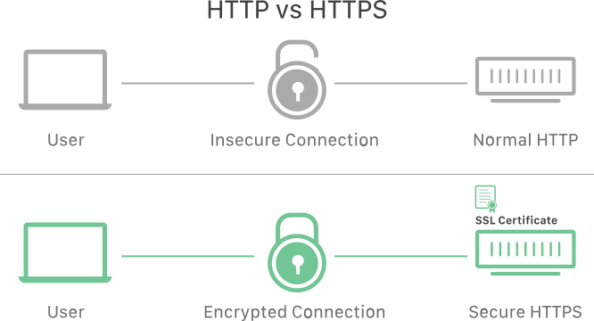
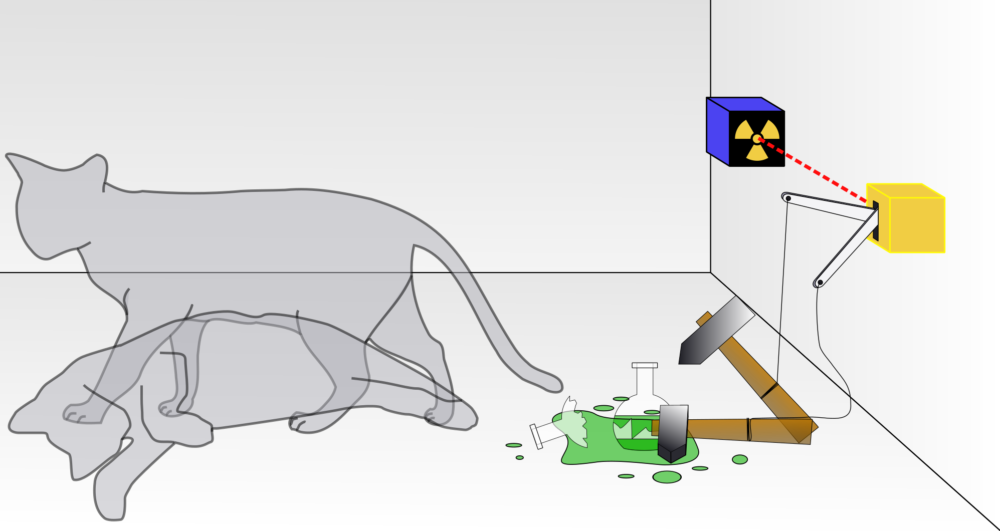
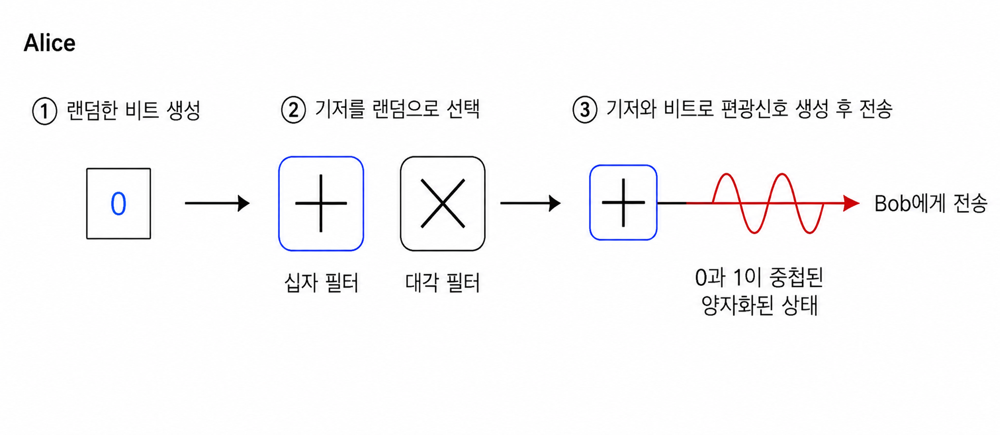
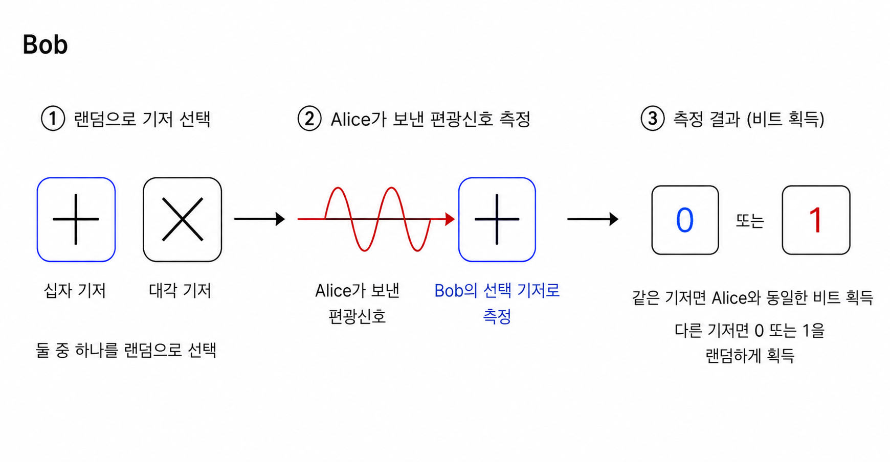
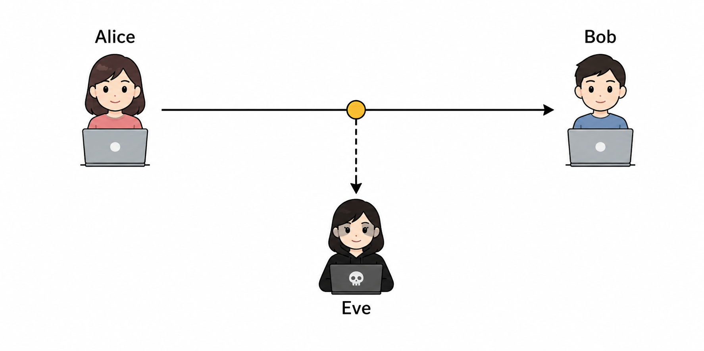

## 발단
물리 시간에 선생님이 자유주제로 발표 수행평가를 한다고 하셨다.
보안 쪽으로 생기부를 써야 했는데 생각보다 물리랑 정보보안 분야의 교집합이 없었고 주제를 정하기 위해 고민에 빠졌다.

그때 예전에 본 블로그 하나가 떠올랐다.

https://cyalume.tistory.com/61

카이스트 특기자를 가신 아주 엄청난 분의 블로그인데 이걸 읽다가 `양자 키 분배` 에 대해 접했었다.
당시에 아마 "양자"라는 단어를 보자마자 거부반응을 보이며 스크롤을 내렸던 걸로 기억하는데 지금 보니 내가 하기 딱 좋은 주제가 아닌가?

바로 관련 논문을 찾아보고 글을 읽기 시작했다. 이제 `양자 키 분배 알고리즘`이 뭔지부터 알아보자

## RSA의 한계

양자 키 분배가 제안된 배경 먼저 알아보도록 하자. 웹의 구조를 잘 알고 있는 개발자나 해커라면 SSL/TLS 프로토콜에 대해 알고 있을 것이다.

기존 `http` 프로토콜은 통신이 암호화되지 않아 공격자가 `mitm attack`을 진행함으로써 서로 주고받는 데이터들을 훔쳐볼 수 있는 한계가 있었다.
때문에 보안 프로토콜인 `SSL` 이 `https`에 적용되게 되었다.

`SSL 프로토콜`은 대칭키 암호화(AES)와 비대칭키 암호화(RSA)를 함께 사용하여 송수신되는 패킷을 공격자로부터 보호한다.
여기서 두 암호화 방식을 모두 사용하는 이유는 `키`를 교환하기 위해서이다.

대칭키 암호화 방식은 하나의 키로 암호화 복호화를 모두 진행한다. 이 키를 공격자가 훔쳐간다면 패킷을 전부 복호화할 수 있게 될 것이다.  
이를 `비대칭키 암호화 (RSA)`로써 방어한다. RSA는 암호화하는 `Public Key (공개키)`와 복호화하는 `Private Key (비밀키)` 두 개가 따로 있어 별도의 대칭키 교환절차를 거칠 필요가 없다.

이 때문에 AES 암호화 키를 생성하고, 그걸 RSA 암호화해서 보낸다. 이후 서버와 클라이언트는 RSA를 통해 안전하게 교환된 AES 키를 가지고 암호화 통신할 수 있다.

**그러나 양자컴퓨터의 개발은 이를 무력화시킨다.**

"RSA 암호화는 컴퓨터가 큰 수를 소인수분해할 때 엄청난 시간이 걸린다."라는 가정을 전제로 작동한다. 슈퍼컴퓨터 할아버지가 와도 못 깨는 암호를 양자컴퓨터는 단 며칠에서 몇주만에 키를 찾고 복호화 해버릴 수 있다.

이 한계 때문에 등장한 방식이 양자 키 분배 (Quantum Key Distribution) 이다.

## Quantum Key Distribution (QKD)

슈뢰딩거의 고양이, 한 번쯤은 들어봤을 것이다. 상자 속에 있는 고양이가 특정 확률로 죽는다고 가정해보자.
이 고양이가 죽었는지 살았는지, 관측자가 관측하기 전까진 하나의 상태로 정해지지 않는다.
고양이가 죽는 상태와 살아있는 상태가 상자를 열기 전까진 함께 존재한다는 것이다. 이를 `중첩 상태`라고 부른다.

양자키 분배는 이 중첩 상태를 활용하여 암호키를 안전하게 주고받는다.

아래 프로토콜의 작동을 예시로 들어보면 설명이 쉬울 것이다.

---

### 배경지식: 편광 신호와 기저

양자 키 분배(QKD)에서는 광자의 편광 방향을 이용해 비트를 표현한다.  
이때 각 편광 방향을 해석하는 기준을 **기저(basis)** 라고 하며, 일반적으로 `+ 기저`와 `× 기저` 두 가지를 사용한다.

각 기저에서 비트는 다음과 같이 매핑되어 편광신호를 만든다.

| 기저 | 비트 0 | 비트 1 |
|---|---|---|
| + 기저 | \| | — |
| × 기저 | / | \ |

---

### BB84 Protocol
설명을 위해서 암호학에서의 단골 손님 `Bob`, `Alice`, `Eve`가 어김없이 등장한다.
Alice는 데이터를 보낼 송신자, Bob은 데이터를 받는 수신자, Eve는 둘 사이의 통신을 도청하는 공격자이다.

- **Alice**
1. Alice는 랜덤한 비트를 생성한다. 
2. Alice는 비트를 편광신호로 바꿔 보내기 위해, **기저**를 랜덤으로 선택한다. 기저는 십자필터와 대각필터 두 종류가 존재한다.
3. Alice는 기저와 비트를 가지고 편광신호를 생성하여 Bob에게 보낸다. 이때 이 편광신호는 0과 1이 중첩되어 존재하는 양자화 된 상태이다.

---

- **Bob**
1. Bob 또한 Alice가 보낸 편광신호를 받기 전에 **기저**를 랜덤으로 선택한다.
2. 이 기저로 Alice가 보낸 신호를 측정한다.
만약 Alice와 Bob이 같은 기저를 골랐다면, Alice가 고른 비트를 Bob이 똑같이 수신했을 것이다.  
그러나 만약 Bob이 Alice와 다른 기저를 골랐다면, Alice가 고른 비트를 Bob이 똑같이 수신했을지, 다르게 수신했을지 랜덤하게 결정된다.

---

- **데이터 송수신 이후**

이제 `Alice`와 `Bob`은 서로에게 자기가 무슨 기저를 골랐었는지 공개한다.  
첫번째 데이터 전송에서 Alice와 Bob이 같은 기저를 선택했었다고 가정하자.
그럼 Alice와 Bob은 기저가 같으니까 동일한 비트를 가지고 있을 것이다.

이렇게 기저가 같은 것끼리만 모아 그 비트로 `sifted key`를 구성한다.

---

- **검증 절차**

이렇게 만들어진 `sifted`의 절반은 공개채널을 통해 공개한다. **양자 비트 오류율**(QBER)의 측정을 위해서다.

QBER 측정의 목적은 "요청이 중간에 도청되었는가?"를 확인하기 위함이다.  

예를 들어, `Alice`는 순서대로 각각 `기저_1`, `기저_2`, `기저_1`을 뽑고 Bob에게 편광신호를 보냈다. (각각 0, 1, 0 비트를 의도하고 담아 보냈다.)    
`Bob`은 순서대로 `기저_2`, `기저_2`, `기저_1`을 뽑아 각각의 Alice가 보낸 요청을 수신했다.

이때 Alice와 Bob의 기저가 같은 경우는 2번째, 3번째 요청이니 `sifted key`는 그 경우만 뽑아  `10.....`이 된다.

여기서 공개된 키를 제외한 나머지 키가 **비트 오류 정정** 과정을 거쳐서 비밀키로써 사용된다. 이러면 키 교환이 안전하게 끝난다.

**그런데 중간에 Eve가 요청을 훔쳐봤다면 어떻게 될까?**

자, Alice는 1을 의도하고 보냈고 Alice와 Bob은 같은 기저를 선택했다고 하자. 
그렇다면 Bob 역시 반드시 `1`을 받아야 하며, 이후 sifted key의 일부를 서로 공개하여 비교할 때 두 값은 동일해야 한다.

그러나 Eve가 이를 감청했었다면 상황이 달라진다.
Alice가 보낸 편광신호가 가던 중에 관측되기 때문에 0과 1중 하나로 확정이 되어버리게 된다.

만약에 0으로 확정되었다면, sifted key의 공개 과정에서 이상치가 나오기에 도청당한걸 알 수 있다.
물론 1로 확정되었다면 Alice와 Bob은 감청되었는지 알 수 없다.

즉, 감청이 탐지될 확률은 Eve가 Alice와 다른 기저를 선택할 확률 `1/2`에, 그로 인해 Bob이 Alice와 다른 비트를 얻게 될 확률 `1/2`를 곱한 값이다.  
따라서 전체 탐지 확률은 `1/2 × 1/2 = 1/4`, 즉 `25%`가 된다.

75% 확률로 도청을 걸리지 않을 수 있다니, 암호학에서 터무니없이 높은 확률이라고 볼 수도 있다.  
그러나 BB84에선 수많은 광자를 반복적으로 교환하며 그 과정에서 고루 섞인 일부 비트를 가지고 QBER을 계산한다.

도청자를 탐지할 확률은 다음과 같이 표현할 수 있다.

$P = 1 - \left(\frac{3}{4}\right)^n$

`n`은 비교에 사용된 비트 수를 의미한다.  

즉, 사용되는 비트 수가 많아질수록 도청자가 끝까지 탐지를 피할 확률은 급격히 감소하며 충분히 많은 비트를 사용할 경우 도청 사실은 거의 확실하게 드러나게 된다.

BB84에서는 QBER이 11%를 넘는다면 도청되었다고 판단하고 키를 폐기하게 된다.