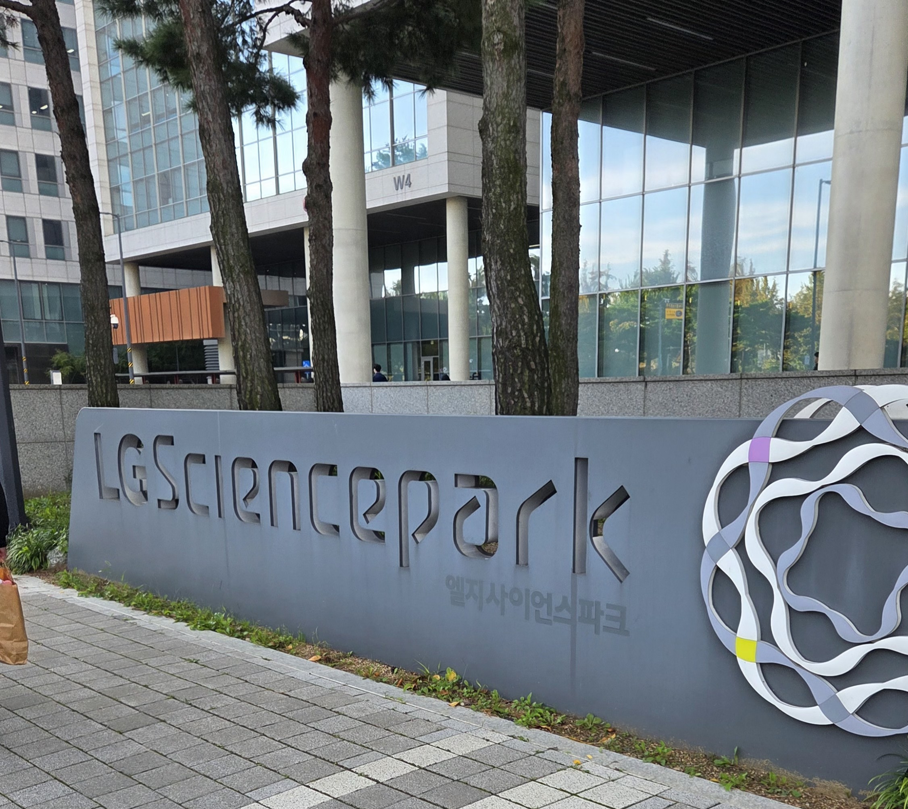
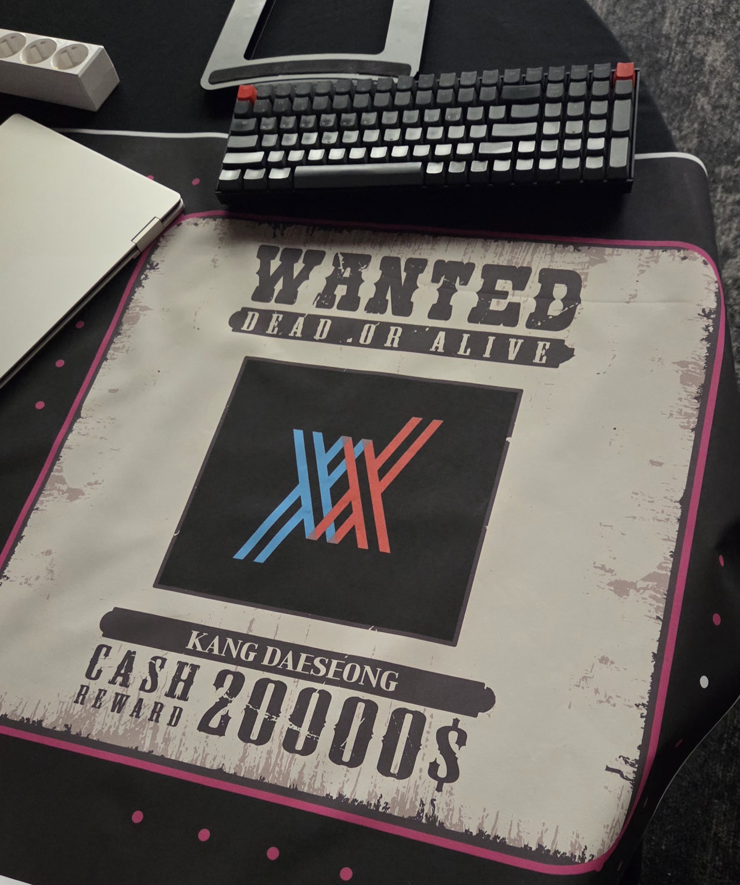
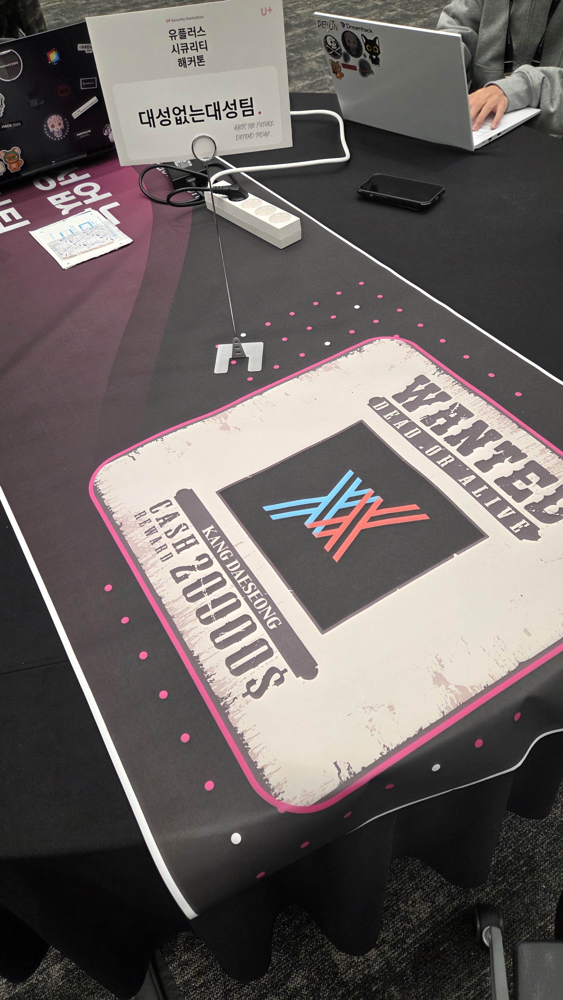

[le0s1mba](https://dreamhack.io/users/37706), [yeonba](https://dreamhack.io/users/53840), [btb](https://dreamhack.io/users/33534) 세명컴고 팀원 3명이랑 `대성없는 대성팀`으로 예선 턱걸이해서 어찌저찌 본선에 갔다왔다.

결과부터 말하자면 예선과 본선 모두 그리 좋지 못한 성적으로 털려버렸다. 재미있게 즐기고 오긴했는데 팀원들한테 민폐끼친거 같아 죄송하다 ㅠㅠ

### 대회장
10월 24일에 본선이 열렸다. 하필 내 고등학생으로써의 마지막 학교 축제랑 겹치긴 했는데 뭐 LG 본선 정도면 빠지고 갈 이유가 충분했다.

6시에 일어나서 지하철 타고 마곡나루로 갔고 LG 마곡사옥에 도착했다.  
다른 대회들이랑 다르게 뭘 많이 줘서 좋았다. 무탠다드 후드집업이랑 스티커랑 그런거 받았는데 입고 다녀도 될 거 같다.

팀명따라서 대성형 프사를 팀 로고로 박았다

### Live fire
처음에 개회사랑 대회 일정 설명 듣고 바로 대회 시작했다.

대회는 `Live fire`, `Scenario`, `Jeopardy` 세 분야가 출제 되었다. CCE 이후로 공방전은 볼 일 없을줄 알았는데 갑자기 나와서 당황했다.
다 그렇듯이 취약한 웹서버가 하나씩 주어지고 15분 주기로 운영진 측에서 공격한다. 취약점 7개 숨어있는거 패치해서 업로드하면 됐다.

`Golang + 파이썬` 기반 서버가 주어졌는데 파일 수가 CCE때보다 많았다.. 아마 대충 40개는 되었을거다.
다들 금방 취약점 한두개씩은 패치했는데 고랭 보고 쫄아버린 나는 시작한지 3시간쯤 지나서야 sqli 하나를 패치했고 대회 후반에 LLM 힘을 빌려 취약점 2개를 더 방어하면서 총 3개를 방어할 수 있었다.
결과가 그런거지 패치를 진짜 늦게하고 중간에 SLA Failed 뜬 것도 꽤 있어서 얘가 점수를 진짜 많이 깎아먹었다.

### JeoPardy
고등학생, 대학생들 다 나온 대회다 보니 모든 분야가 고난이도로 출제 되었다.

내가 잡았던 웹은 2문제가 나왔으며 각각 4솔, 0솔이었다.

첫번째 문제 대충 기억나는대로 설명을 해보겠다.

내부망이랑 외부망이 분리되어있으며 내부, 외부 모두 게시판 기능을 하는 서버가 돌아가고있다.
외부망에선 내부망으로 POST 요청 보낼 수 있는 api를 제공하고 있었고, 내부망 게시판에 있는 flag를 읽는게 목표였다

csp, csrf, origin check 등 여러 문제때문에 외부망 xss -> 내부망 xss (+ csrf bypass, csp bypass) 해서 admin bot 옮겨 flag 읽어와주면 되었다.

익스 방향은 맞았지만 csp bypass를 제대로 못했다 ㅠㅠ 집와서 코드 한 줄 추가해 돌려보니 잘 읽어와지더라..

### After party

대회 끝나고 네트워킹 파티 했다. 조는 신청한 사람들 중에 랜덤으로 정해졌고 우리 테이블에는 가끔 드림핵이랑 대회에서 만나던 두 분과 LG 멘토님, 대학생 한 분 이렇게 계셨다.
같이 밥먹고 소소한 활동하고 했는데 재미있었다.

난 적당히 내향적인지라 대화에 많이 참여하고 그런건 없었지만 중간중간 진로 상담도 받았고 현업에 계신 다른분들 얘기 들으니 확실히 인사이트가 쌓이는 느낌이 들었다.

암튼 좋은 경험이었다. 다음 대회때는 수상을 목표로 해보도록하겠다.