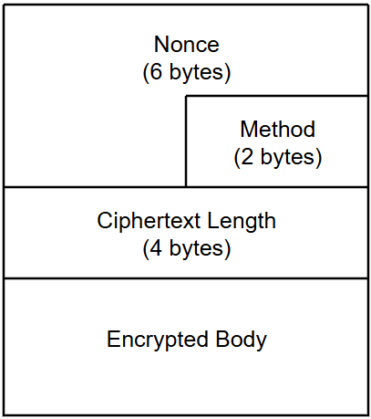

## TL;DR
카카오톡은 보이스톡, 페이스톡, 라이브톡 등 실시간 보이스 관련 기능들을 지원합니다. 24년도 초에 보이스톡을 사용한 제로데이 취약점이 발견된 이후
보이스 유틸 모두를 담당하는 내부 모듈이 `Vox20`에서 `Vox30`으로 리뉴얼 되었습니다.
지금까지 메인 통신 프로토콜인 Loco는 다루어 보았지만 보이스 통신은 또 다른 프로토콜을 구축하여 사용하고 있으며, 다른 분석가가 분석해놓은 자료가 없기에 처음부터 새로 분석해보기로 했습니다.

본인은 리버서가 아닌지라 깊이 있는 분석을 하기엔 한계가 있음을 알립니다.

분석은 서브디바이스 기준 v25.8.3 apk를 대상으로 진행합니다.

---

## Vox30Manager.makeVoiceRoomCall()

`com.kakao.talk.Vox30Manager`를 엔트리 포인트로 잡고 분석을 진행했습니다.
`Vox30Manager`에는 모든 Vox 관련 함수들이 모여있으며 직관적으로 알아볼 수 있는 함수로는 `joinLive`, `joinVoiceRoomCall`, `makeCall`, `makeGroupCall`, `makeLive`, `makeVoiceRoomCall` 등이 있습니다.

이 중 `makeVoiceRoomCall`, `joinVoiceRoomCall` 함수를 대상으로 Flow를 분석하기로 했습니다.
이름만 봐도 알 수 있듯이 보이스룸을 만들었을 때 가장 먼저 Call 되는 함수입니다.
해당 함수가 하는 기능을 정리해보면 다음과 같습니다.

- makeStun()
- makeIceServer()
- createPeerConnection()

### makeStun()
```java
private String makeStun(String str, int i13) {
    return "stun:" + str + ":" + i13;
}
```

### makeIceServer()
`org.webrtc.PeerConnection$IceServer` 클래스로 IceServer를 만듭니다

```java
public static List<PeerConnection.IceServer> setICEAccountInfo() {
    String str;
    ArrayList arrayList = new ArrayList();
    for (int i13 = 0; i13 < 2; i13++) {
        String str2 = "";
        if (i13 == 0) {
            str = "";
        } else {
            str = "turntest";
        }
        if (i13 != 0) {
            str2 = "turn3412";
        }
        arrayList.add(PeerConnection.IceServer.builder("stun:211.231.102.183:9001").setUsername(str).setPassword(str2).createIceServer());
    }
    return arrayList;
}
```

iceServer의 주소와 username, password는 정적으로 삽입되어 있는걸 확인할 수 있습니다.

### createPeerConnection()
```java
private void createPeerConnection(long sdpUserId, List<PeerConnection.IceServer> list, Object voxMediaSession) {
    Logger.e("createPeerConnection :  sdpUserID : " + sdpUserId);
    if (Looper.myLooper() == Looper.getMainLooper()) {
        setCDRMessage(voxMediaSession, sdpUserId, VoxCDRManager.FlowType.CREATE_PEER_CONNETION);
        VoxCall30Impl.CallInfo callInfo = ((VoxMediaSession) voxMediaSession).currentCall.info;
        if (callInfo.localUserId == sdpUserId) {
            int serviceType = callInfo.serviceType;
            if ((serviceType == 6 || serviceType == 10) && callInfo.isGroupCall) {
                this.voxMediaManager.createLocalTrack();
                VoxVideoParams.isVideoCallEnable = true;
            } else {
                int i13 = callInfo.callMediaType;
                if (i13 != 3 && i13 != 2) {
                    VoxVideoParams.isVideoCallEnable = false;
                } else {
                    this.voxMediaManager.createLocalTrack();
                    VoxVideoParams.isVideoCallEnable = true;
                }
            }
        }
        this.voxMediaManager.createConnection(list, sdpUserId, voxMediaSession);
        return;
    }
    new Handler(Looper.getMainLooper()).postAtFrontOfQueue(new c(voxMediaSession, sdpUserId, list));
}
```

보이스룸 Creator 여부와 `VSERVICE_TYPE_TALK_30`, `VSERVICE_TYPE_TALK_30_OPENLINK`에 따라 `isVideoCallEnable` 플래그를 설정합니다.

이후 IceServer와 Peer Connection을 맺습니다.

stun 받아서 ICE 서버 만들고 커넥션 맺는 전형적인 WebRTC Server Creation을 구현한 아주 간단한 함수였습니다.
그러나 이와 달리 `joinVoiceRoomCall`는 Native 라이브러리를 사용하기에 분석이 까다로워집니다.

---

## Vox30Manager.joinVoiceRoomCall()

해당 함수는 자바코드 상에서 분석할게 없습니다.

```java
VoxCall30Impl createVoxCall = createVoxCall(this.voxEngine.JoinVoiceRoomCall(str, i13, z3, j13, j14, j15, vCallMediaType.getValue(), vServiceType.getValue(), vUserType.getValue()), j13);
```

native library인 `this.voxEngine`을 호출해 `voxEngine.JoinVoiceRoomCall()`을 수행합니다.

네이티브 라이브러리는 `libVoxCore.so`에 위치해있습니다.
해당 파일을 IDA로 디컴파일하고 문자열 검색으로 `joinVoiceRoomCall`을 담당하는 함수를 찾았습니다.

```c
int __fastcall sub_58308(
        int a1,
        int a2,
        int a3,
        int a4,
        unsigned __int8 a5,
        int a6,
        int a7,
        int a8,
        int a9,
        int a10,
        int a11)
```

자바코드 상에서는 인자를 9개 넘겨주었지만 pseudo code에서는 인자 11개를 받고있습니다.
이는 VoxModule이 JNI를 통해 네이티브 라이브러리를 호출하기 때문입니다.  
네이티브 라이브러리가 JNI 인터페이스를 구현한다면 첫번째와 두번째 파라미터에는 `JNIEnv`와 `JObject/JClass`가 들어가게 됩니다.
`JNIEnv`는 따로 [구조체를 지정](https://gist.github.com/Jinmo/048776db75067dcd6c57f1154e65b868)함으로써 보다 용이하게 분석할 수 있습니다.

```c
int v11; // r1
int v12; // r0
int v13; // r2
int v14; // r3
int v16; // [sp+4h] [bp-34h]

v11 = a3;
if ( a3 )
{
  v16 = a4;
  v12 = (*(int (__fastcall **)(int, int, _DWORD))(*(_DWORD *)a1 + 676))(a1, a3, 0);
  a4 = v16;
  v11 = v12;
}
```
```c
int v11; // r1
const char *v12; // r0
int v13; // r2
int v14; // r3
int v16; // [sp+4h] [bp-34h]

v11 = a3;
if ( a3 )
{ 
  v16 = a4;
  v12 = (*a1)->GetStringUTFChars(a1, a3, 0);
  a4 = v16;
  v11 = (int)v12;
}
```

바이너리 크기가 워낙 커서 동적 분석을 진행하는 게 바람직합니다. 문제는 필자의 분석 환경인데, 모바일 카카오톡은 x64 바이너리를 지원하지 않습니다. 따라서 64비트 PC 위에서 에뮬레이터로 카카오톡을 실행해 분석할 경우 frida를 통한 네이티브 후킹이 어려워집니다. 특히 64비트 호스트에서 ARM 전용 네이티브 라이브러리를 로드하면 `libhoudini.so`가 이를 인터프리팅 해버리기 때문에 원본 라이브러리의 심볼이나 동작이 그대로 드러나지 않습니다.

지인의 도움을 받아 `libVoxCore.so`의 SSL 관련 라이브러리들의 후킹을 진행했으며 대략적인 프로토콜 구조를 알 수 있었습니다.

---

## Flow
보이스룸 참여절차는 생성자가 채팅으로 초대 메시지를 보냄으로써 시작됩니다. 생성시 전송되는 페이로드 예시는 다음과 같습니다.
```json
{ "type":"vr_invite","csIP":"203.133.188.66","csIP6":"2404:4600:1:8d:203:133:188:66","csPort":9000,"callId":"13299692653040311","duration":0 }
```
`VoiceRoomOpener`는 위와 같은 필드를 포함한 메시지를 전파합니다. 제시된 `csPort`와 별계로 포트는 `5228`로 연결해야합니다.

보이스룸에 연결하는 클라이언트는 TLS를 통한 커스텀 패킷을 전송하게 됩니다. 여기서 흥미로운 점은 이미 보호된 TLS 계층 위에서 한 번 독자적인 암호화 프로토콜을 구축하여 정보를 전달하는 형태를 취한다는 것입니다.

필자는 TLS 계층에서 전송하는 해당 패킷을 `VoxNormalPacket`이라고 이름붙여 서술합니다.
### VoxNormalPacket

Header의 첫 6바이트는 nonce로 보이는 랜덤한 값을 담고있고, 그 다음 2바이트는 method code가 들어갑니다.  
다음은 ciphertext의 길이 정보를 나타내는 length가 4바이트를 담고있고.  
마지막으론 암호화된 본문의 bson 데이터가 붙여집니다. 암호화는 `SeedCBC` 알고리즘을 사용합니다.
